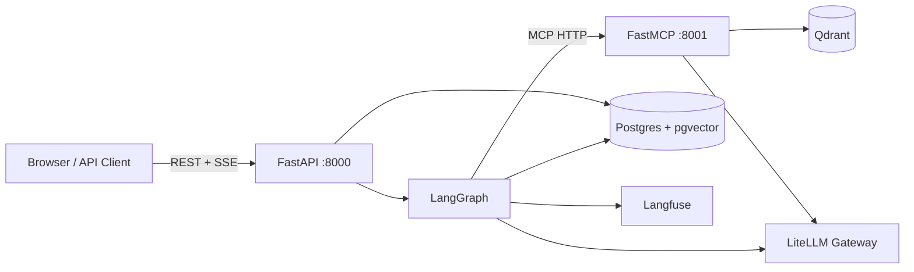
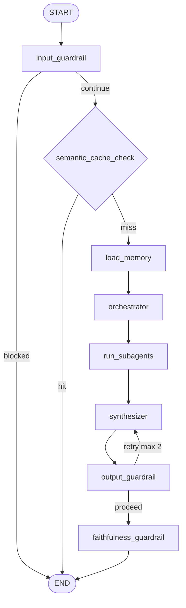
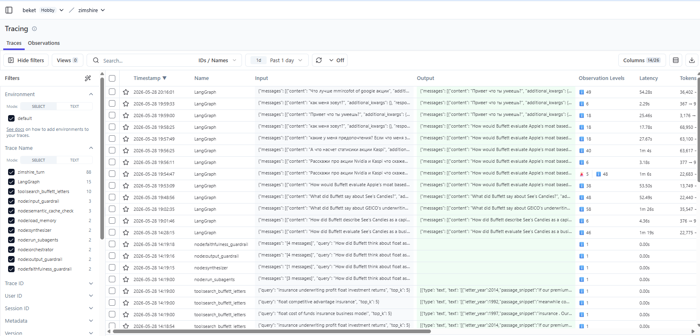
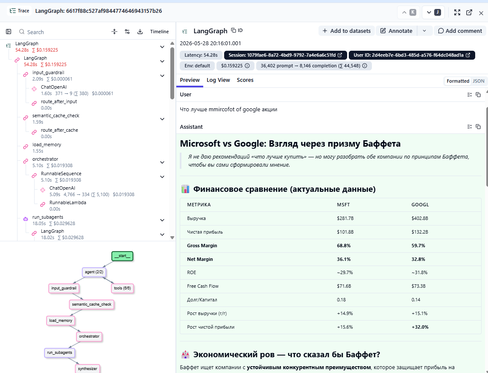
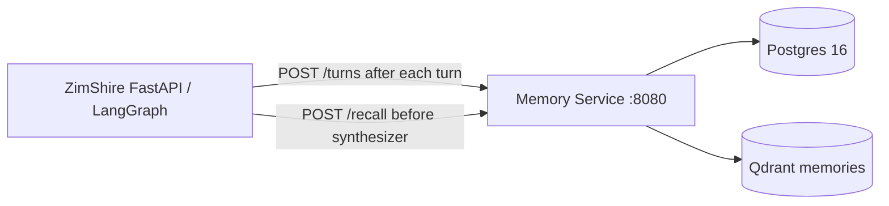

# ZimShire

**Buffett-first AI investment research assistant.** ZimShire helps investors research public companies through Warren Buffett's shareholder letters, live market data, and current web search — grounded in primary sources, not generic chatbot guesses.

> ZimShire is **not** a stock screener, prediction engine, or financial advisor. It is a research companion that never generates buy/sell recommendations, price targets, or portfolio advice — enforced at every layer of the system.

---

## UI


*Empty state: sidebar, starter prompt chips, health indicator. Dark navy + gold + JetBrains Mono aesthetic.*

---

## Assignment coverage

| Task | Requirement | Implementation |
|------|-------------|----------------|
| **1 — Core Service** | Async FastAPI, streaming, conversation persistence, provider-agnostic LLM | `app/main.py`, `app/modules/messages/`, `app/services/llm.py` (LiteLLM gateway) |
| **2 — RAG Pipeline** | Buffett letters corpus, source attribution, `grounded: false` on unsupported claims | `scripts/` ingest, Qdrant hybrid search (dense+BM25+ColBERT), `faithfulness_guardrail`, `rag_retrievals` table |
| **3 — Multi-Agent** | LangGraph, three data sources, checkpointed multi-turn sessions | `app/modules/agents/graph/`, planner → parallel subagents → synthesizer, `AsyncPostgresSaver` |
| **4 — MCP Server** | Standalone FastMCP process, typed tools, stdio + HTTP | `mcp_server/` on port 8001 — 15 data tools + 15 UI tools |
| **5 — Observability** | Langfuse traces per query, latency + token cost at every LLM call | `app/services/langfuse_service.py`, `langfuse_trace_id` on every assistant turn, ~46 observations per trace |
| **6 — Guardrails** | Input / output / faithfulness | `pipeline/preflight.py` (input), `pipeline/safety.py` (output + faithfulness) |
| **Bonus — Semantic cache** | Similar-query cache above threshold | `semantic_cache` table, pgvector similarity ≥ 0.92, 7-day TTL |
| **Bonus — Long-term memory** | Tracked companies and interests across sessions | `AsyncPostgresStore`, `app/modules/chat_history/long_term/` |

---

## Architecture

> **Architecture diagram & DB schema (draw.io):** [Agent Architecture + DB Schema Chart](https://drive.google.com/file/d/16mht8X_s3yDwcIixr4UawR1Fdc47FMKk/view?usp=sharing)

### Two-process design



| Process | Entry point | Port | Responsibility |
|---------|-------------|------|----------------|
| **FastAPI** | `uvicorn app.main:app` | 8000 | REST API, SSE streaming, LangGraph execution, Postgres audit |
| **FastMCP** | `python -m mcp_server.main` | 8001 | 3 data tool groups: RAG search, market data, web search |
| **Frontend** | nginx (built by `npm run build`) | 5173 | React 18 UI — proxies `/api/*` to the API service |

**Hard rule:** `app/` never imports from `mcp_server/`. All tool access goes through `MultiServerMCPClient` at runtime.

### MCP surface: tools only (by design)

The assignment allows choosing which MCP primitives to expose. ZimShire exposes **tools only** — no `@mcp.resource` or `@mcp.prompt` handlers.

| Primitive | Exposed? | Rationale |
|-----------|----------|-----------|
| **Tools** | Yes | RAG (`search_buffett_letters`), market (yfinance), web (SerpApi DuckDuckGo), plus optional UI tools for IDE clients |
| **Resources** | No | Letter corpus lives in Qdrant; static URIs would duplicate retrieval and go stale after re-ingest |
| **Prompts** | No | Research prompts live in `app/core/prompts.py` and the LangGraph orchestrator; MCP clients call tools with their own queries |

External clients (Cursor, Claude Code) get the same data plane as the API via stdio or HTTP on port 8001. Adding a resource or prompt later would be additive, not required for parity with the FastAPI app.

---

## LangGraph pipeline

### Graph topology



### Nodes

| Node | File | What it does |
|------|------|--------------|
| `input_guardrail` | `pipeline/preflight.py` | LLM JSON classifier (`gpt-4o-mini`), fail-open on LLM error |
| `semantic_cache_check` | `pipeline/preflight.py` | embed query → pgvector cosine ≥ 0.92 → skip full pipeline |
| `load_memory` | `pipeline/preflight.py` | Load long-term profile from `AsyncPostgresStore` |
| `orchestrator` | `pipeline/planning.py` | `with_structured_output(OrchestratorPlan)` — selects 0–3 subagents |
| `run_subagents` | `pipeline/research/runner.py` | `asyncio.gather` over RAG / market / web subagents in parallel |
| `synthesizer` | `pipeline/synthesis.py` | `llm.astream()` — tokens streamed in real-time via SSE |
| `output_guardrail` | `pipeline/safety.py` | LLM full-context check (safety + factual), max 2 retries → synthesizer |
| `faithfulness_guardrail` | `pipeline/safety.py` | LLM grounding check + similarity threshold 0.40 → `grounded` + `sources` |

### Models (via LiteLLM gateway)

| Role | Model |
|------|-------|
| Orchestrator + Synthesizer | `claude-sonnet-4-6` |
| RAG / Market / Web subagents | `claude-haiku-4-5` |
| Guardrails (input / output / faithfulness) | `gpt-4o-mini` |
| Memory extraction | `claude-haiku-4-5` |
| Embeddings | `text-embedding-3-small` (1536-dim) |

---

## Real-time SSE streaming

Streaming uses LangGraph's `stream_mode=["messages","values"]`:
- `"messages"` → `(AIMessageChunk, metadata)` per token from `synthesizer` node → forwarded immediately as SSE
- `"values"` → full state dict after each node completes → drives progress events

### SSE event types

| Type | When | Payload |
|------|------|---------|
| `progress` | Before slow stages (subagents, synthesis) | `{type, stage, message}` |
| `token` | Real LLM synthesis tokens, real-time | `{type, content}` |
| `replace` | Output guardrail rewrote already-streamed content | `{type, content}` |
| `blocked` | Input guardrail rejected query | `{type, reason}` |
| `error` | Unhandled graph exception | `{type, detail}` |
| `done` | Always the final event | `{type, message_id, grounded, sources, langfuse_trace_id, cache_hit}` |

### Typical stream

```
data: {"type":"progress","stage":"rag","message":"Searching Buffett letters…"}
data: {"type":"progress","stage":"synthesizing","message":"Composing answer…"}
data: {"type":"token","content":"## GEICO's Underwriting Discipline"}
data: {"type":"token","content":"\n\nBuffett returned to GEICO's…"}
…
data: {"type":"done","message_id":"uuid","grounded":true,
       "sources":[{"letter_year":1995,"passage":"…","similarity_score":0.49}],
       "langfuse_trace_id":"abc123","cache_hit":false}
```

---

## RAG pipeline

### Ingestion (offline, once)

```bash
python scripts/letters_ingestion.py          # download + clean 1977–2024 letters
python scripts/semantic_chunk_letters.py     # semantic chunking → data/semantic_chunks.json
python scripts/upload_to_qdrant.py \
  --chunks-json data/semantic_chunks.json    # upload to Qdrant
```

**Chunking strategy:** Semantic breakpoints via cosine similarity (threshold 0.65) between adjacent sentence embeddings using BAAI/bge-small-en-v1.5 locally. Chunks: 100–800 tokens, 50-token overlap. Three vector spaces per point:
- `dense` — `text-embedding-3-small` 1536-dim cosine (LiteLLM gateway)
- `sparse` — BM25 with IDF modifier
- `multi` — ColBERT late-interaction 96-dim MAX_SIM

**Retrieval:** Dense + sparse prefetch with RRF fusion → ColBERT reranking inside Qdrant. Point IDs are deterministic `uuid5(namespace, f"{year}:{chunk_index}")` — safe to re-ingest.

### Faithfulness grounding

`faithfulness_guardrail` runs **after** `synthesizer` and `output_guardrail`. It evaluates the draft answer against retrieved letter passages (LLM JSON check; similarity fallback if the LLM call fails). Strong-hit threshold: `similarity_score ≥ 0.40` (calibrated for `text-embedding-3-small` — relevant passages often score 0.35–0.55). The `grounded` flag and `sources` list in the SSE `done` event come from this node.

#### `grounded` semantics (three states)

| Value | When | Meaning for clients |
|-------|------|---------------------|
| `true` | RAG ran and faithfulness passed | Letter-specific claims should be treated as supported by retrieved passages; see `sources` (year + passage + score) |
| `false` | RAG ran but faithfulness failed (or zero chunks) | **Do not treat the answer as confirmed by Buffett's letters.** `sources` is empty. Any market/web lines in the same message are illustrative only — use at your own risk |
| `null` | RAG was not invoked | Faithfulness was not evaluated (e.g. market-only or web-only turn). Not the same as “failed check” |

#### Current behaviour (transparency flag — Variant A)

Today, `grounded: false` is a **transparency flag**, not a content gate (same pattern as documented in `docs/assistant_flow.md`):

1. The synthesizer may already have streamed tokens to the client.
2. Faithfulness sets `grounded: false` and `sources: []` on the final `done` event.
3. The UI shows an amber badge (“Not confirmed by letters”) so users do not mistake the text for letter-backed citations.

**User-facing rule:** If `grounded === false`, do not rely on Buffett-letter claims in that message; treat market and web sections as unverified context unless you cross-check primary sources.

#### Stricter alternative (Variant B — not implemented)

A literal reading of the assignment (“return `grounded: false`, not a plausible-sounding hallucination”) would also **replace** the streamed answer when faithfulness fails:

- After `faithfulness_guardrail`, if `grounded === false`, emit SSE `{"type":"replace","content":"..."}` (same mechanism as `output_guardrail` today).
- Replace text with a short, honest fallback, e.g. insufficient letter support for this query; optionally retain only market/web facts that trace to `collected_context`.

Variant B trades UX (user may see tokens then a replace) for stronger anti-hallucination guarantees. Variant A was chosen to avoid discarding useful market/web context when retrieval is weak; Variant B is the documented upgrade path if reviewers require hard blocking.

---

## Guardrails

### Fail-open vs fail-closed (`FAIL_OPEN_ON_GUARDRAIL_ERROR`)

Guardrail nodes call a small LLM (`gpt-4o-mini`). If that call **throws** (gateway down, timeout, parse error), behaviour depends on `.env`:

| `FAIL_OPEN_ON_GUARDRAIL_ERROR` | On LLM failure | Typical use |
|--------------------------------|----------------|-------------|
| `true` (default) | **Fail-open** — allow the turn to continue | Demos, dev, degraded production (prefer serving research over hard outage) |
| `false` | **Fail-closed** — input blocked; output/faithfulness treated as pass-through blocked where applicable | Stricter compliance posture |

| Node | On success | On LLM failure (fail-open) | On LLM failure (fail-closed) |
|------|------------|----------------------------|------------------------------|
| **Input** | Block off-topic / injection / personalized advice | Query proceeds | Query blocked |
| **Output** | Retry or safe rewrite on violation | Draft passes unchanged | Same as fail-open today (output still fail-open on error in code) |
| **Faithfulness** | Set `grounded` + `sources` | Similarity-threshold fallback | Same fallback |

**Note:** Output guardrail **always fail-open on LLM error** today (draft passes) — only input honours `FAIL_OPEN_ON_GUARDRAIL_ERROR` for failures. Safety violations detected successfully still trigger retry + `replace` SSE.

For production hardening, consider fail-closed input (`false`) and fail-closed output on error (safe fallback instead of pass-through).

### Input

LLM JSON classifier (`gpt-4o-mini`) checks for off-topic queries, prompt injection, personal investment advice. On block: graph ends early; client receives SSE `blocked` then `done` with `message_id: null`.

### Output

Single LLM call against the **full collected context** (RAG + market + web + user profile + conversation history). Checks simultaneously:
1. **Safety** — buy/sell recommendations, price targets, personalized portfolio advice
2. **Factual** — claims not traceable to any context source

On violation: `feedback_message` written to state, graph retries `synthesizer` (max 2 retries). On exhaustion: `draft_answer` replaced with safe fallback + `replace` SSE event sent to client.

### Faithfulness

Runs only when `rag_invoked=True`. Sets `grounded: true/false/null` and populates `sources` when grounded. Does **not** emit `replace` on `grounded: false` (see Variant A vs B above). `guardrail_logs` may record `result="blocked"` for a failed faithfulness check — that means “ungrounded”, not “HTTP request blocked”.

---

## Semantic caching

Queries embedded and compared against `semantic_cache` via pgvector. On cosine ≥ 0.92: cached answer re-streamed as SSE tokens, no LLM pipeline run. TTL: 7 days. A Langfuse trace is created even on cache hits.

---

## Long-term memory

`AsyncPostgresStore` under namespace `("users", user_id, "interests")`. `load_memory` reads tracked companies and research interests; `persist_assistant_turn` writes new interests after each turn. Available via `GET /users/{id}/memory/long-term`.

---

## Setup

### Prerequisites

- Docker + Docker Compose
- `.env` at repo root

### Environment variables

| Variable | Purpose |
|----------|---------|
| `LITELLM_BASE_URL` | LiteLLM proxy base URL |
| `LITELLM_API_KEY` | Virtual key |
| `LITELLM_END_USER_ID` | End-user header for billing |
| `DATABASE_URL` | Postgres async DSN (`postgresql+asyncpg://...`) |
| `QDRANT_URL` | Qdrant HTTP endpoint |
| `MCP_BASE_URL` | MCP server (`http://localhost:8001`) |
| `LANGFUSE_PUBLIC_KEY` | Langfuse public key |
| `LANGFUSE_SECRET_KEY` | Langfuse secret key |
| `LANGFUSE_BASE_URL` | Langfuse host |
| `DUCKDUCKGO_API_KEY` | SerpApi key for web search |

### Services and ports

| Service | Container | Port | Description |
|---------|-----------|------|-------------|
| FastAPI | `zimshire-api` | 8000 | REST API + SSE streaming |
| FastMCP | `zimshire-mcp` | 8001 | RAG / market / web tools |
| **Frontend** | `zimshire-frontend` | **5173** | React UI (nginx serving built app) |
| Postgres | `zimshire-postgres` | 5432 | Database |
| Qdrant | `zimshire-qdrant` | 6333 | Vector store |
| pgAdmin | `zimshire-pgadmin` | 5050 | DB admin UI |

### Quick start

```bash
# 1. Start all services (Postgres, Qdrant, MCP, API, Frontend)
docker compose up -d

# 2. Migrate database
alembic upgrade head

# 3. Ingest Buffett letters (one-time, ~5–10 min)
python scripts/letters_ingestion.py
python scripts/semantic_chunk_letters.py
python scripts/upload_to_qdrant.py --chunks-json data/semantic_chunks.json

# 4. Open the UI
open http://localhost:5173

# 5. Verify backend
curl http://localhost:8000/health
# {"status":"ok","postgres":"ok","qdrant":"ok","mcp":"ok"}
```

### Local dev (frontend hot-reload, no Docker for app services)

```bash
# Infrastructure only
docker compose up -d postgres qdrant

# Backend services (hot-reload)
python -m mcp_server.main --transport streamable-http --port 8001
uvicorn app.main:app --reload --port 8000

# Frontend (hot-reload, Vite proxy → localhost:8000)
cd frontend && npm install && npm run dev
# → http://localhost:5173
```

### Frontend (React UI)

| Mode | Command | URL |
|------|---------|-----|
| Docker (production build) | `docker compose up -d frontend` | `http://localhost:5173` |
| Local dev (hot-reload) | `cd frontend && npm install && npm run dev` | `http://localhost:5173` |

The Docker image builds with `node:20-alpine` → `nginx:alpine`. nginx proxies `/api/*` to the `api` service and serves the SPA from `/usr/share/nginx/html`. The `proxy_buffering off` directive is required for SSE streaming to work through nginx.

### MCP server for Cursor / Claude Code

```json
{
  "mcpServers": {
    "zimshire": {
      "command": "python",
      "args": ["-m", "mcp_server.main"],
      "cwd": "/path/to/zimshire"
    }
  }
}
```

---

## API reference (13 endpoints)

**Base URL:** `http://localhost:8000`

### Core endpoints

| Method | Path | Status | Description |
|--------|------|--------|-------------|
| `POST` | `/users` | 201 | Create user |
| `GET` | `/users/{user_id}` | 200/404 | Get user |
| `POST` | `/chats` | 201 | Create chat session |
| `GET` | `/chats/{chat_id}` | 200/404 | Get chat metadata |
| `GET` | `/chats/{chat_id}/messages?user_id=` | 200/403/404 | Conversation history |
| `POST` | `/chats/{chat_id}/messages` | 200 SSE | **Streaming research turn** |
| `GET` | `/health` | 200/503 | Postgres + Qdrant + MCP health |

### Memory endpoints

| Method | Path | Description |
|--------|------|-------------|
| `GET` | `/users/{user_id}/memory/long-term` | Long-term profile (tracked companies, interests) |
| `GET` | `/users/{user_id}/chats/{chat_id}/memory/short-term` | Recent turn pairs from checkpointer |

### Debug / Inspect endpoints

| Method | Path | Description |
|--------|------|-------------|
| `GET` | `/debug/semantic-cache?limit=50` | All semantic cache entries |
| `GET` | `/debug/market-data-cache?limit=100` | Market data TTL cache rows |
| `GET` | `/debug/chats/{chat_id}/rag-retrievals?limit=200` | RAG chunks for a chat |
| `GET` | `/debug/chats/{chat_id}/guardrail-logs?limit=200` | Guardrail decisions for a chat |

### Example payloads

```bash
# Create user
curl -X POST http://localhost:8000/users \
  -H "Content-Type: application/json" \
  -d '{"name": "Alice", "surname": "Smith"}'
# → {"user_id": "uuid", "created_at": "..."}

# Create chat
curl -X POST http://localhost:8000/chats \
  -H "Content-Type: application/json" \
  -d '{"user_id": "uuid", "chat_title": "Apple moat analysis"}'
# → {"chat_id": "uuid", "model": "gpt-4o-mini", ...}

# Stream a research query
curl -N -X POST http://localhost:8000/chats/{chat_id}/messages \
  -H "Content-Type: application/json" \
  -d '{"user_id": "uuid", "query": "How would Buffett evaluate Apple'\''s moat?"}'
```

---

## Project layout

```
zimshire/
  app/
    main.py                          # FastAPI app + lifespan
    core/
      config.py                      # Settings (pydantic-settings + .env)
      prompts.py                     # All LLM prompts
      exceptions.py                  # NotFoundError, ForbiddenError, DomainError
    services/
      llm.py                         # Per-role model factories
      embedding.py                   # embed_text()
      langfuse_service.py            # CallbackHandler, get_trace_id, flush
    modules/
      agents/
        graph/
          state.py                   # ZimShireState TypedDict
          builder.py                 # build_graph()
          routing.py                 # route_after_input/cache/output_guardrail
          schemas.py                 # OrchestratorPlan, SubagentPlanItem, SubagentResult
        runtime/
          service.py                 # init_graph, get_graph, get_store
          mcp_client.py              # MultiServerMCPClient
        mcp/
          registry.py                # ToolRegistry, matches_agent
          allowlists.py              # Tag-based tool filtering
          wrappers.py                # get_agent_tools, market cache wrapper
        pipeline/
          preflight.py               # input_guardrail, semantic_cache_check, load_memory
          planning.py                # orchestrator
          synthesis.py               # synthesizer (llm.astream)
          safety.py                  # output_guardrail, faithfulness_guardrail
          research/
            runner.py                # run_subagents (asyncio.gather)
            react.py                 # run_react_subagent + extract_artifacts
            subagents.py             # run_rag/market/web_subagent
            registry.py              # SUBAGENT_REGISTRY
      messages/
        turn_service.py              # stream_turn — dual-mode graph streaming
  mcp_server/                        # Separate process
    rag/tools.py                     # search_buffett_letters (hybrid RAG)
    market/tools.py                  # 12 yfinance tools
    search/tools.py                  # web_search, web_search_news, web_search_knowledge
    ui/                              # IDE-only DataTable UI tools
  scripts/
    letters_ingestion.py             # Download + clean Buffett letters
    semantic_chunk_letters.py        # Semantic chunking
    upload_to_qdrant.py              # Upload to Qdrant (dense+sparse+ColBERT)
  tests/                             # 44 tests total
```

---

## How to read this codebase

Read in the order below to follow **one user question** from the browser through Postgres, LangGraph, MCP, Qdrant, and back. Each step names one file (or a small group) and what you should understand before moving on.

**Supplementary docs** (after the main path): `docs/api_endpoints.md`, `docs/agent_architecture.md`, `docs/assistant_flow.md`, `docs/mcp_tools_reference.md`.

### End-to-end path (keep this in mind)

```text
Browser (frontend)
  → POST /chats/{id}/messages (SSE)
  → TurnOrchestrationService.stream_turn
  → LangGraph (guardrails → cache → memory → planner → subagents → synthesizer → guardrails)
  → MCP HTTP :8001 (RAG / market / web tools)
  → Qdrant + yfinance + SerpApi
  → persist messages + rag_retrievals + guardrail_logs
  → SSE done { grounded, sources, langfuse_trace_id }
```

---

### Part 1 — `app/` (FastAPI + LangGraph)

#### 1.1 Bootstrap and configuration

| # | File | What to learn |
|---|------|----------------|
| 1 | `app/main.py` | FastAPI app, `lifespan`: `init_mcp_client` → `init_graph`; routers; `/health` |
| 2 | `app/core/config.py` | All env knobs: models, thresholds, URLs |
| 3 | `app/core/database.py` | Async SQLAlchemy session factory |
| 4 | `app/core/dependencies.py` | `get_db` for routes |
| 5 | `app/core/exceptions.py` | `NotFoundError`, `ForbiddenError` |
| 6 | `app/core/providers.py` | `ConfigProvider` / `LLMProvider` protocols |
| 7 | `app/services/llm.py` | LiteLLM gateway via `ChatOpenAI` |
| 8 | `app/services/embedding.py` | `embed_text()` for semantic cache |
| 9 | `app/services/langfuse_service.py` | Callback handler, trace id, flush |

#### 1.2 Data model and HTTP surface

| # | File | What to learn |
|---|------|----------------|
| 10 | `app/models/models.py` | Tables: `users`, `chats`, `messages`, `semantic_cache`, `rag_retrievals`, `guardrail_logs`, … |
| 11 | `alembic/versions/*.py` | Schema evolution (read latest migration after models) |
| 12 | `app/api/router.py` | Which routers are mounted |
| 13 | `app/api/deps.py` | `get_turn_service`, repos, providers |
| 14 | `app/api/health.py` | Postgres / Qdrant / MCP checks |
| 15 | `app/modules/users/router.py` + `repository.py` + `schemas.py` | User CRUD |
| 16 | `app/modules/chats/router.py` + `service.py` + `repository.py` | Chat sessions; `thread_id` = `chat_id` |
| 17 | `app/modules/messages/schemas.py` | `MessageCreate`, SSE-shaped history |
| 18 | `app/modules/messages/router.py` | `GET` history, `POST` → `StreamingResponse` |
| 19 | `app/modules/chat_history/router.py` | Long-term profile + short-term debug endpoints |
| 20 | `app/modules/inspect/router.py` | Debug: semantic cache, RAG rows, guardrail logs |

#### 1.3 The research turn (core product path)

| # | File | What to learn |
|---|------|----------------|
| 21 | `app/modules/messages/turn_service.py` | **Main orchestration**: graph `astream`, SSE events (`progress`, `token`, `replace`, `blocked`, `done`) |
| 22 | `app/modules/messages/service.py` | `persist_assistant_turn`: DB write, RAG rows, memory extraction |
| 23 | `app/modules/messages/repository.py` | Human/assistant message persistence |
| 24 | `app/modules/messages/commands.py` + `handlers.py` | Command-style side effects (if used from persist path) |

Read `turn_service.py` together with the graph — it is the bridge between HTTP and LangGraph.

#### 1.4 LangGraph runtime

| # | File | What to learn |
|---|------|----------------|
| 25 | `app/modules/agents/runtime/graph_factory.py` | `AsyncPostgresSaver` + `AsyncPostgresStore` setup |
| 26 | `app/modules/agents/runtime/service.py` | `init_graph` / `get_graph` / `get_store` |
| 27 | `app/modules/agents/runtime/mcp_client.py` | `MultiServerMCPClient` → MCP HTTP |
| 28 | `app/modules/agents/graph/state.py` | `ZimShireState` fields |
| 29 | `app/modules/agents/graph/schemas.py` | `OrchestratorPlan`, `SubagentPlanItem`, `SubagentResult` |
| 30 | `app/modules/agents/graph/builder.py` | Node list and edges (topology) |
| 31 | `app/modules/agents/graph/routing.py` | Conditional routes after input / cache / output guardrail |
| 32 | `app/core/prompts.py` | All system prompts (planner, subagents, guardrails, memory) |

#### 1.5 Pipeline nodes (read in graph execution order)

| # | File | Node | What to learn |
|---|------|------|----------------|
| 33 | `app/modules/agents/pipeline/preflight.py` | `input_guardrail`, `semantic_cache_check`, `load_memory` | Block / cache hit / user profile |
| 34 | `app/modules/agents/pipeline/planning.py` | `orchestrator` | Structured plan: which subagents run |
| 35 | `app/modules/agents/pipeline/research/registry.py` | — | Maps `rag` / `market` / `web` → runner functions |
| 36 | `app/modules/agents/pipeline/research/runner.py` | `run_subagents` | `asyncio.gather` parallel subagents |
| 37 | `app/modules/agents/pipeline/research/subagents.py` | — | Thin wrappers per agent type |
| 38 | `app/modules/agents/pipeline/research/react.py` | — | ReAct loop: LLM + MCP tool calls |
| 39 | `app/modules/agents/mcp/allowlists.py` | — | Tag filters (`rag`, `market`, `web`) |
| 40 | `app/modules/agents/mcp/registry.py` | — | Tool registry from MCP client |
| 41 | `app/modules/agents/mcp/wrappers.py` | — | Market cache wrapper around tools |
| 42 | `app/modules/agents/pipeline/synthesis.py` | `synthesizer` | `llm.astream` → `draft_answer` |
| 43 | `app/modules/agents/pipeline/safety.py` | `output_guardrail`, `faithfulness_guardrail` | Safety rewrite + `grounded` / `sources` |

#### 1.6 Supporting modules (after you know the graph)

| # | File | What to learn |
|---|------|----------------|
| 44 | `app/modules/cache/gateways.py` + `semantic_cache_repo.py` | Semantic cache lookup/write |
| 45 | `app/modules/guardrails/gateways.py` + `repository.py` | Guardrail audit logs |
| 46 | `app/modules/rag_retrievals/repository.py` | Persist chunks used in a turn |
| 47 | `app/modules/chat_history/short_term/service.py` | Format recent turns for synthesizer |
| 48 | `app/modules/chat_history/long_term/service.py` + `extraction.py` | `AsyncPostgresStore` profile updates |
| 49 | `app/modules/cache/market_cache_repo.py` | TTL cache for yfinance payloads |

---

### Part 2 — `mcp_server/` (tools process)

Read **after** `app/modules/agents/runtime/mcp_client.py` — the API never imports this package; it only calls it over HTTP.

| # | File | What to learn |
|---|------|----------------|
| 1 | `mcp_server/main.py` | Entry point: stdio vs `streamable-http` on :8001 |
| 2 | `mcp_server/core/mcp.py` | FastMCP instance |
| 3 | `mcp_server/core/config.py` | Qdrant URL, embedding models, SerpApi key |
| 4 | `mcp_server/rag/tools.py` | `search_buffett_letters` |
| 5 | `mcp_server/rag/embeddings.py` | Dense / sparse / ColBERT embedders |
| 6 | `mcp_server/rag/qdrant.py` | Hybrid search + rerank in Qdrant |
| 7 | `mcp_server/market/tools.py` | yfinance tools (`async` + executor) |
| 8 | `mcp_server/search/tools.py` | `web_search*` via SerpApi |
| 9 | `mcp_server/search/models.py` | Response shapes |
| 10 | `mcp_server/ui/*.py` | Optional IDE UI tools (DataTable); not used by API graph |

**Offline ingest** (how Qdrant gets data): `scripts/letters_ingestion.py` → `scripts/semantic_chunk_letters.py` → `scripts/upload_to_qdrant.py`.

---

### Part 3 — `frontend/` (React UI)

Read **after** `docs/api_endpoints.md` or `app/modules/messages/router.py` so SSE event types are familiar.

| # | File | What to learn |
|---|------|----------------|
| 1 | `frontend/src/main.tsx` | React root |
| 2 | `frontend/src/types/index.ts` | `Message`, `Source`, `Grounded`, `Chat` |
| 3 | `frontend/src/api/client.ts` | Base URL, fetch wrapper |
| 4 | `frontend/src/api/users.ts` | `POST /users` |
| 5 | `frontend/src/api/chats.ts` | `POST /chats` |
| 6 | `frontend/src/api/messages.ts` | **SSE parser**: `progress`, `token`, `replace`, `blocked`, `done` |
| 7 | `frontend/src/api/health.ts` | Health poll for header badge |
| 8 | `frontend/src/hooks/useUser.ts` | Anonymous user id in `localStorage` |
| 9 | `frontend/src/hooks/useChat.ts` | Chats list, `streamMessage`, streaming state machine |
| 10 | `frontend/src/App.tsx` | Layout: sidebar + thread |
| 11 | `frontend/src/components/Sidebar.tsx` | Chat list |
| 12 | `frontend/src/components/ChatThread.tsx` | Message list + input |
| 13 | `frontend/src/components/MessageBubble.tsx` | Markdown, sources, grounded disclaimer |
| 14 | `frontend/src/components/GroundedBadge.tsx` | `true` / `false` / `null` badges |
| 15 | `frontend/src/components/SourcesPanel.tsx` | Letter citations drawer |
| 16 | `frontend/src/components/QueryInput.tsx` | Send / stop |
| 17 | `frontend/nginx.conf` | `/api` proxy, `proxy_buffering off` for SSE |

---

### Part 4 — Optional (tests, ops, infra)

| Area | Where to look |
|------|----------------|
| **Unit / integration tests** | `tests/test_streaming.py`, `test_guardrails.py`, `test_api_integration.py` |
| **Docker** | `docker-compose.yaml`, `Dockerfile`, `scripts/start_api.sh` |
| **LangGraph tables** | `scripts/setup_langgraph_tables.py` |
| **DB reference** | `docs/db_schema_reference.md`, `init.sql` |

---

### Suggested reading sessions

| Session | Focus | Time (rough) |
|---------|--------|----------------|
| **A** | Steps 1–20 (`app` HTTP + DB) | 
| **B** | Steps 21–43 (turn + LangGraph + pipeline) | 
| **C** | Part 2 `mcp_server` + `scripts/` ingest | 
| **D** | Part 3 `frontend` + one live SSE trace in DevTools | 

After session **B**, set a breakpoint (or log) in `turn_service.py` and send one query from the UI — you should recognize every node name from `builder.py`.

---

## Key design decisions

| Decision | Rationale | Tradeoff |
|----------|-----------|----------|
| **Planner + parallel subagents + synthesizer** (3 nodes) | Structured planning separates "which sources" from "call sources" from "write answer"; parallel subagents cut wall time by 3× | More graph nodes; extra state serialisation per checkpoint |
| **Input guardrail: LLM classifier, fail-open** | Single fast `gpt-4o-mini` call; fail-open avoids blocking legitimate queries during LLM degradation | LLM classifier can occasionally misclassify borderline queries |
| **Output guardrail: full context passed** | Single pass detects both hallucinations (vs collected_context) and safety violations; answer text alone cannot reveal hallucinated facts | Larger prompt per guardrail call; mitigated by cheap model |
| **Faithfulness threshold 0.40** (not 0.75) | `text-embedding-3-small` cosine scores for relevant passages fall in 0.35–0.55, not 0.7–0.9; 0.75 produced `sources=[]` for every response | Lower threshold includes more chunks in `sources`; calibrated against real retrieval data |
| **Real-time streaming via `stream_mode=["messages","values"]`** | LangGraph 1.2.2 dual-mode: tokens streamed as they're generated; `"values"` updates drive progress events at stage boundaries | Guardrail may rewrite after tokens stream — client handles `replace` event |
| **Semantic cache at cosine 0.92** | High threshold prevents false positives; near-identical queries get instant responses | Paraphrased versions of the same question miss the cache |
| **`grounded=null` for non-RAG answers** | Faithfulness undefined for market/web-only answers; distinguishes "not checked" from "failed check" | Client must handle three states: `true`, `false`, `null` |
| **`grounded=false` = transparency (Variant A)** | Users still get synthesis + market/web context when retrieval is weak; UI badge warns not to trust letter claims | Stricter assignment reading wants Variant B (`replace` + honest short text); documented as future path |
| **MCP tools only** | Assignment leaves resources/prompts optional; tools cover RAG, market, web | No static letter resources or canned MCP prompt templates for IDE clients |
| **MCP as separate process** | External clients (Cursor, Claude Code) use the same tools; yfinance blocking calls don't block the async FastAPI event loop | Extra network hop per subagent call; RAG search over MCP adds ~20–30s per query |
| **Guardrails fail-open by default** | `FAIL_OPEN_ON_GUARDRAIL_ERROR=true` keeps the API usable when the guardrail model is down | Jailbreak or advice requests may slip through during outages; set `false` for stricter input blocking |

---

## Observability (Langfuse)

Every request produces a trace with ~46 observations:

```
LangGraph (userId ✓, sessionId ✓)
  ├── input_guardrail [CHAIN] → gpt-4o-mini [GENERATION]
  ├── semantic_cache_check [CHAIN]
  ├── load_memory [CHAIN]
  ├── orchestrator [CHAIN] → claude-sonnet-4-6 [GENERATION]
  ├── run_subagents [AGENT]
  │   ├── agent [AGENT] → claude-haiku-4-5 [GENERATION]
  │   └── search_buffett_letters [TOOL] × N
  ├── synthesizer [CHAIN] → claude-sonnet-4-6 [GENERATION] (streaming)
  ├── output_guardrail [CHAIN] → gpt-4o-mini [GENERATION]
  └── faithfulness_guardrail [CHAIN] → gpt-4o-mini [GENERATION]
```

`langfuse_trace_id` is stored on every assistant `messages` row for audit.

### Trace list — all observations per request



### Trace detail — node spans + LLM generations



---

## Tests

```bash
pytest tests/ -v   # 44 tests, ~10s
```

| File | Tests | Coverage |
|------|-------|----------|
| `test_api_integration.py` | 11 | Users, chats, message history, auth (403/404) |
| `test_streaming.py` | 8 | SSE event ordering, progress/replace/blocked/cache-hit paths |
| `test_guardrails.py` | 10 | input_guardrail, output_guardrail, faithfulness_guardrail nodes |
| `test_tool_registry.py` | 5 | ToolRegistry CRUD + tag filtering |
| `test_subagent_registry.py` | 5 | SubagentRegistry + runner |
| `test_orchestrator_routing.py` | 5 | Route functions + short-term memory |

---

## Future improvements: Memory Service integration

ZimShire today covers **short-term** context (LangGraph checkpointer + last N turn pairs) and a **lightweight long-term** profile (`AsyncPostgresStore`: tracked companies, research interests). The optional bonus in the assignment (“agent remembers tracked companies and research interests across sessions”) is partially met, but it does not provide structured fact evolution, supersession chains, or token-budgeted recall across many sessions.

A natural upgrade is to plug in an external **[Memory Service](https://github.com/BeketML/memory-service)** — a Dockerized HTTP microservice (port **8080**) that ingests conversation turns, extracts structured knowledge, handles fact corrections via supersession, and answers recall queries with hybrid retrieval plus a 3-tier context assembler.

**Repository:** [https://github.com/BeketML/memory-service](https://github.com/BeketML/memory-service)

### What Memory Service adds over current ZimShire memory

| Capability | ZimShire today | Memory Service |
|------------|----------------|----------------|
| Stable user facts (employer, city, preferences) | Flat JSON lists in Postgres store | Normalized keys (`location.city`, `employment.employer`), DB-enforced single active fact per key |
| Fact corrections (“I moved to Berlin”) | Overwrite / append interests | Supersession chain: deactivate old row → insert new; full history via `GET /users/{id}/memories` |
| Recall for next agent turn | `load_memory` + short-term formatting | `POST /recall` — Tier 1 (PG facts) + Tier 2 (Qdrant hybrid + ColBERT) + Tier 3 (recent session turns), greedy `max_tokens` budget |
| Retrieval | N/A for user profile | BGE-M3 dense + sparse + ColBERT; optional query rewrite for multi-hop |
| Durability | In-graph store namespace | Postgres = system of record; Qdrant = rebuildable derived index |

### Memory Service architecture (summary)



- **Write path (`POST /turns`)**: flatten messages → persist turn → LLM extraction (gpt-4o-mini) → reconcile per candidate (insert / bump confidence / supersede) → BGE-M3 embed → Qdrant upsert → `201`. Postgres commit precedes Qdrant; `503` on Qdrant failure so caller can retry; `/admin/reindex` heals drift.
- **Read path (`POST /recall`)**: Tier 1 stable facts from Postgres (always, up to ~50% of budget) → Tier 2 query-relevant memories from Qdrant (RRF + ColBERT rerank, relevance floor 0.3) → Tier 3 recent session turns → markdown context + citations. Cold / off-topic → `200 {"context":"","citations":[]}` (no hallucination).
- **Backing stores**: Postgres owns correctness (partial unique index on active facts); Qdrant owns semantic relevance (rebuildable from PG).

### Suggested integration points in ZimShire

1. **After each completed turn** (in `persist_assistant_turn` or graph `END`):  
   `POST http://memory-service:8080/turns` with `{session_id: chat_id, user_id, messages: [human, assistant], timestamp, metadata}`.

2. **Before orchestrator / synthesizer** (replace or augment `load_memory`):  
   `POST /recall` with `{query, session_id: chat_id, user_id, max_tokens: 512}` → inject `context` into synthesizer system prompt under `## User memory`.

3. **Optional MCP tool** in `mcp_server/`: `recall_user_memory(query, user_id)` wrapping `/recall` for IDE clients.

4. **Docker Compose**: add `memory-service` service; point `MEMORY_SERVICE_URL` in ZimShire `.env`; reuse existing Postgres/Qdrant only if configured (`QDRANT_URL` to shared instance — otherwise bundled volumes in the memory-service stack).

### Quick start (Memory Service standalone)

```bash
git clone https://github.com/BeketML/memory-service.git memory-service
cd memory-service && cp .env.example .env
# OPENAI_API_KEY required for extraction + query dense embeddings

docker compose up -d
until curl -sf http://localhost:8080/health; do sleep 2; done

curl -s http://localhost:8080/health
# → {"status":"ok"}

curl -X POST http://localhost:8080/turns -H 'Content-Type: application/json' -d '{
  "session_id": "smoke-1", "user_id": "user-1",
  "messages": [
    {"role":"user","content":"I just moved to Berlin from NYC."},
    {"role":"assistant","content":"Berlin is a great city."}
  ],
  "timestamp": "2025-03-15T10:30:00Z", "metadata": {}
}'

curl -X POST http://localhost:8080/recall -H 'Content-Type: application/json' -d '{
  "query": "Where does this user live?",
  "session_id": "smoke-2", "user_id": "user-1", "max_tokens": 512
}'
# → context mentions Berlin; may note move from NYC
```

### Tradeoffs to expect

| Topic | Note |
|-------|------|
| Latency | `/turns` is synchronous (LLM + embed inline); budget ~3–8s per turn; run async fire-and-forget from ZimShire if UX-sensitive |
| Keys | Extraction quality depends on consistent normalized keys (`location.city`, etc.) |
| Scope | Memories are **user-scoped** across sessions (intentional); session-scoped only for anonymous `user_id: null` |
| Ops | Two extra containers (or shared PG/Qdrant); `POST /admin/reindex` after Qdrant outages |

This integration would supersede the current `chat_history/long_term` extraction path for production-grade cross-session personalization while keeping Buffett-letter RAG and market/web subagents unchanged.
