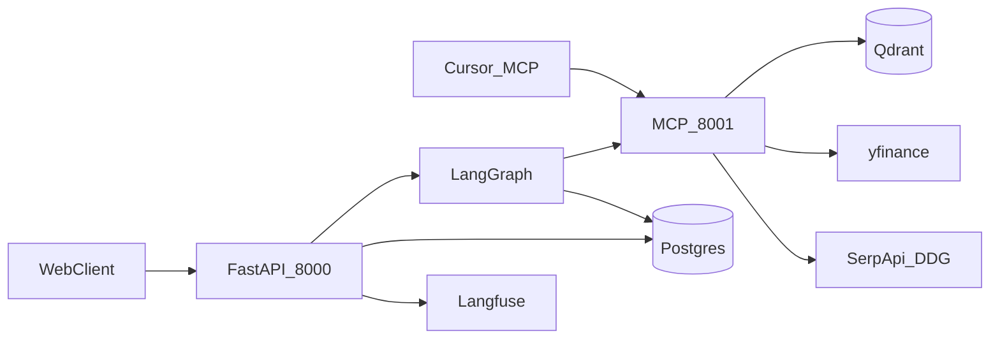
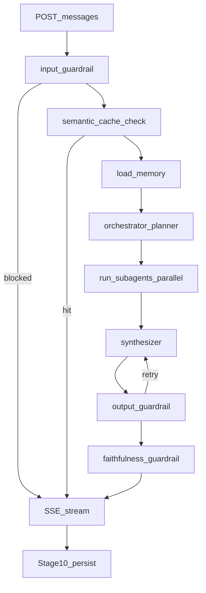
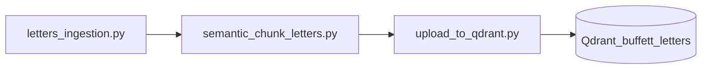

# ZimShire

**Buffett-first AI investment research assistant.** ZimShire helps investors research public companies through Warren Buffett's shareholder letters, live market data, and current web search — grounded in primary sources, not generic chatbot guesses.

ZimShire is **not** a stock screener, prediction engine, or financial advisor. It is a research companion that never generates personalized buy/sell recommendations, price targets, or portfolio advice.

---

## Assignment coverage (BeketTA)

| Task | Requirement | Implementation |
|------|-------------|----------------|
| **1 — Core Service** | Async FastAPI chat API, streaming, conversation persistence, provider-agnostic LLM | `app/main.py`, `app/modules/messages/`, LiteLLM gateway via `app/services/llm.py` |
| **2 — RAG Pipeline** | Buffett letters corpus, source attribution, `grounded: false` when unsupported | `scripts/` ingest pipeline, Qdrant hybrid search, `faithfulness_guardrail`, `rag_retrievals` table |
| **3 — Multi-Agent** | LangGraph, three data sources, checkpointed multi-turn sessions | `app/modules/agents/graph/`, planner + parallel subagents + synthesizer |
| **4 — MCP Server** | Standalone FastMCP process, typed tools | `mcp_server/` on port 8001 (stdio for Cursor, HTTP for LangGraph) |
| **5 — Observability** | Langfuse traces per query, token/cost capture | `app/services/langfuse_service.py`, `langfuse_trace_id` on every assistant turn |
| **6 — Guardrails** | Input / output / faithfulness | `app/modules/agents/pipeline/preflight.py`, `pipeline/safety.py` |
| **Bonus — Semantic cache** | Similar-query cache above threshold | `semantic_cache` table; `SEMANTIC_SIMILARITY_THRESHOLD` in `app/core/config.py` |
| **Bonus — Long-term memory** | Tracked companies and interests across sessions | LangGraph `AsyncPostgresStore`, `app/modules/chat_history/long_term/` |

---

## Architecture

### System overview

Two independent processes share the same codebase image but run separately:

| Process | Entry | Port | Role |
|---------|-------|------|------|
| **FastAPI** | `uvicorn app.main:app` | 8000 | REST API, SSE streaming, LangGraph execution, Postgres audit |
| **MCP (FastMCP)** | `python -m mcp_server.main` | 8001 | RAG, market (yfinance), web search tools |



**Process boundary:** `app/` never imports `mcp_server/` at runtime. Only offline scripts in `scripts/` may import MCP helpers for ingestion. All live data access goes through MCP SSE transport (`MCP_BASE_URL`).

### LangGraph pipeline

Each `POST /chats/{chat_id}/messages` runs the full graph before any text reaches the client (pseudo-SSE). Guardrails always see the complete draft.



Checkpointing uses `thread_id = str(chat_id)`. Multi-turn follow-ups ("Now compare that to banks in 1990") restore full conversation from Postgres checkpointer automatically.

### RAG ingest pipeline (offline, one-time)



---

## Tech stack

| Layer | Technology |
|-------|------------|
| HTTP API | FastAPI (async), SSE |
| Orchestration | LangGraph `StateGraph` |
| LLM / embeddings | LiteLLM via Zimran gateway (no provider SDKs) |
| Vector DB | Qdrant — hybrid dense + BM25 + ColBERT rerank |
| Relational DB | Postgres 16 + pgvector |
| LangGraph persistence | `langgraph-checkpoint-postgres`, `AsyncPostgresStore` |
| MCP | FastMCP (stdio + streamable-http) |
| Market data | yfinance (inside MCP process) |
| Web search | DuckDuckGo via SerpApi |
| Observability | Langfuse v4 |
| Containerization | Docker + docker-compose |

---

## Repository layout

```
zimshire/
├── app/
│   ├── main.py                 # FastAPI app, lifespan (MCP client, graph, store)
│   ├── core/                   # config, database, exceptions, prompts
│   ├── api/                    # router aggregation, health checks
│   ├── services/               # llm, embedding, langfuse_service
│   ├── models/                 # ORM registry (Alembic)
│   └── modules/
│       ├── users/              # POST/GET /users
│       ├── chats/              # POST/GET /chats
│       ├── messages/           # GET/POST /chats/{id}/messages (SSE)
│       ├── cache/              # semantic + market cache
│       ├── guardrails/         # guardrail_logs persistence
│       ├── rag_retrievals/     # citation audit
│       ├── chat_history/       # long/short-term memory endpoints
│       ├── inspect/            # /debug/* read-only inspect endpoints
│       └── agents/
│           ├── graph/          # builder, routing, state, schemas
│           ├── pipeline/       # preflight, planning, research, synthesis, safety
│           ├── runtime/        # service, graph_factory, mcp_client
│           └── mcp/            # tool registry, allowlists, wrappers
├── mcp_server/                 # separate MCP process (never imported from app/)
│   ├── main.py
│   ├── rag/                    # search_buffett_letters
│   ├── market/                 # yfinance tools
│   ├── search/                 # web_search*
│   └── ui/                     # *_ui PrefabApp tools for IDE clients
├── scripts/                    # offline ingest + setup
├── alembic/                    # Postgres migrations
├── tests/
├── docs/                       # detailed technical references
├── docker-compose.yaml
├── Dockerfile
└── .env.example
```

---

## Prerequisites

- **Docker** and **Docker Compose** (recommended path for reviewers)
- **Python 3.13** (matches `Dockerfile`)
- **LiteLLM virtual API key** from Zimran (`LITELLM_API_KEY`)
- **Langfuse** project keys (optional; traces degrade gracefully without them)
- **SerpApi key** for DuckDuckGo web search (`DUCKDUCKGO_API_KEY`)
- ~2 GB disk for Qdrant volume and fastembed model cache

---

## Environment variables

Copy the template and fill in secrets:

```bash
cp .env.example .env
```

| Variable | Required | Description |
|----------|----------|-------------|
| `DATABASE_URL` | yes | `postgresql+asyncpg://...` |
| `POSTGRES_*` | yes (Docker) | Postgres credentials for docker-compose |
| `QDRANT_URL` | yes | Qdrant HTTP endpoint |
| `QDRANT_COLLECTION` | no | Default `buffett_letters` |
| `MCP_BASE_URL` | yes | MCP SSE URL, e.g. `http://localhost:8001` |
| `LITELLM_BASE_URL` | yes | Gateway base URL |
| `LITELLM_API_KEY` | yes | Virtual key |
| `LITELLM_END_USER_ID` | yes | End-user ID header for gateway |
| `DEFAULT_CHAT_MODEL` | no | Chat session default |
| `ORCHESTRATOR_MODEL` | no | Planner + synthesizer |
| `SUBAGENT_MODEL` | no | RAG/market/web ReAct loops |
| `GUARDRAIL_MODEL` | no | Input/output/faithfulness classifiers |
| `MEMORY_MODEL` | no | Long-term memory extraction |
| `EMBEDDING_MODEL` | no | RAG query/index embeddings |
| `LANGFUSE_*` | no | Observability |
| `DUCKDUCKGO_API_KEY` | yes (web) | SerpApi for web subagent |
| `FAIL_OPEN_ON_GUARDRAIL_ERROR` | no | Default `true` |
| `SEMANTIC_SIMILARITY_THRESHOLD` | no | Semantic cache hit threshold (default `0.92`) |
| `SEMANTIC_CACHE_TTL_DAYS` | no | Semantic cache entry TTL (default `7`) |
| `MARKET_CACHE_TTL_HOURS` | no | yfinance cache TTL (default `1`) |
| `FAITHFULNESS_SCORE_THRESHOLD` | no | Fallback grounding min chunk score (default `0.40`) |
| `FAITHFULNESS_MIN_STRONG_HITS` | no | Fallback min strong chunks (default `2`) |
| `OUTPUT_GUARDRAIL_MAX_RETRIES` | no | Synthesizer retries on output violation (default `2`) |
| `SHORT_TERM_TURN_PAIRS` | no | Planner/synthesizer history window (default `5`) |

All runtime thresholds are defined in [app/core/config.py](app/core/config.py) and overridable via `.env`.

---

## Setup and launch

### A. Full Docker stack (recommended)

```bash
cp .env.example .env
# Edit .env — set LITELLM_API_KEY, LITELLM_END_USER_ID, DUCKDUCKGO_API_KEY, etc.

docker compose up -d --build
```

The `api` container automatically runs:

1. `alembic upgrade head`
2. `python scripts/setup_langgraph_tables.py`
3. `uvicorn app.main:app --host 0.0.0.0 --port 8000`

| Service | Container | Port | Purpose |
|---------|-----------|------|---------|
| postgres | zimshire-postgres | 5432 | App data + LangGraph checkpoints/store |
| qdrant | zimshire-qdrant | 6333 | Buffett letters vectors |
| mcp | zimshire-mcp | 8001 | MCP tools (LangGraph connects via SSE) |
| api | zimshire-api | 8000 | FastAPI + LangGraph |
| pgadmin | zimshire-pgadmin | 5050 | Optional DB UI |

Verify health:

```bash
curl http://localhost:8000/health
```

Expected `200`:

```json
{
  "status": "ok",
  "postgres": "ok",
  "qdrant": "ok",
  "mcp": "ok"
}
```

**Qdrant data safety:** Never run `docker compose down -v` — that deletes the `qdrantdata` volume and all indexed chunks. Use `docker compose down` without `-v`.

Swagger UI: `http://localhost:8000/docs`

### B. RAG corpus ingestion (one-time, before first letter-grounded query)

Run from repo root with Qdrant reachable and LiteLLM key set (dense embeddings use the gateway):

```bash
# 1. Download Berkshire shareholder letters (1977–2024) to data/letters/
python scripts/letters_ingestion.py

# 2. Semantic chunking (offline fastembed — no API calls)
python scripts/semantic_chunk_letters.py

# 3. Upload hybrid vectors to Qdrant
python scripts/upload_to_qdrant.py
```

Re-running upload is safe: point IDs are deterministic UUID5 hashes per `(year, chunk_index)`.

### C. Local development (without Docker for app processes)

```bash
cp .env.example .env

docker compose up -d postgres qdrant

python -m venv .venv
# Windows: .venv\Scripts\activate
# Linux/macOS: source .venv/bin/activate
pip install -r requirements.txt

alembic upgrade head
python scripts/setup_langgraph_tables.py

# Terminal 1 — MCP server
python -m mcp_server.main --transport streamable-http --port 8001

# Terminal 2 — API
uvicorn app.main:app --reload --port 8000
```

### D. MCP for Cursor / Claude Code (stdio)

Add to MCP config (adjust `cwd`):

```json
{
  "mcpServers": {
    "zimshire": {
      "command": "python",
      "args": ["-m", "mcp_server.main"],
      "cwd": "/path/to/zimshire"
    }
  }
}
```

For HTTP transport (same as LangGraph):

```bash
python -m mcp_server.main --transport streamable-http --port 8001
```

---

## API reference

**Base URL:** `http://localhost:8000`

**Public endpoints:** 9 (plus 4 debug inspect endpoints under `/debug/*`).

Models are configured server-side in `app/core/config.py` — clients do not pass model or provider overrides.

### End-to-end happy path

```bash
# 1. Create user
USER=$(curl -s -X POST http://localhost:8000/users \
  -H "Content-Type: application/json" \
  -d '{"name":"Alice","surname":"Researcher"}')
USER_ID=$(echo $USER | python -c "import sys,json; print(json.load(sys.stdin)['user_id'])")

# 2. Create chat
CHAT=$(curl -s -X POST http://localhost:8000/chats \
  -H "Content-Type: application/json" \
  -d "{\"user_id\":\"$USER_ID\",\"chat_title\":\"Apple moat analysis\"}")
CHAT_ID=$(echo $CHAT | python -c "import sys,json; print(json.load(sys.stdin)['chat_id'])")

# 3. Send research query (SSE)
curl -N -X POST "http://localhost:8000/chats/$CHAT_ID/messages" \
  -H "Content-Type: application/json" \
  -d "{\"user_id\":\"$USER_ID\",\"query\":\"How would Buffett evaluate Apple'\''s economic moat based on his letters?\"}"

# 4. Fetch history with sources
curl -s "http://localhost:8000/chats/$CHAT_ID/messages?user_id=$USER_ID"
```

---

### 1. `POST /users`

Create a user identity. Optional profile fields seed long-term memory.

**Request:**

```http
POST /users
Content-Type: application/json
```

```json
{}
```

or

```json
{
  "name": "Alice",
  "surname": "Researcher"
}
```

**Response `201`:**

```json
{
  "user_id": "3fa85f64-5717-4562-b3fc-2c963f66afa6",
  "name": "Alice",
  "surname": "Researcher",
  "created_at": "2026-05-24T10:00:00Z"
}
```

---

### 2. `GET /users/{user_id}`

**Response `200`:** same shape as create. **`404`** if not found.

---

### 3. `POST /chats`

**Request:**

```json
{
  "user_id": "3fa85f64-5717-4562-b3fc-2c963f66afa6",
  "chat_title": "Apple moat analysis"
}
```

**Response `201`:**

```json
{
  "chat_id": "a1b2c3d4-0000-0000-0000-000000000001",
  "user_id": "3fa85f64-5717-4562-b3fc-2c963f66afa6",
  "chat_title": "Apple moat analysis",
  "model": "gpt-4o-mini",
  "provider": "openai",
  "created_at": "2026-05-24T10:00:00Z",
  "updated_at": "2026-05-24T10:00:00Z"
}
```

`chat_id` is the sole session identifier; LangGraph uses `str(chat_id)` as `thread_id`.

---

### 4. `GET /chats/{chat_id}`

**Response `200`:** chat metadata. **`404`** if not found.

---

### 5. `GET /chats/{chat_id}/messages`

Requires ownership verification via query parameter.

**Request:**

```http
GET /chats/{chat_id}/messages?user_id={user_id}
```

**Response `200`:**

```json
{
  "chat_id": "a1b2c3d4-0000-0000-0000-000000000001",
  "messages": [
    {
      "message_id": "a1b2c3d4-0000-0000-0000-000000000000",
      "role": "human",
      "content": "How would Buffett evaluate Apple's economic moat?",
      "grounded": null,
      "sources": [],
      "langfuse_trace_id": null,
      "created_at": "2026-05-24T10:00:00Z"
    },
    {
      "message_id": "a1b2c3d4-0000-0000-0000-000000000001",
      "role": "assistant",
      "content": "Warren Buffett consistently emphasized...",
      "grounded": true,
      "sources": [
        {
          "letter_year": 1988,
          "passage": "The key to investing is not assessing how much an industry...",
          "similarity_score": 0.91,
          "qdrant_point_id": "6ba7b810-9dad-11d1-80b4-00c04fd430c8"
        }
      ],
      "langfuse_trace_id": "trace-abc123",
      "created_at": "2026-05-24T10:00:05Z"
    }
  ]
}
```

| `grounded` | Meaning |
|------------|---------|
| `true` | RAG ran; passages support the answer |
| `false` | RAG ran but claims not supported by retrieved passages |
| `null` | RAG not used (market/web-only or human message) |

**Status codes:** `403` wrong user, `404` chat not found.

---

### 6. `POST /chats/{chat_id}/messages` (SSE)

Send a research query. Response is **Server-Sent Events**.

**Request:**

```json
{
  "user_id": "3fa85f64-5717-4562-b3fc-2c963f66afa6",
  "query": "How would Buffett evaluate Apple's economic moat based on his letters?"
}
```

| Field | Type | Required | Notes |
|-------|------|----------|-------|
| `user_id` | uuid | yes | Must match chat owner |
| `query` | string | yes | Max 2000 characters |

**SSE event types:**

| Event | When |
|-------|------|
| `token` | Approved answer text (chunked after full pipeline) |
| `blocked` | Input guardrail rejected the query |
| `done` | Always last — includes `message_id`, `grounded`, `sources`, `langfuse_trace_id` |
| `error` | Graph failure before completion |

**Token stream:**

```
data: {"type": "token", "content": "Warren Buffett "}

data: {"type": "token", "content": "consistently emphasized that "}
```

**Done event:**

```
data: {
  "type": "done",
  "message_id": "a1b2c3d4-0000-0000-0000-000000000001",
  "grounded": true,
  "sources": [
    {
      "letter_year": 1988,
      "passage": "The key to investing...",
      "similarity_score": 0.91,
      "qdrant_point_id": "6ba7b810-9dad-11d1-80b4-00c04fd430c8"
    }
  ],
  "langfuse_trace_id": "trace-abc123",
  "cache_hit": false
}
```

**Input blocked:**

```
data: {"type": "blocked", "reason": "Query is not related to investment research."}

data: {"type": "done", "message_id": null, "grounded": null, "sources": [], "langfuse_trace_id": "trace-xyz"}
```

**Streaming model:** Pseudo-SSE — the graph runs to completion (guardrails, subagents, faithfulness), then the approved `draft_answer` is emitted as token events. This trades live LLM token streaming for full-pipeline safety.

**Python client example:**

```python
import httpx, json

async with httpx.AsyncClient(timeout=120) as client:
    async with client.stream(
        "POST",
        f"http://localhost:8000/chats/{chat_id}/messages",
        json={"user_id": str(user_id), "query": "How would Buffett evaluate Apple's moat?"},
    ) as response:
        async for line in response.aiter_lines():
            if line.startswith("data: "):
                event = json.loads(line[6:])
                if event["type"] == "token":
                    print(event["content"], end="", flush=True)
                elif event["type"] == "done":
                    print(f"\ngrounded={event['grounded']}")
```

---

### 7. `GET /users/{user_id}/memory/long-term`

Inspect LangGraph long-term store profile.

**Query params:** `query` (optional search string)

**Response `200`:**

```json
{
  "user_id": "3fa85f64-5717-4562-b3fc-2c963f66afa6",
  "search_query": "moat",
  "profile": {
    "tracked_companies": ["AAPL"],
    "research_interests": ["economic moat"],
    "preferences": {},
    "explicit_memories": []
  }
}
```

---

### 8. `GET /users/{user_id}/chats/{chat_id}/memory/short-term`

Inspect checkpointer conversation history.

**Query params:** `limit_turn_pairs` (default 5, max 20)

**Response `200`:**

```json
{
  "user_id": "3fa85f64-5717-4562-b3fc-2c963f66afa6",
  "chat_id": "a1b2c3d4-0000-0000-0000-000000000001",
  "thread_id": "a1b2c3d4-0000-0000-0000-000000000001",
  "turn_pairs": [{"human": "...", "assistant": "..."}],
  "formatted": "User: ...\nAssistant: ...",
  "message_count": 4
}
```

---

### 9. `GET /health`

Checks Postgres, Qdrant, and MCP connectivity.

**Response `200`:** all services ok. **`503`:** degraded (any dependency failed).

---

### Debug endpoints (not part of public API contract)

Read-only inspect views for development:

| Method | Path | Description |
|--------|------|-------------|
| `GET` | `/debug/semantic-cache` | Recent semantic cache entries |
| `GET` | `/debug/market-data-cache` | Market TTL cache rows |
| `GET` | `/debug/chats/{chat_id}/rag-retrievals` | RAG audit log for chat |
| `GET` | `/debug/chats/{chat_id}/guardrail-logs` | Guardrail evaluation log |

---

## MCP server

### Running

```bash
# stdio — Cursor / Claude Code
python -m mcp_server.main

# HTTP — LangGraph agent (docker-compose default)
python -m mcp_server.main --transport streamable-http --port 8001
```

Always run from **repo root** (`python -m mcp_server.main`), not from inside `mcp_server/`.

### Tool categories

| Category | Essential data tools | Notes |
|----------|---------------------|-------|
| **RAG** | `search_buffett_letters` | Hybrid Qdrant search over Buffett letters |
| **Market** | `lookup_ticker`, `get_stock_info`, `get_stock_price`, financials, news, etc. | yfinance, no API key |
| **Web** | `web_search`, `web_search_news`, `web_search_knowledge` | SerpApi DuckDuckGo |
| **UI** | `*_ui` variants | PrefabApp widgets for IDE only — **never** called by LangGraph |

Full tool reference: [docs/mcp_tools_reference.md](docs/mcp_tools_reference.md)

### Tools exposed to LangGraph subagents

Tag-filtered allowlist in `app/modules/agents/mcp/allowlists.py`:

- **rag:** `search_buffett_letters`
- **market:** 11 yfinance tools (lookup, info, price, financials, history, news, etc.)
- **web:** `web_search`, `web_search_news`, `web_search_knowledge`

UI-tagged tools and analyst-recommendation tools are excluded from the agent to avoid guardrail violations.

---

## Multi-agent system

### Design

Instead of one monolithic ReAct orchestrator, ZimShire uses a **planner → parallel executors → synthesizer** pattern:

1. **Orchestrator (planner)** — structured output `OrchestratorPlan`: selects 0–3 subagents (`rag`, `market`, `web`) with sub-queries and parameters. Sets `direct_answer_possible: true` for pure follow-up turns that need no data retrieval. No tool calls in this node.
2. **run_subagents** — runs enabled subagents in parallel via `asyncio.gather`. Skips all three when `direct_answer_possible` is set; each subagent still goes through a full `create_react_agent` ReAct loop but with zero tool calls enabled.
3. **Subagents** — independent ReAct loops with MCP tools filtered per agent type (`rag`, `market`, `web` allowlists).
4. **Synthesizer** — writes final `draft_answer` from `collected_context` and conversation history. Receives `feedback_message` from the output guardrail on retry turns.
5. **Guardrails** — output check with retry loop back to synthesizer (max `OUTPUT_GUARDRAIL_MAX_RETRIES` retries, default 2), then faithfulness scoring.

### Graph state fields

`ZimShireState` (TypedDict) holds all graph-visible data. Session identifiers that must not be checkpointed live in `RunnableConfig["configurable"]`:

| State field | Type | Purpose |
|-------------|------|---------|
| `messages` | `Annotated[list[BaseMessage], add_messages]` | Full conversation (LangChain message accumulator) |
| `query` | `str` | Current user query string |
| `user_profile` | `dict` | Long-term profile (tracked companies, interests, preferences) |
| `collected_context` | `dict` | Subagent output (`"rag"`, `"market"`, `"web"` keys — formatted strings) |
| `rag_agent_chunks` | `list[dict]` | Raw Qdrant hits for faithfulness check and audit |
| `rag_invoked` | `bool` | Whether RAG subagent ran this turn |
| `web_agent_sources` | `list[dict]` | Web search source metadata |
| `draft_answer` | `str` | Synthesizer output before guardrails |
| `grounded` | `bool \| None` | Faithfulness result; `None` when RAG not invoked |
| `sources` | `list[dict]` | Top RAG hits returned in `done` event |
| `feedback_message` | `str \| None` | Guardrail rewrite instruction for retry synthesizer call |
| `retry_count` | `int` | Output guardrail retry counter |
| `subagent_plan` | `dict` | Serialised `OrchestratorPlan` |
| `subagent_results` | `list[dict]` | Serialised `SubagentResult[]` per run |
| `direct_answer_possible` | `bool` | Planner flag: skip all data retrieval for follow-up answers |
| `cache_hit` | `bool` | Semantic cache hit flag |
| `input_blocked` | `bool` | Input guardrail blocked this query |
| `input_blocked_reason` | `str \| None` | Reason for input block |
| `output_blocked` | `bool` | Output guardrail blocked draft answer |
| `output_blocked_reason` | `str \| None` | Reason for output block |
| `output_rewritten` | `bool` | Guardrail replaced answer with safe fallback text |

**Config (not checkpointed):**

```python
RunnableConfig["configurable"] = {
    "thread_id": str(chat_id),
    "user_id": str(user_id),
    "chat_id": str(chat_id),
    "human_message_id": str(human_message_id),
}
```

### Subagent registry

New subagents are registered in `app/modules/agents/pipeline/research/registry.py`. Each implements `run(item, config) -> SubagentResult`.

Detailed architecture: [docs/agent_architecture.md](docs/agent_architecture.md)

---

## RAG pipeline — design and tradeoffs

### Corpus source

Warren Buffett's Berkshire Hathaway shareholder letters (1977–2024) from [berkshirehathaway.com/letters](https://www.berkshirehathaway.com/letters.html). Downloaded and cleaned by `scripts/letters_ingestion.py` (HTML + PDF parsing, header/footer stripping).

### Chunking strategy (`scripts/semantic_chunk_letters.py`)

**Approach:** Semantic chunking — not fixed character splits.

1. Split each letter into sentences (abbreviation-aware tokeniser).
2. Embed adjacent sentences locally with **fastembed** `BAAI/bge-small-en-v1.5` — no API cost at ingest.
3. Start a new chunk when cosine similarity between consecutive sentences drops below threshold (**0.65**).
4. Merge chunks shorter than **100 tokens** into neighbours; split chunks longer than **800 tokens** at sentence boundaries.
5. Prepend **50 overlap tokens** from the tail of the previous chunk. The overlap is stored separately in metadata (`overlap_prefix`) so `core_text` (without overlap) is always available. The Qdrant point stores the full `text` (with overlap) so retrieval benefits from the extra context without double-counting.

| Parameter | Value | Tradeoff |
|-----------|-------|----------|
| Threshold 0.65 | Fewer, topic-coherent chunks | Higher → better quality per chunk, lower boundary recall |
| Overlap 50 tokens | Context preserved across splits | Small storage redundancy; boundary queries return coherent passages |
| `BAAI/bge-small-en-v1.5` for boundaries | Free offline ingest | Model differs from query-time `text-embedding-3-small`; acceptable because boundary detection only needs relative similarity, not absolute alignment with query vectors |
| Min 100 / Max 800 tokens | Avoids micro-fragments and over-long passages | Short chunks waste Qdrant point overhead; long chunks dilute retrieval signal |

### Indexing (`scripts/upload_to_qdrant.py`)

Each chunk is stored in Qdrant collection `buffett_letters` with three vector types:

| Vector | Model | Purpose |
|--------|-------|---------|
| **dense** | LiteLLM `text-embedding-3-small` (1536-dim) | Semantic similarity |
| **sparse** | fastembed `qdrant/bm25` | Keyword matching |
| **multi** | ColBERT `answerdotai/answerai-colbert-small-v1` | Late-interaction reranking |

Point IDs: deterministic `uuid5(namespace, "{year}:{chunk_index}")` — safe re-ingestion.

### Runtime retrieval (`mcp_server/rag/tools.py`)

`search_buffett_letters(query, top_k=5, letter_years_filter=None)`:

1. **Dense query** via LiteLLM `text-embedding-3-small` (same model as ingest — ensures embedding space alignment).
2. **Sparse query** via fastembed BM25 tokeniser (keyword signal).
3. **RRF fusion** merges dense + sparse prefetch candidates.
4. **ColBERT rerank** inside Qdrant using late-interaction multivector similarity — each token in the query attends to each token in the passage.
5. Returns per-chunk: `letter_year`, `passage_snippet`, `similarity_score`, `rerank_score`, `chunk_index`, `qdrant_point_id`.

Optional `letter_years_filter` pushes a Qdrant payload filter so the model can retrieve "what did Buffett say about banks in 1990?" accurately.

| Tradeoff | Choice |
|----------|--------|
| Latency vs quality | Hybrid + ColBERT adds ~100–300ms vs pure dense; significantly better passage ranking for Buffett's long-form prose where keyword signals (e.g. "moat", "float", "retained earnings") matter alongside semantics |
| Three vectors per point | Increases Qdrant storage ~3×; enables state-of-art hybrid retrieval without an external reranker API or separate service |
| No external reranker | Keeps infrastructure self-contained (Qdrant + fastembed); ColBERT at 96-dim is smaller than full Cohere Rerank but sufficient for ~50-chunk candidate sets |

### Grounding and attribution

- Every assistant turn that used RAG can return `sources[]` with `letter_year` + passage snippet.
- `faithfulness_guardrail` compares `draft_answer` against `rag_agent_chunks`; sets `grounded: false` when claims are unsupported — never silently hallucinates letter content.
- Full retrieval audit in `rag_retrievals` Postgres table (one row per Qdrant hit per message).

---

## Guardrails — design and tradeoffs

Three LLM-based guardrails plus hard product rules in prompts.

| Guardrail | Purpose | Mechanism | On LLM failure |
|-----------|---------|-----------|----------------|
| **Input** | Block off-topic queries and prompt injection | `gpt-4o-mini` JSON classifier (`GUARDRAIL_INPUT_PROMPT`); checks investment-research relevance and injection patterns | Fail-open by default (`FAIL_OPEN_ON_GUARDRAIL_ERROR=true`) |
| **Output** | Block buy/sell advice, price targets, portfolio recommendations; check factual consistency vs collected context | `gpt-4o-mini` JSON classifier; violations trigger synthesizer retry with `feedback_message`; max **`OUTPUT_GUARDRAIL_MAX_RETRIES`** (default 2) retries then replaced with safe refusal text | Fail-open pass-through |
| **Faithfulness** | Verify that RAG-grounded answers are traceable to retrieved passages | Two-tier: (1) `gpt-4o-mini` LLM evaluates claim coverage (target ≥ 70%); (2) if LLM call fails, rule-based fallback counts chunks with `similarity_score ≥ FAITHFULNESS_SCORE_THRESHOLD` (default 0.40), requires ≥ `FAITHFULNESS_MIN_STRONG_HITS` (default 2) | Rule-based fallback always available |

### Output guardrail retry loop

```
synthesizer → output_guardrail
  → [violation + retry_count < OUTPUT_GUARDRAIL_MAX_RETRIES] → synthesizer (with feedback)
  → [violation + retries exhausted] → replace with safe refusal text
  → [pass] → faithfulness_guardrail
```

### Tradeoffs

| Decision | Rationale |
|----------|-----------|
| Fail-open on input LLM error | Availability for reviewers; configurable to fail-closed via `FAIL_OPEN_ON_GUARDRAIL_ERROR=false` |
| Full draft check before streaming (pseudo-SSE) | Client never sees unvetted content; trades live token streaming for complete safety pipeline |
| `grounded: false` does not block response | Transparency flag — user sees the answer with clear signal that RAG claims are unverified, rather than a silent refusal |
| Retry synthesizer, not subagents | Subagent data is unchanged; only the synthesis framing violated — re-running subagents would be wasteful and non-deterministic |
| Two-tier faithfulness (LLM + rule fallback) | LLM evaluation is more accurate but can fail; rule-based fallback prevents a broken guardrail LLM from silently making every answer appear grounded |
| Safe refusal text on retry exhaustion | After `OUTPUT_GUARDRAIL_MAX_RETRIES` failed rewrites, the synthesizer has proven unable to produce a safe answer from this context — replacing with a static redirect is safer than looping indefinitely |
| Separate `guardrail_logs` table | Every guardrail decision is auditable regardless of whether the message was persisted; required for compliance debugging |

All evaluations logged to `guardrail_logs` with `guardrail_type`, `result`, `confidence`, `blocked_reason`.

---

## Observability (Langfuse)

Every user query produces a Langfuse trace spanning:

- Graph node execution (via LangChain callbacks on subagent ReAct loops)
- MCP tool calls (wrapped with `observe_tool_call`)
- Token usage and cost at each LLM invocation

`langfuse_trace_id` is stored on every assistant `messages` row and returned in the SSE `done` event. Cache hits and input blocks still create minimal traces.

Implementation: `app/services/langfuse_service.py`. Gracefully disabled when `LANGFUSE_PUBLIC_KEY` / `LANGFUSE_SECRET_KEY` are unset.

---

## Memory and caching (bonus features)

### Semantic cache

Before running the full graph, `semantic_cache_check` embeds the query and searches `semantic_cache` (pgvector cosine similarity).

- **Threshold:** `SEMANTIC_SIMILARITY_THRESHOLD` (default `0.92`)
- **TTL:** `SEMANTIC_CACHE_TTL_DAYS` (default `7` days)
- On hit: returns cached `draft_answer` + `sources`, streams as SSE tokens, skips LLM orchestration

Tradeoff: high threshold avoids wrong-answer cache hits; may miss near-duplicates with different wording.

### Market data cache

Postgres `market_data_cache` with **`MARKET_CACHE_TTL_HOURS`** (default `1` hour) per `(ticker, data_type)`. Checked in `app/modules/agents/mcp/wrappers.py` before calling MCP yfinance tools. Reduces redundant network calls within a session.

### Long-term memory

LangGraph `AsyncPostgresStore` namespace `users/{user_id}/profile`. After each turn, `extract_memory_from_turn` (LLM) updates:

- `tracked_companies`
- `research_interests`
- `preferences`
- `explicit_memories`

Loaded in `load_memory` node and injected into orchestrator planner context. Inspect via `GET /users/{user_id}/memory/long-term`.

### Short-term memory

LangGraph Postgres checkpointer stores full `messages` list per `thread_id = str(chat_id)`. Restored automatically on every turn — no explicit resume API needed.

---

## Database overview

### Custom Postgres tables

| Table | Purpose |
|-------|---------|
| `users` | User identity (+ optional name/surname) |
| `chats` | Conversation sessions; `chat_id` = LangGraph `thread_id` |
| `messages` | Human and assistant turns; `grounded`, `langfuse_trace_id` |
| `rag_retrievals` | Audit log of Qdrant hits per assistant message |
| `guardrail_logs` | Input/output/faithfulness evaluation log |
| `market_data_cache` | TTL cache for yfinance responses |
| `semantic_cache` | pgvector cache of past Q&A pairs |

### LangGraph-managed tables

`checkpoints`, `checkpoint_blobs`, `checkpoint_writes` (short-term graph state), `store`, `store_vectors` (long-term memory). Created by `scripts/setup_langgraph_tables.py` — never modified via raw SQL from app code.

### Qdrant

Collection `buffett_letters` holds full chunk text + hybrid vectors. Postgres stores retrieval snapshots only.

Full schema: [docs/db_schema_reference.md](docs/db_schema_reference.md)

---

## Testing

```bash
pip install -r requirements.txt
pytest tests/ -v
```

| Test file | Coverage |
|-----------|----------|
| `test_guardrails.py` | Guardrail routing and behavior |
| `test_orchestrator_routing.py` | Graph routing functions |
| `test_tool_registry.py` | MCP tool tag filtering |
| `test_subagent_registry.py` | Subagent dispatch registry |
| `test_api_integration.py` | HTTP endpoints with mocked DB/services |
| `test_command_handlers.py` | Message command handlers |

Unit and integration tests use dependency overrides and mocks — no live Postgres/Qdrant/MCP required. Full E2E requires the Docker stack and ingested Qdrant corpus.

---

## Key design decisions

### 1. Provider-agnostic LLM layer (LiteLLM gateway only)

All LLM calls go through the Zimran LiteLLM gateway. No OpenAI, Anthropic, or Google SDK is imported directly — only `langchain_openai.ChatOpenAI` pointed at `LITELLM_BASE_URL` with a virtual key. This satisfies the assignment's hard requirement and means swapping models is a single env-var change. The tradeoff: debugging requires knowing which model slug is active; provider-specific features (e.g., Anthropic tool use API) are unavailable unless the gateway supports them.

### 2. Two-process architecture (FastAPI + MCP server)

MCP runs as a separate process (`mcp_server/`) connected to the API via streamable-HTTP SSE. Reasons:

- **Import isolation**: `app/` never imports `mcp_server/`. This is enforced at runtime and prevents FastAPI's async event loop from being contaminated by yfinance's blocking network I/O.
- **Dual transport**: The same MCP server runs `stdio` for Cursor/Claude Code and `streamable-http` for LangGraph — one codebase serves both IDE users and the agent.
- **Independent scaling**: MCP can be restarted without cycling the API (e.g., to refresh fastembed model cache).

Tradeoff: adds a network hop between FastAPI and tools; adds an extra healthcheck dependency.

### 3. Planner → parallel subagents → synthesizer (not one ReAct agent)

A single ReAct loop interleaving RAG, market, and web tool calls would produce unpredictable tool selection, sequential blocking calls, and a prompt that grows with every tool result. The planner pattern solves three problems:

- **Parallelism**: `asyncio.gather` runs all three subagents simultaneously — a query needing RAG + market data finishes in `max(rag_time, market_time)` not `rag_time + market_time`.
- **Focused context**: Each subagent sees only its relevant tools and a targeted sub-query, reducing hallucination from irrelevant context.
- **Structured routing**: `OrchestratorPlan` uses `with_structured_output()` so the planner always returns a valid JSON schema — no regex parsing, no partial-JSON failures.

Tradeoff: the planner's routing decision is opaque to the user; a wrong plan means wrong data even if individual subagents succeed.

### 4. Pseudo-SSE streaming (full pipeline before first token)

The graph runs to completion — including all guardrails — before any text is streamed to the client. The approved `draft_answer` is then emitted as token-sized SSE events. The alternative (streaming LLM tokens through the guardrail in real-time) would require buffering the full output anyway to run the output and faithfulness checks, making true streaming illusory unless the guardrails were weakened to per-sentence checks.

Tradeoff: first-token latency is higher than a naive streaming endpoint; reported `done` event contains all metadata including `grounded` and `sources`.

### 5. Semantic cache at similarity threshold 0.92

Before the graph runs, the query embedding is compared against all cached query embeddings in `semantic_cache` (pgvector cosine). A hit at ≥ 0.92 returns the cached answer directly, skipping all LLM calls. The very high threshold is intentional: at a lower threshold, semantically different questions ("what is Apple's P/E?") could match ("how high is Apple's P/E ratio?") and return stale data. Investment research queries are sensitive to small phrasing differences.

Tradeoff: cache hit rate is low for diverse query sets; cache value is highest for repeated or near-identical research sessions.

### 6. MCP tool allowlist with tag filtering

Each subagent receives exactly the tools it needs via `app/modules/agents/mcp/allowlists.py`. The `"ui"` tag is always excluded from agent-facing registrations — UI tools return `PrefabApp` objects that LLMs cannot meaningfully reason about. The market allowlist is also filtered by `data_type` so the market subagent does not see income statement tools when the orchestrator only asked for stock price.

Tradeoff: restricting tools can prevent creative multi-step reasoning; in practice Buffett-lens research maps cleanly onto the three categories.

### 7. `RunnableConfig` for session identifiers (not graph state)

`thread_id`, `user_id`, `chat_id`, and `human_message_id` are passed in `RunnableConfig["configurable"]`, not `ZimShireState`. This keeps checkpoint serialisation stable: adding a new session field doesn't corrupt existing checkpoints. It also prevents session IDs from being accidentally included in `add_messages` or other state reducers.

### 8. `grounded: null` vs `false` distinction

`grounded` has three values: `true` (RAG ran and claims are supported), `false` (RAG ran but claims are not supported), `null` (RAG was not invoked). This three-value signal lets clients and the audit trail distinguish between "RAG was unnecessary for this query" and "RAG ran but the synthesizer hallucinated". A binary true/false would conflate the latter two cases.

### 9. Deterministic Qdrant point IDs (`uuid5`)

Point IDs are `uuid5(NAMESPACE, f"{year}:{chunk_index}")`. Re-running `upload_to_qdrant.py` on the same corpus produces identical IDs and triggers Qdrant upsert rather than creating duplicates. This is essential for offline re-ingestion after letter text cleaning changes.

### 10. Per-role model assignment

| Role | Model | Rationale |
|------|-------|-----------|
| Orchestrator / synthesizer | `claude-sonnet-4-6` | Highest quality reasoning for plan generation and final answer synthesis |
| Subagents (RAG / market / web) | `claude-haiku-4-5` | Fast, cost-effective for tool-calling ReAct loops; quality needs are lower since they produce data, not final answers |
| Guardrails | `gpt-4o-mini` | Cross-provider to avoid feedback loops where a Claude model evaluates its own output; fast and cheap for JSON classification |
| Memory extraction | `claude-haiku-4-5` | Light extraction task; haiku is sufficient and cheaper than sonnet |

### 11. Long-term memory via LangGraph `AsyncPostgresStore`

User profiles (tracked companies, interests, preferences) are stored in LangGraph's native store rather than a custom table. This co-locates memory with checkpoints, uses the same Postgres connection pool, and provides vector-search capability (`store_vectors` table) without additional infrastructure. The tradeoff is that direct SQL queries against memory data require understanding LangGraph's internal namespace scheme (`users/{user_id}/profile`).

---

## Data sources and compliance

| Source | Usage | Cost |
|--------|-------|------|
| [berkshirehathaway.com/letters](https://www.berkshirehathaway.com/letters.html) | RAG corpus | Free |
| [yfinance](https://pypi.org/project/yfinance/) | Live market data | Free |
| DuckDuckGo via [SerpApi](https://serpapi.com/) | Web search | Free tier key required |

**Hard product rule:** ZimShire must never generate personalized investment recommendations or regulated financial advice. Enforced in system prompts, output guardrail, and MCP tool allowlists.

---

## Further reading

| Document | Contents |
|----------|----------|
| [docs/BeketTA.md](docs/BeketTA.md) | Original assignment specification |
| [docs/api_endpoints.md](docs/api_endpoints.md) | Detailed API contract |
| [docs/agent_architecture.md](docs/agent_architecture.md) | LangGraph nodes, state, subagents |
| [docs/assistant_flow.md](docs/assistant_flow.md) | End-to-end request lifecycle, DB read/write per stage |
| [docs/db_schema_reference.md](docs/db_schema_reference.md) | Postgres + Qdrant + LangGraph schemas |
| [docs/mcp_tools_reference.md](docs/mcp_tools_reference.md) | All MCP tools with examples |
| [docs/links.md](docs/links.md) | External documentation links |

---

## License

Private repository — Zimran AI Engineer test assignment.
