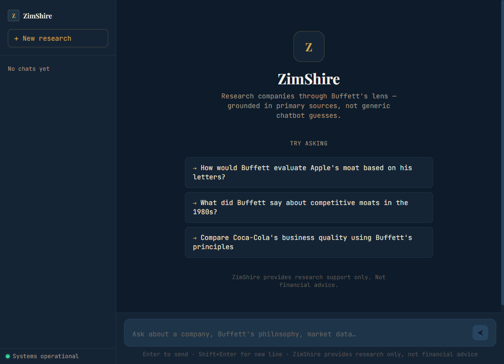
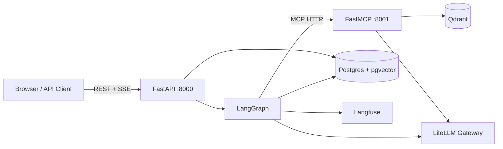

# ZimShire

**Buffett-first AI investment research assistant.** ZimShire helps investors research public companies through Warren Buffett's shareholder letters, live market data, and current web search — grounded in primary sources, not generic chatbot guesses.

> ZimShire is **not** a stock screener, prediction engine, or financial advisor. It is a research companion that never generates buy/sell recommendations, price targets, or portfolio advice — enforced at every layer of the system.

---

## UI



*Empty state: sidebar, starter prompt chips, health indicator. Dark navy + gold + JetBrains Mono aesthetic.*

---

## Assignment coverage

| Task | Requirement | Implementation |
|------|-------------|----------------|
| **1 — Core Service** | Async FastAPI, streaming, conversation persistence, provider-agnostic LLM | `app/main.py`, `app/modules/messages/`, `app/services/llm.py` (LiteLLM gateway) |
| **2 — RAG Pipeline** | Buffett letters corpus, source attribution, `grounded: false` on unsupported claims | `scripts/` ingest, Qdrant hybrid search (dense+BM25+ColBERT), `faithfulness_guardrail`, `rag_retrievals` table |
| **3 — Multi-Agent** | LangGraph, three data sources, checkpointed multi-turn sessions | `app/modules/agents/graph/`, planner → parallel subagents → synthesizer, `AsyncPostgresSaver` |
| **4 — MCP Server** | Standalone FastMCP process, typed tools, stdio + HTTP | `mcp_server/` on port 8001 — 15 data tools + 15 UI tools |
| **5 — Observability** | Langfuse traces per query, latency + token cost at every LLM call | `app/services/langfuse_service.py`, `langfuse_trace_id` on every assistant turn, ~46 observations per trace |
| **6 — Guardrails** | Input / output / faithfulness | `pipeline/preflight.py` (input), `pipeline/safety.py` (output + faithfulness) |
| **Bonus — Semantic cache** | Similar-query cache above threshold | `semantic_cache` table, pgvector similarity ≥ 0.92, 7-day TTL |
| **Bonus — Long-term memory** | Tracked companies and interests across sessions | `AsyncPostgresStore`, `app/modules/chat_history/long_term/` |

---

## Architecture

### Two-process design



| Process | Entry point | Port | Responsibility |
|---------|-------------|------|----------------|
| **FastAPI** | `uvicorn app.main:app` | 8000 | REST API, SSE streaming, LangGraph execution, Postgres audit |
| **FastMCP** | `python -m mcp_server.main` | 8001 | 3 data tool groups: RAG search, market data, web search |
| **Frontend** | nginx (built by `npm run build`) | 5173 | React 18 UI — proxies `/api/*` to the API service |

**Hard rule:** `app/` never imports from `mcp_server/`. All tool access goes through `MultiServerMCPClient` at runtime.

---

## LangGraph pipeline

### Graph topology


### Nodes

| Node | File | What it does |
|------|------|--------------|
| `input_guardrail` | `pipeline/preflight.py` | LLM JSON classifier (`gpt-4o-mini`), fail-open on LLM error |
| `semantic_cache_check` | `pipeline/preflight.py` | embed query → pgvector cosine ≥ 0.92 → skip full pipeline |
| `load_memory` | `pipeline/preflight.py` | Load long-term profile from `AsyncPostgresStore` |
| `orchestrator` | `pipeline/planning.py` | `with_structured_output(OrchestratorPlan)` — selects 0–3 subagents |
| `run_subagents` | `pipeline/research/runner.py` | `asyncio.gather` over RAG / market / web subagents in parallel |
| `synthesizer` | `pipeline/synthesis.py` | `llm.astream()` — tokens streamed in real-time via SSE |
| `output_guardrail` | `pipeline/safety.py` | LLM full-context check (safety + factual), max 2 retries → synthesizer |
| `faithfulness_guardrail` | `pipeline/safety.py` | LLM grounding check + similarity threshold 0.40 → `grounded` + `sources` |

### Models (via LiteLLM gateway)

| Role | Model |
|------|-------|
| Orchestrator + Synthesizer | `claude-sonnet-4-6` |
| RAG / Market / Web subagents | `claude-haiku-4-5` |
| Guardrails (input / output / faithfulness) | `gpt-4o-mini` |
| Memory extraction | `claude-haiku-4-5` |
| Embeddings | `text-embedding-3-small` (1536-dim) |

---

## Real-time SSE streaming

Streaming uses LangGraph's `stream_mode=["messages","values"]`:
- `"messages"` → `(AIMessageChunk, metadata)` per token from `synthesizer` node → forwarded immediately as SSE
- `"values"` → full state dict after each node completes → drives progress events

### SSE event types

| Type | When | Payload |
|------|------|---------|
| `progress` | Before slow stages (subagents, synthesis) | `{type, stage, message}` |
| `token` | Real LLM synthesis tokens, real-time | `{type, content}` |
| `replace` | Output guardrail rewrote already-streamed content | `{type, content}` |
| `blocked` | Input guardrail rejected query | `{type, reason}` |
| `error` | Unhandled graph exception | `{type, detail}` |
| `done` | Always the final event | `{type, message_id, grounded, sources, langfuse_trace_id, cache_hit}` |

### Typical stream

```
data: {"type":"progress","stage":"rag","message":"Searching Buffett letters…"}
data: {"type":"progress","stage":"synthesizing","message":"Composing answer…"}
data: {"type":"token","content":"## GEICO's Underwriting Discipline"}
data: {"type":"token","content":"\n\nBuffett returned to GEICO's…"}
…
data: {"type":"done","message_id":"uuid","grounded":true,
       "sources":[{"letter_year":1995,"passage":"…","similarity_score":0.49}],
       "langfuse_trace_id":"abc123","cache_hit":false}
```

---

## RAG pipeline

### Ingestion (offline, once)

```bash
python scripts/letters_ingestion.py          # download + clean 1977–2024 letters
python scripts/semantic_chunk_letters.py     # semantic chunking → data/semantic_chunks.json
python scripts/upload_to_qdrant.py \
  --chunks-json data/semantic_chunks.json    # upload to Qdrant
```

**Chunking strategy:** Semantic breakpoints via cosine similarity (threshold 0.65) between adjacent sentence embeddings using BAAI/bge-small-en-v1.5 locally. Chunks: 100–800 tokens, 50-token overlap. Three vector spaces per point:
- `dense` — `text-embedding-3-small` 1536-dim cosine (LiteLLM gateway)
- `sparse` — BM25 with IDF modifier
- `multi` — ColBERT late-interaction 96-dim MAX_SIM

**Retrieval:** Dense + sparse prefetch with RRF fusion → ColBERT reranking inside Qdrant. Point IDs are deterministic `uuid5(namespace, f"{year}:{chunk_index}")` — safe to re-ingest.

### Faithfulness grounding

`faithfulness_guardrail` evaluates the synthesized answer against retrieved passages via LLM. Strong-hit threshold: `similarity_score ≥ 0.40` (calibrated for `text-embedding-3-small`'s cosine scale — relevant passages score 0.35–0.55). The `grounded` flag and `sources` list in the `done` event come from this node.

---

## Guardrails

### Input

LLM JSON classifier (`gpt-4o-mini`) checks for off-topic queries, prompt injection, personal investment advice. **Fails open** — if the LLM call throws, the query passes through to avoid blocking legitimate research during service degradation.

### Output

Single LLM call against the **full collected context** (RAG + market + web + user profile + conversation history). Checks simultaneously:
1. **Safety** — buy/sell recommendations, price targets, personalized portfolio advice
2. **Factual** — claims not traceable to any context source

On violation: `feedback_message` written to state, graph retries `synthesizer` (max 2 retries). On exhaustion: `draft_answer` replaced with safe fallback + `replace` SSE event sent to client.

### Faithfulness

Runs only when `rag_invoked=True`. LLM evaluates answer grounding; similarity fallback used if LLM throws. Sets `grounded: true/false/null` and populates `sources`.

---

## Semantic caching

Queries embedded and compared against `semantic_cache` via pgvector. On cosine ≥ 0.92: cached answer re-streamed as SSE tokens, no LLM pipeline run. TTL: 7 days. A Langfuse trace is created even on cache hits.

---

## Long-term memory

`AsyncPostgresStore` under namespace `("users", user_id, "interests")`. `load_memory` reads tracked companies and research interests; `persist_assistant_turn` writes new interests after each turn. Available via `GET /users/{id}/memory/long-term`.

---

## Setup

### Prerequisites

- Docker + Docker Compose
- `.env` at repo root

### Environment variables

| Variable | Purpose |
|----------|---------|
| `LITELLM_BASE_URL` | LiteLLM proxy base URL |
| `LITELLM_API_KEY` | Virtual key |
| `LITELLM_END_USER_ID` | End-user header for billing |
| `DATABASE_URL` | Postgres async DSN (`postgresql+asyncpg://...`) |
| `QDRANT_URL` | Qdrant HTTP endpoint |
| `MCP_BASE_URL` | MCP server (`http://localhost:8001`) |
| `LANGFUSE_PUBLIC_KEY` | Langfuse public key |
| `LANGFUSE_SECRET_KEY` | Langfuse secret key |
| `LANGFUSE_BASE_URL` | Langfuse host |
| `DUCKDUCKGO_API_KEY` | SerpApi key for web search |

### Services and ports

| Service | Container | Port | Description |
|---------|-----------|------|-------------|
| FastAPI | `zimshire-api` | 8000 | REST API + SSE streaming |
| FastMCP | `zimshire-mcp` | 8001 | RAG / market / web tools |
| **Frontend** | `zimshire-frontend` | **5173** | React UI (nginx serving built app) |
| Postgres | `zimshire-postgres` | 5432 | Database |
| Qdrant | `zimshire-qdrant` | 6333 | Vector store |
| pgAdmin | `zimshire-pgadmin` | 5050 | DB admin UI |

### Quick start

```bash
# 1. Start all services (Postgres, Qdrant, MCP, API, Frontend)
docker compose up -d

# 2. Migrate database
alembic upgrade head

# 3. Ingest Buffett letters (one-time, ~5–10 min)
python scripts/letters_ingestion.py
python scripts/semantic_chunk_letters.py
python scripts/upload_to_qdrant.py --chunks-json data/semantic_chunks.json

# 4. Open the UI
open http://localhost:5173

# 5. Verify backend
curl http://localhost:8000/health
# {"status":"ok","postgres":"ok","qdrant":"ok","mcp":"ok"}
```

### Local dev (frontend hot-reload, no Docker for app services)

```bash
# Infrastructure only
docker compose up -d postgres qdrant

# Backend services (hot-reload)
python -m mcp_server.main --transport streamable-http --port 8001
uvicorn app.main:app --reload --port 8000

# Frontend (hot-reload, Vite proxy → localhost:8000)
cd frontend && npm install && npm run dev
# → http://localhost:5173
```

### Frontend (React UI)

| Mode | Command | URL |
|------|---------|-----|
| Docker (production build) | `docker compose up -d frontend` | `http://localhost:5173` |
| Local dev (hot-reload) | `cd frontend && npm install && npm run dev` | `http://localhost:5173` |

The Docker image builds with `node:20-alpine` → `nginx:alpine`. nginx proxies `/api/*` to the `api` service and serves the SPA from `/usr/share/nginx/html`. The `proxy_buffering off` directive is required for SSE streaming to work through nginx.

### MCP server for Cursor / Claude Code

```json
{
  "mcpServers": {
    "zimshire": {
      "command": "python",
      "args": ["-m", "mcp_server.main"],
      "cwd": "/path/to/zimshire"
    }
  }
}
```

---

## API reference (13 endpoints)

**Base URL:** `http://localhost:8000`

### Core endpoints

| Method | Path | Status | Description |
|--------|------|--------|-------------|
| `POST` | `/users` | 201 | Create user |
| `GET` | `/users/{user_id}` | 200/404 | Get user |
| `POST` | `/chats` | 201 | Create chat session |
| `GET` | `/chats/{chat_id}` | 200/404 | Get chat metadata |
| `GET` | `/chats/{chat_id}/messages?user_id=` | 200/403/404 | Conversation history |
| `POST` | `/chats/{chat_id}/messages` | 200 SSE | **Streaming research turn** |
| `GET` | `/health` | 200/503 | Postgres + Qdrant + MCP health |

### Memory endpoints

| Method | Path | Description |
|--------|------|-------------|
| `GET` | `/users/{user_id}/memory/long-term` | Long-term profile (tracked companies, interests) |
| `GET` | `/users/{user_id}/chats/{chat_id}/memory/short-term` | Recent turn pairs from checkpointer |

### Debug / Inspect endpoints

| Method | Path | Description |
|--------|------|-------------|
| `GET` | `/debug/semantic-cache?limit=50` | All semantic cache entries |
| `GET` | `/debug/market-data-cache?limit=100` | Market data TTL cache rows |
| `GET` | `/debug/chats/{chat_id}/rag-retrievals?limit=200` | RAG chunks for a chat |
| `GET` | `/debug/chats/{chat_id}/guardrail-logs?limit=200` | Guardrail decisions for a chat |

### Example payloads

```bash
# Create user
curl -X POST http://localhost:8000/users \
  -H "Content-Type: application/json" \
  -d '{"name": "Alice", "surname": "Smith"}'
# → {"user_id": "uuid", "created_at": "..."}

# Create chat
curl -X POST http://localhost:8000/chats \
  -H "Content-Type: application/json" \
  -d '{"user_id": "uuid", "chat_title": "Apple moat analysis"}'
# → {"chat_id": "uuid", "model": "gpt-4o-mini", ...}

# Stream a research query
curl -N -X POST http://localhost:8000/chats/{chat_id}/messages \
  -H "Content-Type: application/json" \
  -d '{"user_id": "uuid", "query": "How would Buffett evaluate Apple'\''s moat?"}'
```

---

## Project layout

```
zimshire/
  app/
    main.py                          # FastAPI app + lifespan
    core/
      config.py                      # Settings (pydantic-settings + .env)
      prompts.py                     # All LLM prompts
      exceptions.py                  # NotFoundError, ForbiddenError, DomainError
    services/
      llm.py                         # Per-role model factories
      embedding.py                   # embed_text()
      langfuse_service.py            # CallbackHandler, get_trace_id, flush
    modules/
      agents/
        graph/
          state.py                   # ZimShireState TypedDict
          builder.py                 # build_graph()
          routing.py                 # route_after_input/cache/output_guardrail
          schemas.py                 # OrchestratorPlan, SubagentPlanItem, SubagentResult
        runtime/
          service.py                 # init_graph, get_graph, get_store
          mcp_client.py              # MultiServerMCPClient
        mcp/
          registry.py                # ToolRegistry, matches_agent
          allowlists.py              # Tag-based tool filtering
          wrappers.py                # get_agent_tools, market cache wrapper
        pipeline/
          preflight.py               # input_guardrail, semantic_cache_check, load_memory
          planning.py                # orchestrator
          synthesis.py               # synthesizer (llm.astream)
          safety.py                  # output_guardrail, faithfulness_guardrail
          research/
            runner.py                # run_subagents (asyncio.gather)
            react.py                 # run_react_subagent + extract_artifacts
            subagents.py             # run_rag/market/web_subagent
            registry.py              # SUBAGENT_REGISTRY
      messages/
        turn_service.py              # stream_turn — dual-mode graph streaming
  mcp_server/                        # Separate process
    rag/tools.py                     # search_buffett_letters (hybrid RAG)
    market/tools.py                  # 12 yfinance tools
    search/tools.py                  # web_search, web_search_news, web_search_knowledge
    ui/                              # IDE-only DataTable UI tools
  scripts/
    letters_ingestion.py             # Download + clean Buffett letters
    semantic_chunk_letters.py        # Semantic chunking
    upload_to_qdrant.py              # Upload to Qdrant (dense+sparse+ColBERT)
  tests/                             # 44 tests total
```

---

## Key design decisions

| Decision | Rationale | Tradeoff |
|----------|-----------|----------|
| **Planner + parallel subagents + synthesizer** (3 nodes) | Structured planning separates "which sources" from "call sources" from "write answer"; parallel subagents cut wall time by 3× | More graph nodes; extra state serialisation per checkpoint |
| **Input guardrail: LLM classifier, fail-open** | Single fast `gpt-4o-mini` call; fail-open avoids blocking legitimate queries during LLM degradation | LLM classifier can occasionally misclassify borderline queries |
| **Output guardrail: full context passed** | Single pass detects both hallucinations (vs collected_context) and safety violations; answer text alone cannot reveal hallucinated facts | Larger prompt per guardrail call; mitigated by cheap model |
| **Faithfulness threshold 0.40** (not 0.75) | `text-embedding-3-small` cosine scores for relevant passages fall in 0.35–0.55, not 0.7–0.9; 0.75 produced `sources=[]` for every response | Lower threshold includes more chunks in `sources`; calibrated against real retrieval data |
| **Real-time streaming via `stream_mode=["messages","values"]`** | LangGraph 1.2.2 dual-mode: tokens streamed as they're generated; `"values"` updates drive progress events at stage boundaries | Guardrail may rewrite after tokens stream — client handles `replace` event |
| **Semantic cache at cosine 0.92** | High threshold prevents false positives; near-identical queries get instant responses | Paraphrased versions of the same question miss the cache |
| **`grounded=null` for non-RAG answers** | Faithfulness undefined for market/web-only answers; distinguishes "not checked" from "failed check" | Client must handle three states: `true`, `false`, `null` |
| **MCP as separate process** | External clients (Cursor, Claude Code) use the same tools; yfinance blocking calls don't block the async FastAPI event loop | Extra network hop per subagent call; RAG search over MCP adds ~20–30s per query |

---

## Observability (Langfuse)

Every request produces a trace with ~46 observations:

```
LangGraph (userId ✓, sessionId ✓)
  ├── input_guardrail [CHAIN] → gpt-4o-mini [GENERATION]
  ├── semantic_cache_check [CHAIN]
  ├── load_memory [CHAIN]
  ├── orchestrator [CHAIN] → claude-sonnet-4-6 [GENERATION]
  ├── run_subagents [AGENT]
  │   ├── agent [AGENT] → claude-haiku-4-5 [GENERATION]
  │   └── search_buffett_letters [TOOL] × N
  ├── synthesizer [CHAIN] → claude-sonnet-4-6 [GENERATION] (streaming)
  ├── output_guardrail [CHAIN] → gpt-4o-mini [GENERATION]
  └── faithfulness_guardrail [CHAIN] → gpt-4o-mini [GENERATION]
```

`langfuse_trace_id` is stored on every assistant `messages` row for audit.

---

## Tests

```bash
pytest tests/ -v   # 44 tests, ~10s
```

| File | Tests | Coverage |
|------|-------|----------|
| `test_api_integration.py` | 11 | Users, chats, message history, auth (403/404) |
| `test_streaming.py` | 8 | SSE event ordering, progress/replace/blocked/cache-hit paths |
| `test_guardrails.py` | 10 | input_guardrail, output_guardrail, faithfulness_guardrail nodes |
| `test_tool_registry.py` | 5 | ToolRegistry CRUD + tag filtering |
| `test_subagent_registry.py` | 5 | SubagentRegistry + runner |
| `test_orchestrator_routing.py` | 5 | Route functions + short-term memory |
