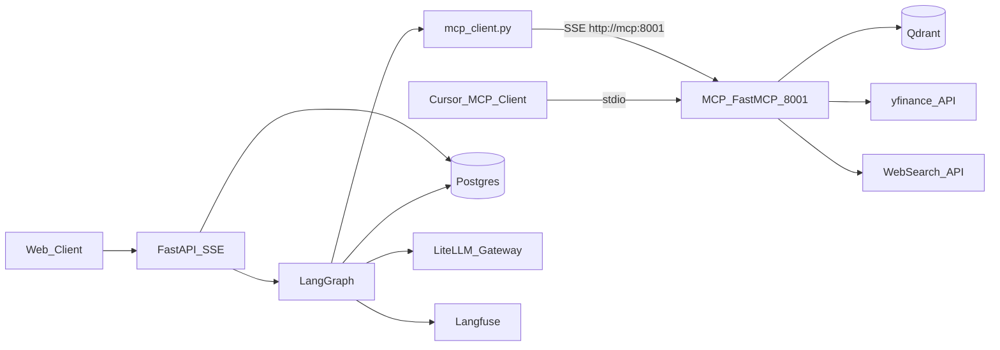

# ZimShire — Cursor context

AI investment **research** assistant (Buffett-first lens). Not a screener, prediction engine, or financial advisor. Hard rule: **no buy/sell recommendations, price targets, or personalized portfolio advice** — enforced in `output_guardrail` at every layer.

**Deadline (assignment):** 29 May 2026, 19:00.

---

## Documentation index

| File | Purpose |
|------|---------|
| [docs/BeketTA.md](docs/BeketTA.md) | Official assignment spec (Tasks 1–6, bonus, requirements) |
| [docs/db_schema_reference.md](docs/db_schema_reference.md) | Postgres custom tables, Qdrant, LangGraph storage, RAG persist examples |
| [docs/assistant_flow.md](docs/assistant_flow.md) | End-to-end request lifecycle; what to READ/WRITE per stage |
| [docs/agent_architecture.md](docs/agent_architecture.md) | LangGraph topology, state, nodes, MCP, project layout |
| [docs/implementation_plan.md](docs/implementation_plan.md) | Phased build order and acceptance criteria |
| [docs/qa.md](docs/qa.md) | **LiteLLM + LangGraph stack**, gateway models, `.env` variables (no secret values in docs) |
| [docs/links.md](docs/links.md) | External Qdrant / LangGraph / Langfuse doc URLs |

---

## Assignment → implementation map

| Task | Requirement | Where in codebase / docs |
|------|-------------|---------------------------|
| **1** | FastAPI async chat API, runtime model/provider, **SSE streaming**, conversation persistence | Phase 5; `POST /chats/{chat_id}/messages` |
| **2** | RAG over Buffett letters, source attribution (year + passage), `grounded: false` when not supported; chunking in README | Phase 2; Qdrant `buffett_letters`; `rag_retrievals` audit |
| **3** | Multi-agent **LangGraph**, RAG + yfinance + web, **checkpointing** by `thread_id` | `app/graph/`; `AsyncPostgresSaver` |
| **4** | Standalone **FastMCP** server, typed tools, separate process | `mcp_server/` (`python -m mcp_server.main`); docker `mcp` service |
| **5** | **Langfuse** traces per user query (latency, tokens, cost) | `messages.langfuse_trace_id` |
| **6** | Input / output / faithfulness guardrails + `guardrail_logs` | Graph nodes + README tradeoffs |
| **Bonus** | Semantic cache (`semantic_cache`), long-term memory (`store`) | Nodes `semantic_cache_check`, `load_memory` |

**Stack:** **LangGraph** (orchestration) + **LiteLLM** (all LLM/embeddings via Zimran gateway). No direct provider SDK keys. Details, model whitelist, and `.env` variable names: [docs/qa.md](docs/qa.md). Secret values only in root `.env` (gitignored).

---

## System architecture (short)



| Layer | Role |
|-------|------|
| **FastAPI** | REST, SSE, persist `users` / `chats` / `messages`, bulk `rag_retrievals`, run `graph.astream()` |
| **LangGraph** | `load_memory` → `orchestrator` (subagent tools) → guardrails; checkpointer for multi-turn |
| **`mcp_server/services/`** | Qdrant, yfinance, web search — only imported inside `mcp_server/server.py`; graph calls via SSE |
| **`app/services/`** | LLM wrappers, embeddings, Langfuse helpers — used within FastAPI/graph only |
| **Postgres (custom)** | UI/audit: messages, rag_retrievals, guardrail_logs, caches |
| **Postgres (LangGraph)** | `checkpoints*`, `store*` — do not write raw SQL; use LangGraph APIs |
| **Qdrant** | Full corpus at runtime (read); offline ingest only |

**Two processes:** `uvicorn app.main:app` (port 8000) and `python -m mcp_server.main --transport sse --port 8001` (data tools only). Graph nodes connect to MCP via SSE. MCP must not duplicate service logic.

---

## Critical invariants

1. **LangGraph `config["configurable"]["thread_id"]` === `str(chat_id)`** — derived from the chat row PK, not stored separately in `chats`.
2. **`thread_id`, `user_id`, `chat_id`, `model`, `human_message_id`** live in `RunnableConfig["configurable"]`, not in graph state (checkpoint serialization).
3. **RAG hits in graph state** (`rag_agent_chunks`); **`rag_retrievals` rows only in FastAPI Stage 10** after `assistant` `message_id` exists.
4. **One Qdrant search → k rows in `rag_retrievals`** (same `message_id`, different `qdrant_point_id`). Do not store all hits in one JSON column unless you deliberately change the schema.
5. **MCP tools = data only**; guardrails, `grounded`, streaming synthesis stay in FastAPI + LangGraph.
6. **Product principle:** research companion; rewrite/block regulated-advice patterns.
7. **`draft_answer` never reaches the client before `output_guardrail` completes.** Orchestrator uses `ainvoke`; SSE streaming happens in FastAPI after the graph run, using `final_state["draft_answer"]`.

---

## Request flow (stages)

Multi-turn: skip registration + new chat; start at human message.

| Stage | What happens |
|-------|----------------|
| 1 | `POST /users` → `users`, optional `store` profile |
| 2 | `POST /chats` → `chats` row with new `chat_id` (server-generated) |
| 3 | Human message → `messages`; load `chats`; restore checkpoint |
| 4 | `input_guardrail` → `guardrail_logs`; may END early |
| 5 | `semantic_cache_check` → optional skip graph; Langfuse trace created even on cache hit |
| 6 | Graph: `load_memory` (ST+LT) → `orchestrator` (subagent tools: `rag_agent` / `market_agent` / `web_agent`) |
| 7 | `orchestrator` buffers complete `draft_answer` in graph state — no client streaming yet |
| 8 | `output_guardrail` → checks full `draft_answer`; may rewrite; `guardrail_logs` |
| 9 | `faithfulness_guardrail` → `grounded`, `sources`; `guardrail_logs` |
| 9.5 | FastAPI streams approved `draft_answer` to client as SSE token events |
| 10 | Persist: `messages` (assistant), **N × `rag_retrievals`**, `semantic_cache`, `store.aput`, `chats.updated_at` |

Detail: [docs/assistant_flow.md](docs/assistant_flow.md).

---

## LangGraph graph (MVP topology)

```
START → input_guardrail → (blocked? END) → semantic_cache_check → (hit? END)
      → load_memory → orchestrator → output_guardrail → faithfulness_guardrail → END
```

**Orchestrator** calls subagent tools (`rag_agent`, `market_agent`, `web_agent`) only when needed — no separate planner node.

**State (`ZimShireState`):** `messages`, `query`, `user_preferences`, `rag_agent_chunks`, `rag_agent_result`, `rag_invoked`, `web_agent_sources`, `web_agent_result`, `market_agent_result`, `draft_answer`, `grounded`, `sources`, guardrail/cache flags. See [agent_architecture.md](docs/agent_architecture.md) §3.

Full node specs and code samples: [docs/agent_architecture.md](docs/agent_architecture.md).

---

## Postgres custom tables (summary)

| Table | Notes |
|-------|--------|
| `users` | Root identity |
| `chats` | `chat_id` PK (= LangGraph `thread_id` as `str(chat_id)`), `model`, `provider` |
| `messages` | `role` human/assistant; `grounded`, `langfuse_trace_id` on assistant |
| **`rag_retrievals`** | **One row per Qdrant point (chunk)** from top-k search; see below |
| `guardrail_logs` | `input` / `output` / `faithfulness` |
| `market_data_cache` | TTL cache for yfinance |
| `semantic_cache` | pgvector query → cached response |

LangGraph-managed (no direct SQL): `checkpoints`, `checkpoint_blobs`, `checkpoint_writes`, `store`, `store_vectors`.

Full DDL and examples: [docs/db_schema_reference.md](docs/db_schema_reference.md).

---

## RAG and `rag_retrievals` (important)

**Qdrant:** one collection `buffett_letters`; **one point = one chunk** (vector + payload: `letter_year`, `chunk_index`, `text`, `source_file`).

**Point IDs:** deterministic `uuid5(namespace, f"{letter_year}:{chunk_index}")` for idempotent re-ingest.

**Search:** `query_points` with `limit=top_k` (default 5). Optional filter on `letter_year`; optional [Grouping API](https://qdrant.tech/documentation/search/search/#grouping-api) for diversity across years.

**Postgres audit (`rag_retrievals`):**

| Column | Meaning |
|--------|---------|
| `message_id` | Assistant message FK |
| `qdrant_collection` | e.g. `buffett_letters` |
| `qdrant_point_id` | **Single chunk** id (string) |
| `rank` | 0 = best match |
| `letter_year`, `passage_snippet`, `similarity_score` | Denormalized at retrieval time |
| `used_in_response` | Set true if cited in final answer |

**Unique:** `(message_id, qdrant_collection, qdrant_point_id)`.

**Persist pattern:** loop `rag_agent_chunks` → `RagRetrievalRepo.bulk_create` (or N `create` calls). API `sources[]` mirrors faithfulness output from strong hits.

Assignment **does not name** this table; it requires attribution + faithfulness. Table is internal audit for citations and grading.

---

## API surface (target)

| Method | Path | Action |
|--------|------|--------|
| `POST` | `/users` | Create user |
| `GET` | `/users/{user_id}` | Get user metadata |
| `POST` | `/chats` | Create chat (server generates `chat_id`) |
| `GET` | `/chats/{chat_id}` | Chat metadata |
| `GET` | `/chats/{chat_id}/messages` | Conversation history |
| `POST` | `/chats/{chat_id}/messages` | **Streaming** research turn (SSE) — tokens delivered after guardrails |
| `GET` | `/health` | Health check (Postgres + Qdrant + MCP) |

Assistant response shape (after persist):

```json
{
  "message_id": "uuid",
  "content": "...",
  "grounded": true,
  "sources": [{ "letter_year": 1988, "passage": "...", "similarity_score": 0.87, "qdrant_point_id": "uuid" }],
  "langfuse_trace_id": "..."
}
```

---

## MCP server (Task 4)

**Tools (required):** `search_buffett_letters`, `get_market_data`, `web_search` — all delegate to `mcp_server/services/`.

**Optional:** resources `zimshire://letters/years`, `zimshire://policy/research`; prompts `analyze_moat`, `margin_of_safety`.

**Do not expose via MCP:** full graph, guardrails, `rag_retrievals`, semantic cache, LiteLLM synthesis.

Cursor config example in [docs/agent_architecture.md §11.7](docs/agent_architecture.md).

---

## Recommended project layout

```
zimshire/
  app/
    main.py
    core/                # config.py, prompts.py, dependencies.py
    routers/             # users.py, chats.py, messages.py (SSE), health.py
    graph/
      state.py
      routing.py
      builder.py
      mcp_client.py      # MultiServerMCPClient → MCP_BASE_URL (SSE)
      tools/
        subagents.py     # rag_agent, market_agent, web_agent
      nodes/
        guardrails.py    # input / output / faithfulness
        cache.py         # semantic_cache_check
        memory.py        # load_memory (ST + LT)
        orchestrator.py  # ReAct loop
    services/            # llm.py, embedding.py, langfuse_service.py (no data services)
    models/
    schemas/
    db/
    repositories/        # user_repo, chat_repo, message_repo, rag_repo, cache_repo
  mcp_server/            # separate process (renamed from `mcp/` to avoid clashing with the official `mcp` SDK pulled by fastmcp)
    main.py
    server.py
    core/config.py
    services/
      qdrant.py
      yfinance_market.py
      search.py
  scripts/               # download_letters.py, ingest_letters.py
  tests/
  docs/
  docker-compose.yaml
```

Build order: [docs/implementation_plan.md](docs/implementation_plan.md) (Phases 0–11).

---

## RAG ingest defaults (document in README)

| Parameter | Suggested |
|-----------|-----------|
| Chunk size | 800–1200 tokens |
| Overlap | 100–150 tokens |
| Collection | `buffett_letters`, cosine, dim = embedding size |
| Embedding model | `text-embedding-3-small` (via gateway) |
| Corpus | `python scripts/download_letters.py` → `data/letters/{YEAR}.md`; then `ingest_letters.py` |

---

## Environment

**Secrets:** all real values in project root **`.env`** (never commit). Variable names and gateway models: [docs/qa.md](docs/qa.md).

| Variable | Purpose |
|----------|---------|
| `LITELLM_BASE_URL`, `LITELLM_API_KEY`, `LITELLM_END_USER_ID` | Zimran LiteLLM gateway + `x-litellm-end-user-id` |
| `DEFAULT_CHAT_MODEL`, `EMBEDDING_MODEL` | Defaults (`gpt-4o-mini`, `text-embedding-3-small`) |
| `OPENAI_API_BASE`, `OPENAI_API_KEY` | Optional OpenAI-compatible client aliases |
| `LANGFUSE_*` | Tracing |
| `DATABASE_URL`, `QDRANT_URL` | Infra (when configured) |
| `DUCKDUCKGO_API_KEY` | Web search (DuckDuckGo) |

Load via `app/config.py` (pydantic-settings). See also `.env.example` when added.

---

## External references

Listed in [docs/links.md](docs/links.md):

- Qdrant: quickstart, manage data, search, tutorials
- LangGraph: quickstart, persistence, memory
- Langfuse: docs

Qdrant local: REST `localhost:6333`, dashboard `/dashboard`, gRPC `6334`.

---

## Implementation checklist (definition of done)

1. Register → chat → streamed answer with **sources** and **`grounded`**
2. Multi-turn via same `str(chat_id)` checkpoint key
3. Guardrails: block bad input, rewrite bad output
4. MCP: three tools, separate process
5. Langfuse: full trace per message
6. `docker compose up` + ingest + tests on clean machine
7. **`rag_retrievals`:** N rows for N Qdrant hits on letter queries

---

## Coding notes for agents

- Match existing patterns in `app/` when adding code; minimal scope per change.
- Graph nodes call MCP tools via `app/graph/mcp_client.py` and `MCP_BASE_URL` — do NOT import `mcp_server/services/` directly in graph nodes.
- `mcp_server/services/` is only imported inside `mcp_server/server.py`.
- Synthesizer uses `ainvoke`, NOT `astream`. SSE token streaming happens in FastAPI after the graph completes.
- Persist `rag_retrievals` in FastAPI only (after assistant `message_id`).
- Set `used_in_response` when persisting (snippet match or LLM attribution step).
- `grounded=false` when `rag_invoked` but empty/low-score `rag_agent_chunks` (fewer than 2 hits with score ≥ 0.75) — do not invent letter quotes.
- Langfuse trace must be created for every request, including cache hits (one span `cache_hit`).
- MCP transport: SSE (`http://mcp:8001`) for internal graph calls; stdio for Cursor/Claude Code.
- Docker: all four services (`postgres`, `qdrant`, `mcp`, `api`) defined in `docker-compose.yaml`.
- Do not commit API keys from `docs/qa.md`.

---

## Quick commands (target state)

```bash
docker compose up -d          # starts postgres, qdrant, mcp, api
alembic upgrade head
python scripts/download_letters.py
python scripts/ingest_letters.py
pytest tests/ -v
```

Local dev (without docker for app):
```bash
docker compose up -d postgres qdrant
python -m mcp_server.main --transport sse --port 8001
uvicorn app.main:app --reload --port 8000
```
