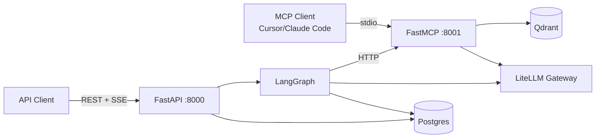
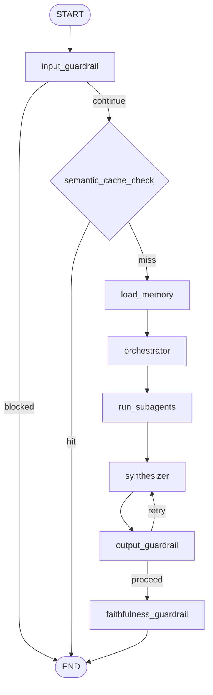

# ZimShire Agent Architecture

Technical reference for the LangGraph multi-agent research pipeline.

**Related docs:**
- [assistant_flow.md](assistant_flow.md) — end-to-end request lifecycle and DB read/write per stage
- [db_schema_reference.md](db_schema_reference.md) — Postgres, Qdrant, LangGraph table schemas
- [api_endpoints.md](api_endpoints.md) — HTTP API and SSE event shapes

---

## 1. Overview

ZimShire answers investment research questions through a **Buffett-first lens**, combining:
- Warren Buffett shareholder letters 1977–2024 (RAG over Qdrant via MCP)
- Live market data (yfinance via MCP, cached in Postgres)
- Current web search (DuckDuckGo via MCP)

The intelligence layer is a **compiled LangGraph `StateGraph`** with a structured planner, parallel subagents, and a dedicated synthesizer node. The MCP server runs as a **separate process** (port 8001) consumed by LangGraph via HTTP and by external IDE clients via stdio.

---

## 2. Two-Process Architecture

| Process | Entry point | Port | Responsibility |
|---------|-------------|------|----------------|
| **FastAPI** | `uvicorn app.main:app` | 8000 | REST API, SSE streaming, LangGraph execution, Postgres |
| **FastMCP** | `python -m mcp_server.main` | 8001 | RAG, market, web search tools |



**Rule:** `app/` never imports from `mcp_server/`. Graph nodes call tools through `MultiServerMCPClient` — they never access Qdrant, yfinance, or web search directly.

---

## 3. Graph State (`ZimShireState`)

All nodes return partial dicts; LangGraph merges updates into full state. Conversation history uses `add_messages` so new messages append without overwriting prior turns.

```python
class ZimShireState(TypedDict):
    # Core
    messages: Annotated[list[BaseMessage], add_messages]
    query: NotRequired[str]

    # Long-term memory (load_memory)
    user_profile: NotRequired[dict]

    # Collected context from subagents
    collected_context: NotRequired[dict]   # keys: "rag" | "market" | "web"

    # Raw artifacts for guardrails + audit
    rag_agent_chunks: NotRequired[list[dict]]
    rag_invoked: NotRequired[bool]
    web_agent_sources: NotRequired[list[dict]]

    # Orchestrator planner output
    subagent_plan: NotRequired[dict]        # serialised OrchestratorPlan
    subagent_results: NotRequired[list[dict]]
    direct_answer_possible: NotRequired[bool]

    # Synthesizer output
    draft_answer: NotRequired[str]
    grounded: NotRequired[bool | None]
    sources: NotRequired[list[dict]]

    # Output guardrail feedback loop
    feedback_message: NotRequired[str | None]
    retry_count: NotRequired[int]

    # Flags
    cache_hit: NotRequired[bool]
    input_blocked: NotRequired[bool]
    input_blocked_reason: NotRequired[str | None]
    output_blocked: NotRequired[bool]
    output_blocked_reason: NotRequired[str | None]
    output_rewritten: NotRequired[bool]
```

### Field reference

| Field | Set by | Purpose |
|-------|--------|---------|
| `messages` | FastAPI + nodes | Thread; restored by checkpointer each turn |
| `query` | `input_guardrail` | Latest user text for embed, store, tools |
| `user_profile` | `load_memory` | `{tracked_companies, research_interests, preferences, explicit_memories}` |
| `collected_context` | `run_subagents` | `{rag: str, market: str, web: str}` — formatted context per source |
| `rag_agent_chunks` | `run_subagents` | Raw Qdrant hits for faithfulness scoring + `rag_retrievals` audit |
| `rag_invoked` | `run_subagents` | `True` if RAG subagent ran this turn |
| `subagent_plan` | `orchestrator` | `OrchestratorPlan` — which subagents to enable, `direct_answer_possible` |
| `draft_answer` | `synthesizer` | LLM answer before guardrails |
| `grounded` | `faithfulness_guardrail` | `true` / `false` / `null` (null when RAG not used) |
| `sources` | `faithfulness_guardrail` | Citations (letter_year, passage, score, point_id) |
| `feedback_message` | `output_guardrail` | Critique for synthesizer retry |
| `retry_count` | `output_guardrail` | Loop counter; capped at `output_guardrail_max_retries=2` |
| `cache_hit` | `semantic_cache_check` | Skip orchestrator when true |
| `output_rewritten` | `output_guardrail` | Answer was replaced with safe fallback |

**NOT in state** (lives in `RunnableConfig["configurable"]`): `thread_id`, `user_id`, `chat_id`, `model`, `human_message_id`.

---

## 4. Graph Topology

### Nodes

| Node | File | Model |
|------|------|-------|
| `input_guardrail` | `pipeline/preflight.py` | `gpt-4o-mini` |
| `semantic_cache_check` | `pipeline/preflight.py` | — (embed only) |
| `load_memory` | `pipeline/preflight.py` | — |
| `orchestrator` | `pipeline/planning.py` | `claude-sonnet-4-6` |
| `run_subagents` | `pipeline/research/runner.py` | `claude-haiku-4-5` (per subagent) |
| `synthesizer` | `pipeline/synthesis.py` | `claude-sonnet-4-6` |
| `output_guardrail` | `pipeline/safety.py` | `gpt-4o-mini` |
| `faithfulness_guardrail` | `pipeline/safety.py` | `gpt-4o-mini` |

### Routing

```python
# pipeline/preflight.py → routing.py
def route_after_input(state):
    return "blocked" if state.get("input_blocked") else "continue"

def route_after_cache(state):
    return "hit" if state.get("cache_hit") else "miss"

def route_after_output_guardrail(state):
    if state.get("output_blocked") and state.get("retry_count", 0) < 2:
        return "retry"   # → synthesizer
    return "proceed"     # → faithfulness_guardrail
```

### Edge map

```
START → input_guardrail
input_guardrail →[blocked]→ END
input_guardrail →[continue]→ semantic_cache_check
semantic_cache_check →[hit]→ END
semantic_cache_check →[miss]→ load_memory
load_memory → orchestrator
orchestrator → run_subagents
run_subagents → synthesizer
synthesizer → output_guardrail
output_guardrail →[retry, retry_count < 2]→ synthesizer
output_guardrail →[proceed]→ faithfulness_guardrail
faithfulness_guardrail → END
```



---

## 5. Node Specifications

### 5.1 `input_guardrail` (`pipeline/preflight.py`)

**Goal:** Block off-topic queries, prompt injection, and personal investment advice before any LLM or tool call.

**Implementation:** Single `gpt-4o-mini` call returning structured JSON `{blocked: bool, reason: str|null}`. **Fail-open** — if the LLM call throws, `blocked=False` (allow through) unless `fail_open_on_guardrail_error=False` in config.

**What it catches:**
- Off-topic queries (cooking, politics, entertainment)
- Prompt injection / jailbreak attempts
- Personal investment advice requests ("Should I buy X?")

**On block:** Adds safe `AIMessage` to state with example research questions, routes to END. Writes `guardrail_logs` row.

---

### 5.2 `semantic_cache_check` (`pipeline/preflight.py`)

**Goal:** Skip the full pipeline for semantically similar queries.

**Process:**
1. Embed `state["query"]` via `embed_text()` (LiteLLM gateway, `text-embedding-3-small`)
2. pgvector cosine similarity search against `semantic_cache`
3. Hit threshold: ≥ **0.92**

**On hit:** Returns `cache_hit=True`, `draft_answer`, `sources`, `grounded` from the cache row. Increments `hit_count`. Graph ends — no LLM calls.

**On miss:** Returns `cache_hit=False` and continues to `load_memory`.

---

### 5.3 `load_memory` (`pipeline/preflight.py`)

**Goal:** Load user's research context for personalization.

**Long-term (store):** `LongTermMemoryService.load_profile(user_id, query)` — `AsyncPostgresStore` semantic search over `("users", user_id, "interests")` namespace.

**Short-term:** Conversation history already in `state["messages"]` (restored by checkpointer). `ShortTermMemoryService` formats it for the system prompt; not stored in state.

**Returns:** `user_profile: {tracked_companies, research_interests, preferences, explicit_memories}`

---

### 5.4 `orchestrator` (`pipeline/planning.py`)

**Goal:** Decide which subagents to invoke.

**Implementation:** `llm.with_structured_output(OrchestratorPlan)` — produces a structured plan, not a ReAct loop. The planner selects 0–3 subagents and sets `direct_answer_possible` for conversational follow-ups.

```python
class OrchestratorPlan(BaseModel):
    subagents: list[SubagentPlanItem]    # which to enable: rag / market / web
    direct_answer_possible: bool         # True → subagents likely not needed
    reasoning: str                       # planner's reasoning (logged)
```

The plan is serialised into `state["subagent_plan"]` and consumed by `run_subagents`.

---

### 5.5 `run_subagents` (`pipeline/research/runner.py`)

**Goal:** Execute the enabled subagents in parallel and accumulate results.

**Implementation:** `asyncio.gather` over enabled items from `subagent_plan`. Each subagent is looked up in `SUBAGENT_REGISTRY` and runs a ReAct agent with filtered MCP tools.

```python
results = await asyncio.gather(
    *(_run_one(item) for item in enabled)
)
```

**Subagents:**

| Name | MCP tools used | Tag filter |
|------|---------------|------------|
| `rag` | `search_buffett_letters` | `rag` tag |
| `market` | 12 yfinance tools | `market` tag, cache-first |
| `web` | `web_search`, `web_search_news` | `web` tag |

**Returns:** `collected_context`, `rag_agent_chunks`, `rag_invoked`, `web_agent_sources`, `subagent_results`

---

### 5.6 `synthesizer` (`pipeline/synthesis.py`)

**Goal:** Produce the final answer from all collected context.

**Implementation:** `llm.astream()` — emits tokens in real-time. LangGraph's `stream_mode="messages"` captures these tokens and forwards them as SSE `token` events before the guardrails run.

```python
full_content = ""
async for chunk in llm.astream([system_msg, human_msg], config=config):
    if isinstance(chunk.content, str):
        full_content += chunk.content
```

The system prompt includes: user profile, recent conversation (last 5 turns), all collected context (RAG + market + web), and optional `feedback_message` if this is a guardrail retry.

**Returns:** `draft_answer`, `messages` (AIMessage), `feedback_message=None`

---

### 5.7 `output_guardrail` (`pipeline/safety.py`)

**Goal:** Block buy/sell advice, price targets, and factual hallucinations before the answer reaches the client.

**Implementation:** Single `gpt-4o-mini` call against the **full collected context** (RAG + market + web + user profile + recent conversation). Returns:
```json
{
  "factual_consistent": bool,
  "unsupported_claims": ["claim..."],
  "safety_violation": bool,
  "safety_category": "buy_sell" | "price_target" | "portfolio_advice" | "prediction" | null,
  "safety_reason": "...",
  "feedback": "specific rewrite instruction or null"
}
```

**On violation:**
- `retry_count < output_guardrail_max_retries (2)` → writes `feedback_message`, increments `retry_count`, routes back to `synthesizer`
- `retry_count >= 2` → sets `output_rewritten=True`, replaces `draft_answer` with safe fallback, client receives `replace` SSE event

**Always passes:** Research questions describing Buffett's philosophy, presenting market data factually, framing analysis with appropriate uncertainty.

---

### 5.8 `faithfulness_guardrail` (`pipeline/safety.py`)

**Goal:** Determine whether the answer is grounded in retrieved Buffett letter passages.

**Runs only when** `rag_invoked=True`. Early exit returns `grounded=None, sources=[]` otherwise.

**Implementation:** LLM call (`gpt-4o-mini`) evaluates the answer against retrieved passages. Returns `{grounded: bool, score: float, unsupported_claims: list}`. Fallback (if LLM throws): similarity threshold check.

**Strong hit threshold:** `FAITHFULNESS_SCORE_THRESHOLD = 0.40`

Calibrated for `text-embedding-3-small` — relevant Buffett letter passages score 0.35–0.55 cosine similarity, not 0.7–0.9. Sources filter: chunks with `similarity_score ≥ 0.40`, up to 5 returned.

**Returns:** `grounded: true/false/null`, `sources: list[{letter_year, passage, similarity_score, qdrant_point_id}]`

The answer is **never blocked** when `grounded=False` — this is a transparency flag, not a safety gate. The SSE `done` event carries `grounded: false` and `sources: []` so the client can show a disclaimer.

---

## 6. Real-Time Streaming

Streaming is implemented in `turn_service.py` using LangGraph's dual stream mode:

```python
async for typ, chunk in graph.astream(inputs, config, stream_mode=["messages", "values"]):
    if typ == "messages":
        msg_chunk, metadata = chunk
        if metadata.get("langgraph_node") == "synthesizer" and msg_chunk.content:
            yield _sse({"type": "token", "content": msg_chunk.content})
    elif typ == "values":
        final_state = chunk
        # Emit progress events based on state transitions
```

**Progress events** fire based on state field appearances in `"values"` updates:
- `subagent_plan` appears → one `progress` event per enabled subagent
- `collected_context` appears (subagents done) → `progress` stage `"synthesizing"`

**Replace event** fires post-loop when `output_rewritten=True` and synthesis tokens were already streamed.

---

## 7. Short-Term Memory (Multi-Turn)

LangGraph persists `state["messages"]` to Postgres after each node via `AsyncPostgresSaver`. Key: `config["configurable"]["thread_id"]` = `str(chat_id)`.

On turn 2, the checkpointer restores full message history automatically. `load_memory` formats the last 5 turns into the system prompt. The orchestrator and synthesizer see full context.

```
Turn 1: "How would Buffett evaluate Apple's moat?" → RAG subagent invoked
Turn 2: "Compare that to what he said about Coca-Cola in 1988."
         → messages restored → RAG subagent called with year filter [1988]
```

---

## 8. Long-Term Memory

`AsyncPostgresStore` under namespace `("users", user_id, "interests")`.

| Operation | When | Method |
|-----------|------|--------|
| Read | `load_memory` node | `store.asearch(namespace, query=state["query"])` |
| Write | `persist_assistant_turn` (Stage 10) | `store.aput` per new interest |

The `LongTermMemoryService` in `app/modules/chat_history/long_term/` reads the profile and exposes it via `GET /users/{id}/memory/long-term`.

---

## 9. MCP Server Tools

The MCP server (`mcp_server/`) exposes tools in three groups:

| Group | Tools | Data source |
|-------|-------|-------------|
| **RAG** | `search_buffett_letters` | Qdrant `buffett_letters` (hybrid: dense+BM25+ColBERT) |
| **Market** | `get_stock_info/price/history`, `get_income_statement/balance_sheet/cashflow`, `get_earnings_estimate`, `get_institutional_holders`, `get_insider_transactions`, `get_stock_news`, `lookup_ticker` | yfinance |
| **Web** | `web_search`, `web_search_news`, `web_search_knowledge` | DuckDuckGo via SerpApi |
| **UI** | All `*_ui` variants | Renders DataTable for Cursor / Claude Code only |

Tools are filtered to each subagent by **tag** (`rag`, `market`, `web`) and **allowlist** in `mcp/allowlists.py`. UI tools (`ui` tag) are always excluded from LangGraph agents.

**Market tool cache:** `_wrap_market_tool` in `mcp/wrappers.py` wraps market tools with a Postgres TTL cache (1 hour). The wrapper extracts the ticker, checks `market_data_cache`, and calls the MCP tool only on miss.

---

## 10. Observability (Langfuse)

One trace per user message. The Langfuse `CallbackHandler` is passed in `config["callbacks"]` and automatically captures:

| Span type | What |
|-----------|------|
| `CHAIN` | Each LangGraph node (with latency) |
| `GENERATION` | Each LLM call (model, tokens, cost) |
| `AGENT` | ReAct subagent iterations |
| `TOOL` | Individual MCP tool calls |

Trace metadata: `userId` = user UUID, `sessionId` = chat UUID, `trace_name` = `"zimshire_turn"`.

A typical full-pipeline trace has ~46 observations. `langfuse_trace_id` is stored on every assistant `messages` row for audit.

---

## 11. Package Layout

```
app/modules/agents/
  graph/
    state.py          # ZimShireState TypedDict
    builder.py        # build_graph(checkpointer, store) → CompiledGraph
    routing.py        # route_after_input/cache/output_guardrail
    schemas.py        # OrchestratorPlan, SubagentPlanItem, SubagentResult
  runtime/
    service.py        # init_graph, close_graph, get_graph, get_store
    mcp_client.py     # MultiServerMCPClient init/close/get_mcp_tools
    graph_factory.py  # build_checkpointer_and_store
    observability.py  # wrap_node (no-op stub — CallbackHandler handles tracing)
  mcp/
    registry.py       # ToolRegistry, matches_agent, get_registry
    allowlists.py     # AGENT_TOOL_ALLOWLIST, EXCLUDE_TAGS, AgentName
    wrappers.py       # get_agent_tools, _wrap_market_tool, format_tool_names_for_prompt
  pipeline/
    preflight.py      # input_guardrail, semantic_cache_check, load_memory
    planning.py       # orchestrator
    synthesis.py      # synthesizer
    safety.py         # output_guardrail, faithfulness_guardrail
    research/
      runner.py       # run_subagents
      react.py        # run_react_subagent, extract_artifacts
      subagents.py    # run_rag/market/web_subagent
      registry.py     # SUBAGENT_REGISTRY
```
