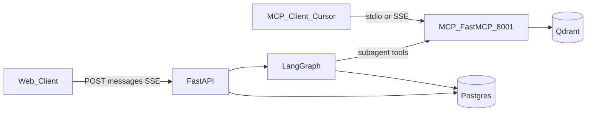
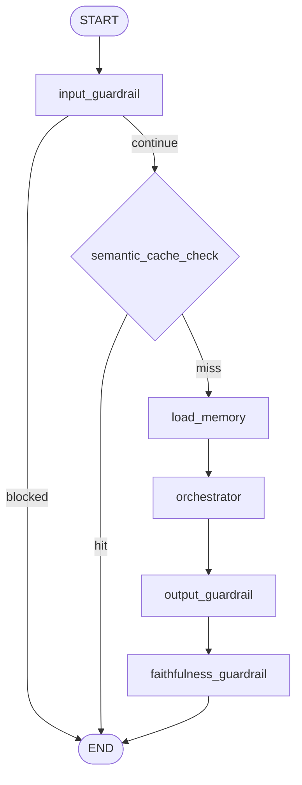

# ZimShire Agent Architecture

Technical reference for the LangGraph multi-agent research system.

**Related docs:**

- [assistant_flow.md](assistant_flow.md) — end-to-end request lifecycle and DB read/write per stage
- [db_schema_reference.md](db_schema_reference.md) — Postgres, Qdrant, LangGraph table schemas
- [api_endpoints.md](api_endpoints.md) — HTTP API and SSE event shapes
- [PROJECT.md](PROJECT.md) — project overview and invariants

---

## 1. Overview

ZimShire answers investment research questions through a **Buffett-first lens**, combining:

- Warren Buffett shareholder letters (RAG over Qdrant via MCP)
- Live market data (yfinance via MCP, cached in Postgres)
- Current web search (DuckDuckGo via MCP)

The intelligence layer is implemented as **one compiled LangGraph `StateGraph`** with an orchestrator that dynamically calls three subagent tools. MCP server runs as a **separate process** and is consumed both by LangGraph (via SSE) and external clients (Cursor, Claude Code).

---

## 2. Two-Process Architecture

| Process | Entry point | Port | Responsibility |
|---|---|---|---|
| **FastAPI** | `uvicorn app.main:app` | 8000 | REST API, SSE streaming, LangGraph execution, Postgres audit |
| **MCP (FastMCP)** | `python -m mcp_server.main` | 8001 | Three data tools: RAG, market, web search |

**Rule:** All data access (Qdrant, yfinance, web search) lives exclusively in `mcp_server/services/`. Graph nodes and subagent tools never import these directly — they always go through `mcp_client.py` via SSE transport.



---

## 3. Graph State (`ZimShireState`)

All nodes return partial dicts. LangGraph merges updates into full state. Conversation history uses `add_messages` reducer so new messages append without overwriting prior turns.

```python
from typing import Annotated, NotRequired
from typing_extensions import TypedDict
from langchain_core.messages import BaseMessage
from langgraph.graph.message import add_messages


class ZimShireState(TypedDict):
    # --- Core ---
    messages: Annotated[list[BaseMessage], add_messages]
    query: str

    # --- Memory context (load_memory) ---
    user_preferences: NotRequired[list[str]]  # long-term store hits

    # --- Sub-agent results (orchestrator closure accumulator) ---
    rag_agent_chunks: NotRequired[list[dict]]   # raw: letter_year, passage_snippet, similarity_score, qdrant_point_id
    rag_agent_result: NotRequired[str]          # formatted passages returned to orchestrator LLM
    rag_invoked: NotRequired[bool]              # early-exit signal for faithfulness_guardrail
    web_agent_sources: NotRequired[list[dict]]  # raw: title, url, snippet
    web_agent_result: NotRequired[str]
    market_agent_result: NotRequired[str]       # formatted JSON/text returned to orchestrator LLM

    # --- Orchestrator result ---
    draft_answer: NotRequired[str]
    grounded: NotRequired[bool | None]          # None if RAG not invoked
    sources: NotRequired[list[dict]]            # citations for SSE done event

    # --- Guardrail flags ---
    cache_hit: NotRequired[bool]
    input_blocked: NotRequired[bool]
    input_blocked_reason: NotRequired[str | None]
    output_blocked: NotRequired[bool]
    output_blocked_reason: NotRequired[str | None]
    output_rewritten: NotRequired[bool]
```

### Field reference

| Section | Field | Set by | Purpose |
|---|---|---|---|
| Core | `messages` | FastAPI + orchestrator | Thread; restored by checkpointer each turn |
| Core | `query` | `input_guardrail` or cache | Latest user text for embed, store, tools |
| Memory | `user_preferences` | `load_memory` | Long-term interests from `store` |
| Sub-agent | `rag_agent_chunks` | `rag_agent` tool | Raw Qdrant hits → faithfulness scores + `rag_retrievals` |
| Sub-agent | `rag_agent_result` | `rag_agent` tool | Formatted passages (orchestrator context) |
| Sub-agent | `rag_invoked` | orchestrator return | `True` if `rag_agent` ran this turn |
| Sub-agent | `web_agent_sources` | `web_agent` tool | Raw search hits |
| Sub-agent | `web_agent_result` | `web_agent` tool | Formatted snippets for orchestrator |
| Sub-agent | `market_agent_result` | `market_agent` tool | Formatted market JSON for orchestrator |
| Orchestrator | `draft_answer` | orchestrator or cache | Final text before client streaming |
| Orchestrator | `grounded` | `faithfulness_guardrail` or cache | Letter grounding flag |
| Orchestrator | `sources` | `faithfulness_guardrail` or cache | `letter_year`, `passage`, `score`, `point_id` |
| Guardrail | `cache_hit` | `semantic_cache_check` | Skip orchestrator when true |
| Guardrail | `input_blocked` / `input_blocked_reason` | `input_guardrail` | Early exit |
| Guardrail | `output_blocked` / `output_blocked_reason` | `output_guardrail` | Rewrite path |
| Guardrail | `output_rewritten` | `output_guardrail` | Answer was replaced |

### What is NOT in state

`thread_id`, `user_id`, `chat_id`, `model`, `provider`, `human_message_id`, `langfuse_trace_id` live in `RunnableConfig["configurable"]` — stable across checkpoint serialization.

```python
config = {
    "configurable": {
        "thread_id": str(chat.chat_id),
        "user_id": str(chat.user_id),
        "chat_id": str(chat.chat_id),
        "model": chat.model,
        "provider": chat.provider,
        "human_message_id": str(human_message.message_id),
    }
}
```

### Why `chat_history: list[str]` is NOT in state

`state["messages"]` is restored automatically by the LangGraph checkpointer on every turn. Duplicating it as a formatted string list in state wastes context window and creates inconsistency. `load_memory` formats history for the system prompt on-the-fly but does not store the result in state.

---

## 4. Graph Topology

### Nodes

| Node | Purpose |
|---|---|
| `input_guardrail` | Block off-topic queries and prompt injection |
| `semantic_cache_check` | Return cached answer for semantically similar queries |
| `load_memory` | Load long-term user preferences from store; format short-term context |
| `orchestrator` | ReAct loop calling `rag_agent`, `market_agent`, `web_agent` tools |
| `output_guardrail` | Block or rewrite buy/sell recommendations |
| `faithfulness_guardrail` | Set `grounded` and `sources` from `rag_agent_chunks` vs `draft_answer` |

### Routing

```python
def route_after_input(state: ZimShireState) -> str:
    return "blocked" if state.get("input_blocked") else "continue"

def route_after_cache(state: ZimShireState) -> str:
    return "hit" if state.get("cache_hit") else "miss"
```

### Edge map

```
START → input_guardrail
input_guardrail →[blocked]→ END
input_guardrail →[continue]→ semantic_cache_check
semantic_cache_check →[hit]→ END
semantic_cache_check →[miss]→ load_memory
load_memory → orchestrator
orchestrator → output_guardrail
output_guardrail → faithfulness_guardrail
faithfulness_guardrail → END
```



### Graph builder

```python
from langgraph.graph import END, START, StateGraph

from app.graph.state import ZimShireState
from app.graph.routing import route_after_cache, route_after_input
from app.graph.nodes.guardrails import (
    faithfulness_guardrail,
    input_guardrail,
    output_guardrail,
)
from app.graph.nodes.memory import load_memory
from app.graph.nodes.orchestrator import orchestrator
from app.graph.nodes.cache import semantic_cache_check


def build_graph(checkpointer, store):
    builder = StateGraph(ZimShireState)

    builder.add_node("input_guardrail", input_guardrail)
    builder.add_node("semantic_cache_check", semantic_cache_check)
    builder.add_node("load_memory", load_memory)
    builder.add_node("orchestrator", orchestrator)
    builder.add_node("output_guardrail", output_guardrail)
    builder.add_node("faithfulness_guardrail", faithfulness_guardrail)

    builder.add_edge(START, "input_guardrail")
    builder.add_conditional_edges(
        "input_guardrail",
        route_after_input,
        {"blocked": END, "continue": "semantic_cache_check"},
    )
    builder.add_conditional_edges(
        "semantic_cache_check",
        route_after_cache,
        {"hit": END, "miss": "load_memory"},
    )
    builder.add_edge("load_memory", "orchestrator")
    builder.add_edge("orchestrator", "output_guardrail")
    builder.add_edge("output_guardrail", "faithfulness_guardrail")
    builder.add_edge("faithfulness_guardrail", END)

    return builder.compile(checkpointer=checkpointer, store=store)
```

---

## 5. Node Specifications

### 5.1 `input_guardrail`

**Reads:** `state["messages"][-1].content` (also used to set `query` if not set yet)

**Logic:** LLM classifier checks for off-topic queries (not investment research) and prompt injection patterns.

**Writes to state:** `input_blocked: bool`, `input_blocked_reason: str | None`

**Writes to DB:** `guardrail_logs` row with `guardrail_type="input"`

**On block:** adds safe `AIMessage` to state, routes to END.

---

### 5.2 `semantic_cache_check`

**Reads:** `state["query"]` → embeds → pgvector similarity search on `semantic_cache`

**Threshold:** cosine similarity ≥ 0.92

**On hit:** returns `cache_hit=True`, `draft_answer`, `sources`, `grounded` from cache. Graph ends without touching orchestrator or MCP.

**On miss:** returns `cache_hit=False`.

**SQL pattern:**

```sql
SELECT id, cached_response, sources, grounded
FROM semantic_cache
WHERE (expires_at IS NULL OR expires_at > NOW())
ORDER BY query_embedding <=> :embedding
LIMIT 1;
```

---

### 5.3 `load_memory`

**Reads:** `state["messages"]` (for short-term context formatting), `store` (for long-term user preferences)

**Long-term lookup:** `store.asearch(("users", user_id, "interests"), query=state["query"], limit=5)`

**Writes to state:** `user_preferences: list[str]` (e.g. `"AAPL: moat analysis"`)

**Does NOT store `chat_history` in state** — history is already in `state["messages"]` restored by checkpointer. The formatted string is built inline for the orchestrator system prompt only.

```python
def build_system_prompt(state: ZimShireState) -> str:
    prefs = state.get("user_preferences") or []
    history_lines = []
    for m in state["messages"][-20:]:
        role = "User" if m.type == "human" else "Assistant"
        history_lines.append(f"{role}: {m.content}")
    return (
        "## User preferences (long-term)\n"
        + ("\n".join(f"- {p}" for p in prefs) or "(none)")
        + "\n\n## Conversation (short-term)\n"
        + "\n".join(history_lines)
    )
```

---

### 5.4 `orchestrator`

**Core pattern:** ReAct loop via `create_react_agent`. Receives full `messages` + system prompt built from `user_preferences` and formatted chat history.

**Key design — closure accumulator:**

Subagent tools write raw results into a shared `accumulated` dict via closure. After `agent.ainvoke()` completes, the orchestrator node returns everything in one dict — this is the only correct way to propagate tool outputs into LangGraph state without direct mutation.

```python
async def orchestrator(state: ZimShireState, config: RunnableConfig) -> dict:
    accumulated = {
        "rag_agent_chunks": [],
        "rag_agent_result": "",
        "web_agent_sources": [],
        "web_agent_result": "",
        "market_agent_result": "",
    }
    tools = build_tools_with_accumulator(accumulated, config)

    agent = create_react_agent(llm, tools)
    result = await agent.ainvoke({
        "messages": [
            SystemMessage(content=build_system_prompt(state)),
            *state["messages"],
        ]
    })

    draft = result["messages"][-1].content

    return {
        "draft_answer": draft,
        "rag_agent_chunks": accumulated["rag_agent_chunks"],
        "rag_agent_result": accumulated["rag_agent_result"],
        "rag_invoked": len(accumulated["rag_agent_chunks"]) > 0,
        "web_agent_sources": accumulated["web_agent_sources"],
        "web_agent_result": accumulated["web_agent_result"],
        "market_agent_result": accumulated["market_agent_result"],
        "messages": [AIMessage(content=draft)],
    }
```

**Why `ainvoke` not `astream`:** Output guardrail and faithfulness guardrail need the complete `draft_answer`. Streaming is handled at the FastAPI layer after the full graph completes.

---

### 5.5 Subagent Tools

All three tools are built inside `build_tools_with_accumulator`. Each tool:

1. Calls MCP via `get_mcp_tools()` (SSE to port 8001)
2. Writes raw results into `accumulated` via closure
3. Returns a formatted string to the orchestrator LLM

Implement in `app/graph/tools/subagents.py`.

#### `rag_agent`

```python
@tool
async def rag_agent(query: str, years: list[int] | None = None) -> str:
    """Search Buffett shareholder letters for investment philosophy, moats, intrinsic value."""
    hits = await get_mcp_tools()["search_buffett_letters"].ainvoke({
        "query": query, "top_k": 5, "letter_years_filter": years
    })
    accumulated["rag_agent_chunks"].extend(hits)
    formatted = "\n\n".join(
        f"[{h['letter_year']}] score={h['similarity_score']:.3f}\n{h['passage_snippet']}"
        for h in hits
    ) if hits else "No relevant Buffett letter passages found."
    accumulated["rag_agent_result"] = formatted
    return formatted
```

| | |
|---|---|
| MCP tool | `search_buffett_letters(query, top_k, letter_years_filter)` |
| Returns to LLM | Same string as `rag_agent_result` |
| State (via return) | `rag_agent_chunks`, `rag_agent_result`, `rag_invoked` |

#### `market_agent`

```python
@tool
async def market_agent(tickers: list[str]) -> str:
    """Get live market data: P/E, financials, price for ticker symbols."""
    result = {}
    data_type = "info"
    for ticker in tickers:
        cached = await MarketDataCacheRepo.get_valid(ticker=ticker, data_type=data_type)
        if cached:
            result[ticker] = cached.payload
        else:
            payload = await get_mcp_tools()["get_market_data"].ainvoke({
                "ticker": ticker, "data_type": data_type,
            })
            await MarketDataCacheRepo.upsert(ticker=ticker, data_type=data_type, payload=payload, ...)
            result[ticker] = payload
    text = json.dumps(result, indent=2)[:4000]
    accumulated["market_agent_result"] = text
    return text
```

Cache-first: checks `market_data_cache` in Postgres before calling MCP. `MarketDataCacheRepo` is the only custom Postgres repo used inside graph tooling. Raw ticker payloads live inside the JSON string in `market_agent_result` (not a separate `market_data` dict in state).

#### `web_agent`

```python
@tool
async def web_agent(query: str) -> str:
    """Search the web for recent news and events not covered in Buffett letters."""
    results = await get_mcp_tools()["web_search"].ainvoke({"query": query, "max_results": 5})
    accumulated["web_agent_sources"].extend(results)
    text = "\n".join(f"- {r['title']}: {r['snippet']}" for r in results)
    accumulated["web_agent_result"] = text
    return text
```

---

### 5.6 `output_guardrail`

**Reads:** `state["draft_answer"]`

**Logic:** LLM classifier detects buy/sell recommendations, explicit price targets, personalized portfolio advice.

**On violation:** rewrites `draft_answer` with safe fallback text. Sets `output_rewritten=True`, `output_blocked=True`, `output_blocked_reason`.

**Writes to DB:** `guardrail_logs` row with `guardrail_type="output"`

---

### 5.7 `faithfulness_guardrail`

**When it runs:** Always — but exits early if `rag_invoked=False`.

**Reads:** `state["rag_agent_chunks"]`, `state["rag_agent_result"]` (optional cross-check), `state["draft_answer"]`

**Logic:**

```
if rag_invoked is False:
    → grounded=None, sources=[]

if rag_agent_chunks is empty:
    → grounded=False, sources=[]

strong_hits = rag_agent_chunks where similarity_score >= 0.75

grounded = len(strong_hits) >= 2   # threshold-based, no extra LLM call

sources = [
    {letter_year, passage, score, qdrant_point_id}
    for each strong hit in rag_agent_chunks
]
```

`rag_agent_result` is the formatted text the orchestrator saw; scoring uses structured `rag_agent_chunks` only.

**Why no extra LLM call for faithfulness:** Adding another LLM call here increases latency and cost on every RAG-invoked request. Score threshold (≥ 0.75) with minimum hit count (≥ 2) is a practical proxy. If stricter faithfulness is needed, an LLM-based check can be toggled via config.

**Writes to state:** `grounded: bool | None`, `sources: list[dict]`

**Writes to DB:** `guardrail_logs` row with `guardrail_type="faithfulness"`

---

## 6. Grounding Flow (End-to-End)

```
rag_agent tool called
    └─ Qdrant returns hits via MCP
    └─ hits → accumulated["rag_agent_chunks"]
    └─ formatted text → accumulated["rag_agent_result"] + orchestrator LLM

orchestrator LLM synthesizes draft_answer using tool results

output_guardrail checks draft_answer (no RAG awareness)

faithfulness_guardrail:
    └─ reads rag_agent_chunks from state (orchestrator node return)
    └─ reads draft_answer from state
    └─ filters strong hits (score >= 0.75)
    └─ sets grounded=True/False/None
    └─ builds sources list

FastAPI persist:
    └─ writes assistant message with grounded flag
    └─ writes rag_retrievals rows (one per chunk)
    └─ writes to semantic_cache (for future hits)
    └─ writes to store (long-term user interests)
```

**Key point:** Grounding happens AFTER orchestrator completes — because faithfulness checks the final synthesized answer against chunks, not chunks against nothing.

---

## 7. Short-Term Memory (Multi-Turn)

LangGraph persists `state["messages"]` to Postgres after each node via `AsyncPostgresSaver`. Key is `configurable["thread_id"]` = `str(chat_id)`.

On turn 2, checkpointer restores full message history automatically. `load_memory` formats the last N turns into the system prompt. Orchestrator sees full context.

| Turn | User | Orchestrator behavior |
|---|---|---|
| 1 | How would Buffett view Apple's moat? | calls `rag_agent(query=...)` |
| 2 | Now compare that to banks in 1990 | messages include turn 1; calls `rag_agent(..., years=[1990])` |

**Alignment rule:** FastAPI also writes human/assistant rows to `messages` for the UI API. Keep graph `messages` and custom `messages` table consistent by always passing the new human message into `astream` input.

---

## 8. Long-Term Memory

Stored in `AsyncPostgresStore` under namespace `("users", user_id, "interests")`.

| Operation | When | API |
|---|---|---|
| Read | `load_memory` node | `store.asearch(namespace, query=state["query"], limit=5)` |
| Write | FastAPI Stage 10 | `store.aput` per ticker / interest |

```python
async def persist_interests(store, user_id: str, state: dict):
    namespace = ("users", user_id, "interests")
    tickers: list[str] = []
    if state.get("market_agent_result"):
        try:
            tickers = list(json.loads(state["market_agent_result"]).keys())
        except json.JSONDecodeError:
            pass
    for ticker in tickers:
        await store.aput(namespace, key=ticker, value={
            "company": ticker,
            "interest": state.get("query", ""),
        })
```

---

## 9. FastAPI SSE Streaming

Graph runs to **full completion** before streaming begins. This is required because `output_guardrail` and `faithfulness_guardrail` must see the complete `draft_answer`.

```
graph.astream(input, config, stream_mode="values")
    → final_state collected

approved_text = final_state["draft_answer"]
    → chunked into ~4-word SSE token events
    → streamed to client

done event:
    {message_id, grounded, sources, cache_hit, langfuse_trace_id}
```

Pseudo-SSE: not token-by-token LLM streaming during graph execution; tokens are emitted only after guardrails pass.

---

## 10. MCP Server

Separate FastMCP process exposing three tools, optional resources, and optional prompts.

| MCP surface | Name | Service |
|---|---|---|
| Tool | `search_buffett_letters` | `mcp_server/services/qdrant.py` |
| Tool | `get_market_data` | `mcp_server/services/yfinance_market.py` |
| Tool | `web_search` | `mcp_server/services/search.py` |
| Resource | `zimshire://letters/years` | Indexed letter years |
| Resource | `zimshire://policy/research` | No buy/sell advice policy |
| Prompt | `analyze_moat` | Moat analysis template |

| Transport | Consumer |
|---|---|
| SSE `http://mcp:8001` | LangGraph via `mcp_client.py` |
| stdio | Cursor / Claude Code |

**Rule:** Subagent tools call MCP via `mcp_client.py`. `mcp_server/services/` is only imported inside `mcp_server/server.py`.

### `mcp_client.py` (sketch)

```python
from langchain_mcp_adapters.client import MultiServerMCPClient

async def init_mcp_client(base_url: str = "http://localhost:8001") -> None:
    _client = MultiServerMCPClient({
        "zimshire": {"url": f"{base_url}/mcp", "transport": "streamable_http"}
    })
    tool_list = await _client.get_tools()
    _tools = {t.name: t for t in tool_list}
```

Initialise once in FastAPI lifespan; reuse across requests.

---

## 11. Observability (Langfuse)

One trace per user message. Spans per expensive node.

| Node / tool | Span | Captures |
|---|---|---|
| `load_memory` | `load_memory` | preference count, context length |
| `orchestrator` | `orchestrator` | model, tokens, tool calls made |
| `rag_agent` | `rag_retrieval` | hit count, top score |
| `market_agent` | `market_data` | tickers, cache hit/miss |
| `web_agent` | `web_search` | result count |
| `faithfulness_guardrail` | `faithfulness` | grounded, strong hit count |

`langfuse_trace_id` stored on assistant `messages` row for audit. Create a trace for every request including cache hits (minimal span `cache_hit`).

---

## 12. Storage Reference

| Node | Postgres (custom) | LangGraph tables | Qdrant | External |
|---|---|---|---|---|
| `input_guardrail` | `guardrail_logs` | checkpoint | — | LLM classifier |
| `semantic_cache_check` | `semantic_cache` R/W | checkpoint | — | embed |
| `load_memory` | — | `store` R | — | — |
| `orchestrator` | `market_data_cache` R/W (via `market_agent`) | checkpoint | — | LiteLLM, MCP |
| `rag_agent` (tool) | — | — | R via MCP | — |
| `output_guardrail` | `guardrail_logs` | checkpoint | — | LLM classifier |
| `faithfulness_guardrail` | `guardrail_logs` | checkpoint | — | — |
| FastAPI persist | `messages`, `rag_retrievals`, `semantic_cache`, `chats` | `store` W | — | Langfuse |

---

## 13. Key Design Decisions

| Decision | Rationale | Tradeoff |
|---|---|---|
| Closure accumulator for tool outputs | Only correct way to propagate tool data into LangGraph state without direct mutation | Tools must be rebuilt per request |
| `ainvoke` in orchestrator (not `astream`) | Guardrails need complete `draft_answer` | User waits silently during graph execution; mitigated by SSE chunking after |
| Faithfulness via score threshold, not LLM | No extra latency/cost per RAG request | Less precise than LLM-based attribution check |
| `messages` not duplicated as `chat_history` | Checkpointer restores it automatically; duplication wastes context | `load_memory` must format it inline for system prompt |
| MCP as separate process | External clients (Cursor) can consume same tools; clean service boundary | Extra network hop per subagent call (up to 3 SSE roundtrips) |
| `grounded=None` for market-only answers | Matches assignment semantics; RAG grounding does not apply | Client must handle three states: true, false, null |

---

## 14. Recommended project layout

```
app/
  graph/
    state.py
    routing.py
    builder.py
    mcp_client.py
    tools/
      subagents.py          # build_tools_with_accumulator
    nodes/
      guardrails.py
      cache.py
      memory.py
      orchestrator.py
  repositories/
    cache_repo.py           # market_data_cache + semantic_cache
mcp_server/                # renamed from `mcp/` so it doesn't shadow the official mcp SDK (fastmcp dep)
  main.py
  server.py
  core/
    config.py
  services/
    qdrant.py
    yfinance_market.py
    search.py
```

---

## 15. Testing checklist

| Test | Assert |
|---|---|
| Input guardrail blocks off-topic | `input_blocked`, no MCP call |
| Cache hit | `cache_hit`, graph ends before `load_memory` |
| Orchestrator tool choice | Mock tools; accumulator gets chunks only when `rag_agent` called |
| RAG persist | N `rag_retrievals` rows for N items in `rag_agent_chunks` |
| Multi-turn | Turn 2 `messages` in checkpoint include turn 1 |
| Output guardrail rewrite | No buy/sell language in stored assistant content |
| Faithfulness | `grounded=false` when `rag_invoked` but `rag_agent_chunks` empty or &lt; 2 strong hits |
