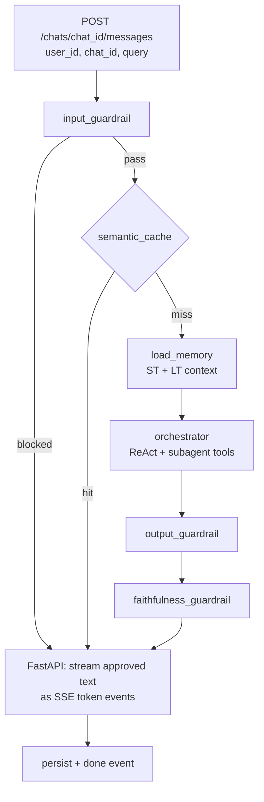

# ZimShire API Endpoints

## Canonical API

This document is the **single source of truth** for the public HTTP API (**9 endpoints**). There is no `/invoke` or client-supplied `thread_id`. The client identifies sessions by `chat_id` only; LangGraph checkpointing uses `str(chat_id)` as `thread_id` internally.

ZimShire exposes 9 HTTP endpoints. All LLM orchestration, guardrails, and persistence happen server-side inside the LangGraph graph. Models are configured server-side via `app/core/config.py` — clients do not pass model overrides.

**Base URL:** `http://localhost:8000`

**Content-Type:** `application/json` for all requests and non-streaming responses; `text/event-stream` for `POST /chats/{chat_id}/messages`.

---

## Endpoint overview

| # | Method | Path | Description |
|---|--------|------|-------------|
| 1 | `POST` | `/users` | Create a user identity |
| 2 | `GET` | `/users/{user_id}` | Get user metadata |
| 3 | `POST` | `/chats` | Create a new chat session (server generates `chat_id`) |
| 4 | `GET` | `/chats/{chat_id}` | Get chat metadata |
| 5 | `GET` | `/chats/{chat_id}/messages` | Retrieve conversation history |
| 6 | `POST` | `/chats/{chat_id}/messages` | Send a research query — SSE streaming response |
| 7 | `GET` | `/users/{user_id}/memory/long-term` | Inspect long-term user profile (store) |
| 8 | `GET` | `/users/{user_id}/chats/{chat_id}/memory/short-term` | Inspect short-term checkpointer history |
| 9 | `GET` | `/health` | Health check (Postgres + Qdrant + MCP) |

---

## `POST /users`

Create a new user identity. Must be called before creating chats.

### Request

```http
POST /users
Content-Type: application/json
```

**Body:** empty `{}` or omitted.

### Response `201 Created`

```json
{
  "user_id": "3fa85f64-5717-4562-b3fc-2c963f66afa6",
  "created_at": "2026-05-24T10:00:00Z"
}
```

### Status codes

| Code | Meaning |
|------|---------|
| `201` | User created |
| `500` | Postgres unreachable |

---

## `GET /users/{user_id}`

Retrieve user metadata. Used by clients to verify a user exists.

### Request

```http
GET /users/3fa85f64-5717-4562-b3fc-2c963f66afa6
```

### Response `200 OK`

```json
{
  "user_id": "3fa85f64-5717-4562-b3fc-2c963f66afa6",
  "created_at": "2026-05-24T10:00:00Z"
}
```

### Status codes

| Code | Meaning |
|------|---------|
| `200` | User found |
| `404` | User not found |

---

## `POST /chats`

Create a new named conversation session. The server generates `chat_id` (uuid4); LangGraph uses `str(chat_id)` as the checkpointer `thread_id`.

### Request

```http
POST /chats
Content-Type: application/json
```

**Body:**

```json
{
  "user_id": "3fa85f64-5717-4562-b3fc-2c963f66afa6",
  "chat_title": "Apple moat analysis"
}
```

| Field | Type | Required | Description |
|-------|------|----------|-------------|
| `user_id` | `uuid` | yes | Must exist in `users` table |
| `chat_title` | `string` | no | Human-readable label for the conversation |

`model` and `provider` are set server-side from `DEFAULT_CHAT_MODEL` and `DEFAULT_PROVIDER` in config (returned in response).

### Response `201 Created`

```json
{
  "chat_id": "a1b2c3d4-0000-0000-0000-000000000001",
  "user_id": "3fa85f64-5717-4562-b3fc-2c963f66afa6",
  "chat_title": "Apple moat analysis",
  "model": "gpt-4o-mini",
  "provider": "openai",
  "created_at": "2026-05-24T10:00:00Z",
  "updated_at": "2026-05-24T10:00:00Z"
}
```

`chat_id` is the sole session identifier exposed to clients; it doubles as LangGraph `thread_id` (`str(chat_id)`).

### Status codes

| Code | Meaning |
|------|---------|
| `201` | Chat created |
| `404` | `user_id` not found |
| `422` | Validation error |

---

## `GET /chats/{chat_id}`

Get metadata for an existing chat.

### Request

```http
GET /chats/a1b2c3d4-0000-0000-0000-000000000001
```

### Response `200 OK`

```json
{
  "chat_id": "a1b2c3d4-0000-0000-0000-000000000001",
  "user_id": "3fa85f64-5717-4562-b3fc-2c963f66afa6",
  "chat_title": "Apple moat analysis",
  "model": "gpt-4o-mini",
  "provider": "openai",
  "created_at": "2026-05-24T10:00:00Z",
  "updated_at": "2026-05-24T10:00:05Z"
}
```

### Status codes

| Code | Meaning |
|------|---------|
| `200` | Chat found |
| `404` | Chat not found |

---

## `GET /chats/{chat_id}/messages`

Retrieve the full message history for a conversation. Used to display past turns in the UI.

### Request

```http
GET /chats/a1b2c3d4-0000-0000-0000-000000000001/messages
```

### Response `200 OK`

```json
{
  "chat_id": "a1b2c3d4-0000-0000-0000-000000000001",
  "messages": [
    {
      "message_id": "a1b2c3d4-0000-0000-0000-000000000000",
      "role": "human",
      "content": "How would Buffett evaluate Apple's economic moat based on his letters?",
      "grounded": null,
      "sources": [],
      "langfuse_trace_id": null,
      "created_at": "2026-05-24T10:00:00Z"
    },
    {
      "message_id": "a1b2c3d4-0000-0000-0000-000000000001",
      "role": "assistant",
      "content": "Warren Buffett consistently emphasized that an economic moat...",
      "grounded": true,
      "sources": [
        {
          "letter_year": 1988,
          "passage": "The key to investing is not assessing how much an industry is going to affect society...",
          "similarity_score": 0.91,
          "qdrant_point_id": "6ba7b810-9dad-11d1-80b4-00c04fd430c8"
        }
      ],
      "langfuse_trace_id": "trace-abc123",
      "created_at": "2026-05-24T10:00:05Z"
    }
  ]
}
```

**Response fields:**

| Field | Type | Description |
|-------|------|-------------|
| `messages[].role` | `"human" \| "assistant"` | Who sent the message |
| `messages[].grounded` | `bool \| null` | `null` for human turns and market/web-only answers |
| `messages[].sources` | `array` | Buffett letter citations; empty for human turns |
| `messages[].langfuse_trace_id` | `string \| null` | Present for every assistant turn (including cache hits) |

**Empty chat:** returns `{"chat_id": "...", "messages": []}` with `200`.

### Status codes

| Code | Meaning |
|------|---------|
| `200` | History returned (may be empty) |
| `403` | Chat does not belong to the requesting user |
| `404` | Chat not found |

---

## `POST /chats/{chat_id}/messages`

Send a research query to the ZimShire agent. Response is a **Server-Sent Events (SSE) stream**.

### Streaming flow

The graph runs to completion before any tokens are sent to the client:

```
1. input_guardrail   — validate query
2. semantic_cache    — check for similar cached answer
3. load_memory → orchestrator (rag_agent / market_agent / web_agent tools)
4. output_guardrail  — full text check (ainvoke, no streaming)
5. faithfulness_guardrail — set grounded + sources
6. FastAPI streams approved draft_answer as SSE token events
7. done event + persist (messages, rag_retrievals, ...)
```

This guarantees the client only ever receives guardrail-approved content.

### Request

```http
POST /chats/a1b2c3d4-0000-0000-0000-000000000001/messages
Content-Type: application/json
```

**Body:**

```json
{
  "user_id": "3fa85f64-5717-4562-b3fc-2c963f66afa6",
  "chat_id": "a1b2c3d4-0000-0000-0000-000000000001",
  "query": "How would Buffett evaluate Apple's economic moat based on his letters?"
}
```

| Field | Type | Required | Description |
|-------|------|----------|-------------|
| `user_id` | `uuid` | yes | Must match the chat owner |
| `chat_id` | `uuid` | yes | Must match path `{chat_id}` (LangGraph `thread_id`) |
| `query` | `string` | yes | The research question. Max 2000 characters. |

`message_id` for the human turn is generated server-side. LLM models are taken from server config only (no client `model` field).

### Response — SSE stream

**Token events** (streamed after guardrails complete):

```
data: {"type": "token", "content": "Warren"}

data: {"type": "token", "content": " Buffett"}

data: {"type": "token", "content": " consistently emphasized..."}
```

**Done event** (always the final event):

```
data: {
  "type": "done",
  "message_id": "a1b2c3d4-0000-0000-0000-000000000001",
  "grounded": true,
  "sources": [
    {
      "letter_year": 1988,
      "passage": "The key to investing is not assessing how much an industry is going to affect society...",
      "similarity_score": 0.91,
      "qdrant_point_id": "6ba7b810-9dad-11d1-80b4-00c04fd430c8"
    }
  ],
  "langfuse_trace_id": "trace-abc123"
}
```

**Guardrail block event** (input blocked):

```
data: {"type": "blocked", "reason": "Query is not related to investment research or Buffett's philosophy."}

data: {"type": "done", "message_id": null, "grounded": null, "sources": [], "langfuse_trace_id": "trace-xyz"}
```

**Cache hit** (semantic cache served the answer — still streamed token by token):

```
data: {"type": "token", "content": "Based on Buffett's 1988 letter..."}

data: {"type": "done", "message_id": "uuid", "grounded": true, "sources": [...], "cache_hit": true, "langfuse_trace_id": "trace-abc"}
```

Note: `langfuse_trace_id` is always populated — even on cache hits a minimal Langfuse trace is created (one span `cache_hit`, no LLM cost).

### `done` event fields

| Field | Type | Description |
|-------|------|-------------|
| `type` | `"done"` | Always `"done"` |
| `message_id` | `uuid \| null` | Persisted assistant message id; `null` if input was blocked |
| `grounded` | `bool \| null` | `true` — grounded in Buffett letters; `false` — RAG ran but passages did not support claims; `null` — RAG not used |
| `sources` | `array` | Buffett letter citations (used passages). Empty if `grounded` is `false` or `null` |
| `langfuse_trace_id` | `string` | Langfuse trace for this request. Always present (minimal trace on cache hit or block) |
| `cache_hit` | `bool` | Present and `true` only when semantic cache served the answer |

### `grounded` field semantics

| Value | Meaning |
|-------|---------|
| `true` | RAG ran; retrieved passages support the answer; `sources` is populated |
| `false` | RAG ran but passages did not support claims; answer may contain a refusal note |
| `null` | RAG was not used (market-only or web-only answer) |

### Multi-turn behaviour

The `chat_id` identifies the session. LangGraph restores the full conversation from the Postgres checkpointer keyed by `str(chat_id)`. No explicit "resume" call is needed.

```json
// Turn 1
POST /chats/abc123/messages
{ "content": "How would Buffett view Apple's moat?" }

// Turn 2 — same chat_id, graph sees full history
POST /chats/abc123/messages
{ "content": "Now compare that to what he said about banks in 1990." }
```

### Status codes

| Code | Meaning |
|------|---------|
| `200` | Stream started. Guardrail blocks are delivered inside the stream as `blocked` events. |
| `404` | `chat_id` not found |
| `422` | Request body validation failed |
| `500` | Internal error before stream could start (e.g. Postgres unreachable) |

### curl example

```bash
curl -N -X POST http://localhost:8000/chats/a1b2c3d4-0000-0000-0000-000000000001/messages \
  -H "Content-Type: application/json" \
  -d '{"content": "How would Buffett evaluate Apple'\''s moat based on his letters?"}'
```

### Python example (httpx)

```python
import httpx, json

async with httpx.AsyncClient(timeout=120) as client:
    async with client.stream(
        "POST",
        "http://localhost:8000/chats/a1b2c3d4-0000-0000-0000-000000000001/messages",
        json={"content": "How would Buffett evaluate Apple's moat?"},
    ) as response:
        async for line in response.aiter_lines():
            if line.startswith("data: "):
                event = json.loads(line[6:])
                if event["type"] == "token":
                    print(event["content"], end="", flush=True)
                elif event["type"] == "done":
                    print()
                    print(f"grounded={event['grounded']}")
                    print(f"sources={event['sources']}")
```

---

## `GET /users/{user_id}/memory/long-term`

Inspect long-term memory for a user (LangGraph `AsyncPostgresStore`).

### Query parameters

| Param | Type | Default | Description |
|-------|------|---------|-------------|
| `query` | `string` | `""` | Optional search string for semantic store lookup |

### Response `200 OK`

```json
{
  "user_id": "3fa85f64-5717-4562-b3fc-2c963f66afa6",
  "search_query": "moat",
  "profile": {
    "tracked_companies": ["AAPL"],
    "research_interests": ["economic moat"],
    "preferences": {},
    "explicit_memories": []
  }
}
```

### Status codes

| Code | Meaning |
|------|---------|
| `200` | Profile returned |
| `404` | User not found |

---

## `GET /users/{user_id}/chats/{chat_id}/memory/short-term`

Inspect short-term memory from the LangGraph checkpointer (`thread_id = str(chat_id)`).

### Query parameters

| Param | Type | Default | Description |
|-------|------|---------|-------------|
| `limit_turn_pairs` | `int` | `5` | Max Human/Assistant pairs to return (1–20) |

### Response `200 OK`

```json
{
  "user_id": "3fa85f64-5717-4562-b3fc-2c963f66afa6",
  "chat_id": "a1b2c3d4-0000-0000-0000-000000000001",
  "thread_id": "a1b2c3d4-0000-0000-0000-000000000001",
  "turn_pairs": [
    {"human": "...", "assistant": "..."}
  ],
  "formatted": "User: ...\nAssistant: ...",
  "message_count": 4
}
```

### Status codes

| Code | Meaning |
|------|---------|
| `200` | Memory returned (may be empty on new chat) |
| `403` | Chat does not belong to user |
| `404` | Chat not found |

---

## `GET /health`

Health check endpoint. Verifies connectivity to Postgres, Qdrant, and the MCP server (`MCP_BASE_URL` from `.env`).

### Request

```http
GET /health
```

### Response `200 OK`

```json
{
  "status": "ok",
  "postgres": "ok",
  "qdrant": "ok",
  "mcp": "ok"
}
```

### Response `503 Service Unavailable`

```json
{
  "status": "degraded",
  "postgres": "ok",
  "qdrant": "ok",
  "mcp": "error: connection refused"
}
```

---

## Streaming model

`POST /chats/{chat_id}/messages` returns **pseudo-SSE**: the graph runs to completion (guardrails, orchestrator, faithfulness), then the final answer is emitted as SSE events. This is not token-by-token LLM streaming; it trades live tokens for full-pipeline safety checks.

---

## Error response shape (non-stream errors)

```json
{
  "detail": "chat_id not found"
}
```

---

## Graph pipeline (what happens inside `POST /chats/{chat_id}/messages`)



### Node → data source mapping

| Node | LLM call | Data source |
|------|----------|-------------|
| `input_guardrail` | classifier (LiteLLM) | `guardrail_logs` write |
| `semantic_cache_check` | embed (LiteLLM) | `semantic_cache` R/W |
| `load_memory` | — | checkpointer `messages`; `store.asearch` |
| `orchestrator` | `ainvoke` + tool loop (LiteLLM) | subagent tools → MCP |
| `rag_agent` (tool) | embed (inside MCP) | `search_buffett_letters` → Qdrant |
| `market_agent` (tool) | — | `market_data_cache` R/W; MCP on miss |
| `web_agent` (tool) | — | `web_search` → DuckDuckGo |
| `output_guardrail` | classifier (LiteLLM) | `guardrail_logs` write |
| `faithfulness_guardrail` | rule-based or LLM | `guardrail_logs` write |
| FastAPI persist | — | `messages`, `rag_retrievals`, `semantic_cache` write |

### MCP server tools

The MCP server runs as a separate process and exposes three data tools:

| Tool | Called by | Data source |
|------|-----------|-------------|
| `search_buffett_letters(query, top_k)` | `rag_agent` | Qdrant `buffett_letters` |
| `get_market_data(ticker, data_type)` | `market_agent` on cache miss | yfinance (blocking call safe in MCP process) |
| `web_search(query, max_results)` | `web_agent` | DuckDuckGo |

The LangGraph graph connects to the MCP server via **SSE transport** (`http://localhost:8001`) — concurrent-safe for multiple simultaneous FastAPI requests.
