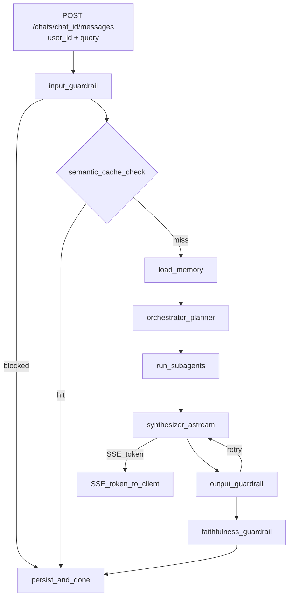

# ZimShire API Endpoints

## Canonical API

This document is the **single source of truth** for the public HTTP API (**9 endpoints**). There is no `/invoke` or client-supplied `thread_id`. The client identifies sessions by `chat_id` only; LangGraph checkpointing uses `str(chat_id)` as `thread_id` internally.

ZimShire exposes 9 public HTTP endpoints. All LLM orchestration, guardrails, and persistence happen server-side inside the LangGraph graph. Models are configured server-side via `app/core/config.py` — clients do not pass model overrides.

**Additional endpoints:** 4 read-only **debug / inspect** routes under `/debug/*` are documented separately (non-public contract; no auth — dev/reviewer use only).

**Base URL:** `http://localhost:8000`

**Content-Type:** `application/json` for all requests and non-streaming responses; `text/event-stream` for `POST /chats/{chat_id}/messages`.

**Swagger UI:** `http://localhost:8000/docs`

---

## Endpoint overview

### Public (9)

| # | Method | Path | Description |
|---|--------|------|-------------|
| 1 | `POST` | `/users` | Create a user identity |
| 2 | `GET` | `/users/{user_id}` | Get user metadata |
| 3 | `POST` | `/chats` | Create a new chat session (server generates `chat_id`) |
| 4 | `GET` | `/chats/{chat_id}` | Get chat metadata |
| 5 | `GET` | `/chats/{chat_id}/messages` | Retrieve conversation history |
| 6 | `POST` | `/chats/{chat_id}/messages` | Send a research query — SSE streaming response |
| 7 | `GET` | `/users/{user_id}/memory/long-term` | Inspect long-term user profile (store) |
| 8 | `GET` | `/users/{user_id}/chats/{chat_id}/memory/short-term` | Inspect short-term checkpointer history |
| 9 | `GET` | `/health` | Health check (Postgres + Qdrant + MCP) |

### Debug / inspect (non-public)

| Method | Path | Description |
|--------|------|-------------|
| `GET` | `/debug/semantic-cache` | List semantic cache rows |
| `GET` | `/debug/market-data-cache` | List market data cache rows |
| `GET` | `/debug/chats/{chat_id}/rag-retrievals` | RAG audit log for a chat |
| `GET` | `/debug/chats/{chat_id}/guardrail-logs` | Guardrail evaluation log for a chat |

---

## `POST /users`

Create a new user identity. Must be called before creating chats. Optional `name` / `surname` seed long-term memory profile.

### Request

```http
POST /users
Content-Type: application/json
```

**Body:** empty `{}`, omitted body, or:

```json
{
  "name": "Alice",
  "surname": "Researcher"
}
```

| Field | Type | Required | Description |
|-------|------|----------|-------------|
| `name` | `string \| null` | no | Optional given name |
| `surname` | `string \| null` | no | Optional family name |

### Response `201 Created`

```json
{
  "user_id": "3fa85f64-5717-4562-b3fc-2c963f66afa6",
  "name": "Alice",
  "surname": "Researcher",
  "created_at": "2026-05-24T10:00:00Z"
}
```

### Status codes

| Code | Meaning |
|------|---------|
| `201` | User created |
| `500` | Postgres unreachable |

---

## `GET /users/{user_id}`

Retrieve user metadata. Used by clients to verify a user exists.

### Request

```http
GET /users/3fa85f64-5717-4562-b3fc-2c963f66afa6
```

### Response `200 OK`

```json
{
  "user_id": "3fa85f64-5717-4562-b3fc-2c963f66afa6",
  "name": "Alice",
  "surname": "Researcher",
  "created_at": "2026-05-24T10:00:00Z"
}
```

### Status codes

| Code | Meaning |
|------|---------|
| `200` | User found |
| `404` | User not found |

---

## `POST /chats`

Create a new named conversation session. The server generates `chat_id` (uuid4); LangGraph uses `str(chat_id)` as the checkpointer `thread_id`.

### Request

```http
POST /chats
Content-Type: application/json
```

**Body:**

```json
{
  "user_id": "3fa85f64-5717-4562-b3fc-2c963f66afa6",
  "chat_title": "Apple moat analysis"
}
```

| Field | Type | Required | Description |
|-------|------|----------|-------------|
| `user_id` | `uuid` | yes | Must exist in `users` table |
| `chat_title` | `string` | no | Human-readable label (max 200 characters) |

Clients do **not** send `model` or `provider`. Both are set server-side from `DEFAULT_CHAT_MODEL` and `DEFAULT_PROVIDER` in config and returned in the response.

### Response `201 Created`

```json
{
  "chat_id": "a1b2c3d4-0000-0000-0000-000000000001",
  "user_id": "3fa85f64-5717-4562-b3fc-2c963f66afa6",
  "chat_title": "Apple moat analysis",
  "model": "gpt-4o-mini",
  "provider": "openai",
  "created_at": "2026-05-24T10:00:00Z",
  "updated_at": "2026-05-24T10:00:00Z"
}
```

`chat_id` is the sole session identifier exposed to clients; it doubles as LangGraph `thread_id` (`str(chat_id)`).

### Status codes

| Code | Meaning |
|------|---------|
| `201` | Chat created |
| `404` | `user_id` not found |
| `422` | Validation error |

---

## `GET /chats/{chat_id}`

Get metadata for an existing chat.

### Request

```http
GET /chats/a1b2c3d4-0000-0000-0000-000000000001
```

### Response `200 OK`

```json
{
  "chat_id": "a1b2c3d4-0000-0000-0000-000000000001",
  "user_id": "3fa85f64-5717-4562-b3fc-2c963f66afa6",
  "chat_title": "Apple moat analysis",
  "model": "gpt-4o-mini",
  "provider": "openai",
  "created_at": "2026-05-24T10:00:00Z",
  "updated_at": "2026-05-24T10:00:05Z"
}
```

### Status codes

| Code | Meaning |
|------|---------|
| `200` | Chat found |
| `404` | Chat not found |

---

## `GET /chats/{chat_id}/messages`

Retrieve the full message history for a conversation. Requires ownership verification via query parameter.

### Request

```http
GET /chats/a1b2c3d4-0000-0000-0000-000000000001/messages?user_id=3fa85f64-5717-4562-b3fc-2c963f66afa6
```

### Query parameters

| Param | Type | Required | Description |
|-------|------|----------|-------------|
| `user_id` | `uuid` | yes | Must match the chat owner |

### Response `200 OK`

```json
{
  "chat_id": "a1b2c3d4-0000-0000-0000-000000000001",
  "messages": [
    {
      "message_id": "a1b2c3d4-0000-0000-0000-000000000000",
      "role": "human",
      "content": "How would Buffett evaluate Apple's economic moat based on his letters?",
      "grounded": null,
      "sources": [],
      "langfuse_trace_id": null,
      "created_at": "2026-05-24T10:00:00Z"
    },
    {
      "message_id": "a1b2c3d4-0000-0000-0000-000000000001",
      "role": "assistant",
      "content": "Warren Buffett consistently emphasized that an economic moat...",
      "grounded": true,
      "sources": [
        {
          "letter_year": 1988,
          "passage": "The key to investing is not assessing how much an industry is going to affect society...",
          "similarity_score": 0.91,
          "qdrant_point_id": "6ba7b810-9dad-11d1-80b4-00c04fd430c8"
        }
      ],
      "langfuse_trace_id": "trace-abc123",
      "created_at": "2026-05-24T10:00:05Z"
    }
  ]
}
```

**Response fields:**

| Field | Type | Description |
|-------|------|-------------|
| `messages[].role` | `"human" \| "assistant"` | Who sent the message |
| `messages[].grounded` | `bool \| null` | `null` for human turns and market/web-only answers |
| `messages[].sources` | `array` | Buffett letter citations (assistant turns only; filtered to `used_in_response`) |
| `messages[].langfuse_trace_id` | `string \| null` | Present for assistant turns |

**Empty chat:** returns `{"chat_id": "...", "messages": []}` with `200`.

### Status codes

| Code | Meaning |
|------|---------|
| `200` | History returned (may be empty) |
| `403` | Chat does not belong to the requesting user |
| `404` | Chat not found |

---

## `POST /chats/{chat_id}/messages`

Send a research query to the ZimShire agent. Response is a **Server-Sent Events (SSE) stream**.

### Streaming flow

```
1. Persist human message (server-generated message_id)
2. LangGraph astream (stream_mode: messages + values)
3. progress events — after planner (per enabled subagent) and before synthesis
4. token events — real LLM chunks from synthesizer node (llm.astream)
5. output_guardrail — full draft check (+ optional retry → synthesizer runs again)
6. faithfulness_guardrail — set grounded + sources
7. replace event — if output guardrail rewrote text that was already streamed
8. token fallback — cache hit or no synthesis tokens: word-chunk replay of draft_answer
9. persist assistant turn + done event
```

**Hybrid streaming model:** synthesis tokens are delivered progressively as the LLM generates them. Output and faithfulness guardrails run **after** the synthesis stream completes inside the graph. The text persisted to Postgres and returned in `done` is always the post-guardrail final answer. If the output guardrail replaces streamed content, clients receive a `replace` event and must swap the entire displayed answer.

### Request

```http
POST /chats/a1b2c3d4-0000-0000-0000-000000000001/messages
Content-Type: application/json
```

**Body:**

```json
{
  "user_id": "3fa85f64-5717-4562-b3fc-2c963f66afa6",
  "query": "How would Buffett evaluate Apple's economic moat based on his letters?"
}
```

| Field | Type | Required | Description |
|-------|------|----------|-------------|
| `user_id` | `uuid` | yes | Must match the chat owner |
| `query` | `string` | yes | The research question (1–2000 characters) |

`chat_id` comes from the URL path only — do not send it in the body. Human `message_id` is generated server-side. LLM models are taken from server config only.

**Response headers:** `Content-Type: text/event-stream`, `Cache-Control: no-cache`, `X-Accel-Buffering: no`

### Response — SSE events

All events use the format `data: {json}\n\n`.

#### SSE event reference

| `type` | When | Key fields |
|--------|------|------------|
| `progress` | After orchestrator plan / before synthesis | `stage`: `rag` \| `market` \| `web` \| `synthesizing`; `message` |
| `token` | Synthesizer LLM stream, or cache-hit fallback | `content` |
| `replace` | Output guardrail rewrote already-streamed text | `content` (full replacement text) |
| `blocked` | Input guardrail rejected the query | `reason` |
| `error` | Graph run failed | `detail` |
| `done` | Always the final event | `message_id`, `grounded`, `sources`, `langfuse_trace_id`, `cache_hit` |

**Client contract:** on `replace`, replace the **entire** displayed answer with `content` (do not append).

#### Progress events

```
data: {"type": "progress", "stage": "rag", "message": "Searching Buffett letters…"}

data: {"type": "progress", "stage": "market", "message": "Fetching market data…"}

data: {"type": "progress", "stage": "synthesizing", "message": "Composing answer…"}
```

#### Token events (real LLM stream during synthesis)

```
data: {"type": "token", "content": "Warren"}

data: {"type": "token", "content": " Buffett"}

data: {"type": "token", "content": " consistently emphasized..."}
```

#### Replace event (output guardrail rewrite after stream)

```
data: {"type": "replace", "content": "ZimShire can help you research companies through Buffett's philosophy..."}
```

#### Done event (always last on success paths)

```
data: {
  "type": "done",
  "message_id": "a1b2c3d4-0000-0000-0000-000000000001",
  "grounded": true,
  "sources": [
    {
      "letter_year": 1988,
      "passage": "The key to investing is not assessing how much an industry is going to affect society...",
      "similarity_score": 0.91,
      "qdrant_point_id": "6ba7b810-9dad-11d1-80b4-00c04fd430c8"
    }
  ],
  "langfuse_trace_id": "trace-abc123",
  "cache_hit": false
}
```

#### Input blocked

```
data: {"type": "blocked", "reason": "Query is not related to investment research or Buffett's philosophy."}

data: {"type": "done", "message_id": null, "grounded": null, "sources": [], "langfuse_trace_id": "trace-xyz", "cache_hit": false}
```

#### Cache hit (no synthesizer LLM stream — fallback word-chunk tokens after graph)

```
data: {"type": "token", "content": "Based on Buffett's 1988 letter..."}

data: {"type": "done", "message_id": "uuid", "grounded": true, "sources": [...], "cache_hit": true, "langfuse_trace_id": "trace-abc"}
```

#### Graph error

```
data: {"type": "error", "detail": "orchestrator planner failed: ..."}

data: {"type": "done", "message_id": null, "grounded": null, "sources": [], "langfuse_trace_id": "trace-err", "cache_hit": false}
```

Note: `langfuse_trace_id` is always populated on terminal `done` events — including cache hits, blocks, and errors.

### `done` event fields

| Field | Type | Description |
|-------|------|-------------|
| `type` | `"done"` | Always `"done"` |
| `message_id` | `uuid \| null` | Persisted assistant message id; `null` if input blocked or graph error before persist |
| `grounded` | `bool \| null` | `true` — grounded in Buffett letters; `false` — RAG ran but passages did not support claims; `null` — RAG not used |
| `sources` | `array` | Buffett letter citations (used passages). Empty if `grounded` is `false` or `null` |
| `langfuse_trace_id` | `string \| null` | Langfuse trace for this request |
| `cache_hit` | `bool` | `true` when semantic cache served the answer; `false` otherwise |

### `grounded` field semantics

| Value | Meaning |
|-------|---------|
| `true` | RAG ran; retrieved passages support the answer; `sources` is populated |
| `false` | RAG ran but passages did not support claims |
| `null` | RAG was not used (market-only, web-only, or cache hit without letter sources) |

### Multi-turn behaviour

The `chat_id` identifies the session. LangGraph restores the full conversation from the Postgres checkpointer keyed by `str(chat_id)`. No explicit "resume" call is needed.

```json
// Turn 1
POST /chats/abc123/messages
{ "user_id": "...", "query": "How would Buffett view Apple's moat?" }

// Turn 2 — same chat_id, graph sees full history
POST /chats/abc123/messages
{ "user_id": "...", "query": "Now compare that to what he said about banks in 1990." }
```

### Status codes

| Code | Meaning |
|------|---------|
| `200` | Stream started. Guardrail blocks and errors are delivered inside the stream. |
| `403` | `user_id` does not own the chat |
| `404` | `chat_id` not found |
| `422` | Request body validation failed |
| `500` | Internal error before stream could start (e.g. Postgres unreachable) |

### curl example

```bash
curl -N -X POST http://localhost:8000/chats/a1b2c3d4-0000-0000-0000-000000000001/messages \
  -H "Content-Type: application/json" \
  -d '{"user_id": "3fa85f64-5717-4562-b3fc-2c963f66afa6", "query": "How would Buffett evaluate Apple'\''s moat based on his letters?"}'
```

### Python example (httpx)

```python
import httpx, json

USER_ID = "3fa85f64-5717-4562-b3fc-2c963f66afa6"
CHAT_ID = "a1b2c3d4-0000-0000-0000-000000000001"

async with httpx.AsyncClient(timeout=120) as client:
    async with client.stream(
        "POST",
        f"http://localhost:8000/chats/{CHAT_ID}/messages",
        json={"user_id": USER_ID, "query": "How would Buffett evaluate Apple's moat?"},
    ) as response:
        async for line in response.aiter_lines():
            if line.startswith("data: "):
                event = json.loads(line[6:])
                if event["type"] == "progress":
                    print(f"[{event['stage']}] {event['message']}")
                elif event["type"] == "token":
                    print(event["content"], end="", flush=True)
                elif event["type"] == "replace":
                    print("\n--- replaced ---\n" + event["content"])
                elif event["type"] == "done":
                    print()
                    print(f"grounded={event['grounded']}")
                    print(f"sources={event['sources']}")
```

---

## `GET /users/{user_id}/memory/long-term`

Inspect long-term memory for a user (LangGraph `AsyncPostgresStore`).

### Query parameters

| Param | Type | Default | Description |
|-------|------|---------|-------------|
| `query` | `string` | `""` | Optional search string for semantic store lookup (max 500 characters) |

### Response `200 OK`

```json
{
  "user_id": "3fa85f64-5717-4562-b3fc-2c963f66afa6",
  "search_query": "moat",
  "profile": {
    "tracked_companies": ["AAPL"],
    "research_interests": ["economic moat"],
    "preferences": {},
    "explicit_memories": []
  }
}
```

### Status codes

| Code | Meaning |
|------|---------|
| `200` | Profile returned |
| `404` | User not found |

---

## `GET /users/{user_id}/chats/{chat_id}/memory/short-term`

Inspect short-term memory from the LangGraph checkpointer (`thread_id = str(chat_id)`).

### Query parameters

| Param | Type | Default | Description |
|-------|------|---------|-------------|
| `limit_turn_pairs` | `int` | `5` | Max Human/Assistant pairs to return (1–20) |

### Response `200 OK`

```json
{
  "user_id": "3fa85f64-5717-4562-b3fc-2c963f66afa6",
  "chat_id": "a1b2c3d4-0000-0000-0000-000000000001",
  "thread_id": "a1b2c3d4-0000-0000-0000-000000000001",
  "turn_pairs": [
    {"human": "...", "assistant": "..."}
  ],
  "formatted": "User: ...\nAssistant: ...",
  "message_count": 4
}
```

### Status codes

| Code | Meaning |
|------|---------|
| `200` | Memory returned (may be empty on new chat) |
| `403` | Chat does not belong to user |
| `404` | Chat not found |

---

## `GET /health`

Health check endpoint. Verifies connectivity to Postgres, Qdrant, and the MCP server (`MCP_BASE_URL` from `.env`).

### Request

```http
GET /health
```

### Response `200 OK`

```json
{
  "status": "ok",
  "postgres": "ok",
  "qdrant": "ok",
  "mcp": "ok"
}
```

### Response `503 Service Unavailable`

```json
{
  "status": "degraded",
  "postgres": "ok",
  "qdrant": "ok",
  "mcp": "error: connection refused"
}
```

---

## Debug / inspect endpoints (non-public)

Read-only views for development and reviewer debugging. **Not part of the 9-endpoint public contract.** No authentication — do not expose in production without a gateway.

### `GET /debug/semantic-cache`

| Param | Type | Default | Description |
|-------|------|---------|-------------|
| `limit` | `int` | `50` | Max rows (1–500) |

**Response `200 OK`:** array of:

| Field | Type | Description |
|-------|------|-------------|
| `id` | `uuid` | Row id |
| `original_query` | `string` | Cached query text |
| `hit_count` | `int` | Times served |
| `expires_at` | `datetime \| null` | TTL expiry |

### `GET /debug/market-data-cache`

| Param | Type | Default | Description |
|-------|------|---------|-------------|
| `limit` | `int` | `100` | Max rows (1–500) |

**Response `200 OK`:** array of:

| Field | Type | Description |
|-------|------|-------------|
| `id` | `uuid` | Row id |
| `ticker` | `string` | Stock symbol |
| `data_type` | `string` | Cache key type |
| `fetched_at` | `datetime` | When fetched |
| `expires_at` | `datetime` | TTL expiry |

### `GET /debug/chats/{chat_id}/rag-retrievals`

| Param | Type | Default | Description |
|-------|------|---------|-------------|
| `limit` | `int` | `200` | Max rows (1–1000) |

**Response `200 OK`:** array of:

| Field | Type | Description |
|-------|------|-------------|
| `id` | `uuid` | Row id |
| `message_id` | `uuid` | Assistant message |
| `letter_year` | `int \| null` | Buffett letter year |
| `passage_snippet` | `string \| null` | Excerpt |
| `similarity_score` | `float \| null` | Retrieval score |
| `used_in_response` | `bool \| null` | Cited in final answer |
| `created_at` | `datetime` | Log timestamp |

### `GET /debug/chats/{chat_id}/guardrail-logs`

| Param | Type | Default | Description |
|-------|------|---------|-------------|
| `limit` | `int` | `200` | Max rows (1–1000) |

**Response `200 OK`:** array of:

| Field | Type | Description |
|-------|------|-------------|
| `id` | `uuid` | Row id |
| `message_id` | `uuid` | Human message id |
| `guardrail_type` | `string` | `input` \| `output` \| `faithfulness` |
| `result` | `string` | `passed` \| `blocked` |
| `confidence` | `float \| null` | Classifier confidence |
| `blocked_reason` | `string \| null` | Reason when blocked |
| `checked_at` | `datetime` | Evaluation timestamp |

---

## Streaming model

`POST /chats/{chat_id}/messages` uses **hybrid SSE streaming**:

- **Progress events** during research (subagent plan and pre-synthesis).
- **Real LLM token events** during the `synthesizer` node (`llm.astream`, forwarded via LangGraph `stream_mode="messages"`).
- **Guardrails after synthesis** — output and faithfulness checks run on the complete draft inside the graph before persist.
- **`replace` event** when the output guardrail rewrites content that was already streamed to the client.
- **Fallback chunking** on semantic cache hits (no synthesizer LLM call) — approved cached text emitted as word-chunk `token` events after the graph completes.

**Tradeoff (Task 1 vs Task 6):** progressive token delivery satisfies the assignment streaming requirement; the persisted assistant message and `done` payload always reflect post-guardrail text. Clients must handle `replace` to stay consistent with the database.

---

## Error response shape (non-stream errors)

```json
{
  "detail": "chat not found"
}
```

---

## Graph pipeline (what happens inside `POST /chats/{chat_id}/messages`)



### Node to data source mapping

| Node | LLM call | Data source |
|------|----------|-------------|
| `input_guardrail` | classifier (LiteLLM) | `guardrail_logs` write |
| `semantic_cache_check` | embed (LiteLLM) | `semantic_cache` R/W |
| `load_memory` | — | checkpointer `messages`; `store.asearch` |
| `orchestrator` | structured output plan (LiteLLM) | no tools — selects subagents |
| `run_subagents` | ReAct per subagent (LiteLLM) | MCP tools (tag-filtered) |
| `synthesizer` | `astream` (LiteLLM) | `collected_context` + profile + history |
| `output_guardrail` | classifier (LiteLLM) | `guardrail_logs` write; may retry synthesizer |
| `faithfulness_guardrail` | classifier or threshold fallback | `guardrail_logs` write; sets `grounded` + `sources` |
| FastAPI persist | — | `messages`, `rag_retrievals`, `semantic_cache`, long-term memory |

Subagents inside `run_subagents`:

| Subagent | MCP tools (examples) | Data source |
|----------|---------------------|-------------|
| `rag` | `search_buffett_letters` | Qdrant `buffett_letters` |
| `market` | `lookup_ticker`, `get_stock_info`, financials, etc. | `market_data_cache` R/W; yfinance via MCP on miss |
| `web` | `web_search`, `web_search_news`, `web_search_knowledge` | DuckDuckGo via SerpApi |

Full MCP tool reference: [mcp_tools_reference.md](mcp_tools_reference.md). LangGraph subagent allowlist: `app/modules/agents/mcp/allowlists.py`.

The LangGraph graph connects to the MCP server via **streamable-http / SSE transport** (`http://localhost:8001`) — concurrent-safe for multiple simultaneous FastAPI requests.
