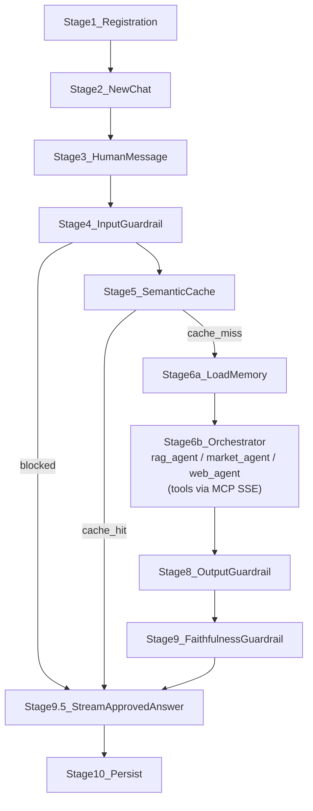

# ZimShire Assistant Flow

End-to-end user story: from registration through a streamed agent response. For each step this document lists what the system **reads**, what it **writes**, and which storage layer is involved.

Related schema reference: [db_schema_reference.md](db_schema_reference.md).

**Storage layers in this flow:**

| Layer | Role |
|-------|------|
| **Postgres (custom tables)** | Users, chats, messages, audit logs, caches |
| **Postgres (LangGraph)** | Short-term graph state (`checkpoints*`) and long-term memory (`store*`) |
| **Qdrant** | Buffett letters corpus (read-only at runtime after offline ingest) |
| **Langfuse** | Traces, latency, token usage (external; linked via `langfuse_trace_id`) |
| **External APIs** | LiteLLM gateway, yfinance, web search |

---

## Overview



**Multi-turn:** Stages 1–2 run once per user / per new chat. Follow-up messages in the same chat start at Stage 3 (see [Stage 11](#stage-11--resuming-an-existing-chat-multi-turn)).

---

## API endpoints (canonical)

Seven REST endpoints — full schemas in [api_endpoints.md](api_endpoints.md):

| Method | Path |
|--------|------|
| `POST` | `/users` |
| `GET` | `/users/{user_id}` |
| `POST` | `/chats` (server generates `chat_id`) |
| `GET` | `/chats/{chat_id}` |
| `GET` | `/chats/{chat_id}/messages` |
| `POST` | `/chats/{chat_id}/messages` (SSE) |
| `GET` | `/health` |

At `POST /chats` the server generates `chat_id`; for every graph turn pass `config["configurable"]["thread_id"] = str(chat_id)`.

---

## Stage 1 — User registration

**Trigger:** `POST /users`.

**Goal:** Create a stable `user_id` for all chats and long-term memory namespaces.

| Action | Table / store | Operation | Data |
|--------|---------------|-----------|------|
| Create identity | `users` | **WRITE** | `user_id` (new uuid4), `created_at` |
| Initialize profile namespace | `store` | **WRITE** | `prefix = users/{user_id}/profile`, `key = "meta"`, `value = {}` |
| — | `store_vectors` | — | No rows until profile fields are indexed |

**Reads:** none.

**Notes:**

- Long-term memory uses LangGraph `AsyncPostgresStore`; you do not INSERT into `store` via raw SQL.
- Optional: also create empty namespace `users/{user_id}/interests` for tracked companies (bonus task).

---

## Stage 2 — Creating a new chat

**Trigger:** `POST /chats` with `{ user_id, chat_title, model, provider }`.

**Goal:** Bind a UI conversation to a LangGraph checkpointer thread via `chat_id`. The server generates `chat_id` — the client never chooses it.

| Action | Table / store | Operation | Data |
|--------|---------------|-----------|------|
| Verify user | `users` | **READ** | `SELECT` by `user_id` |
| Create session | `chats` | **WRITE** | `chat_id` (uuid4), `user_id`, `chat_title`, `model`, `provider`, `created_at`, `updated_at` |
| First graph run (later) | `checkpoints` | **WRITE** (auto) | Created on first `graph.astream()` with `configurable.thread_id = str(chat_id)` |

**Reads:** `users`.

**Invariant:** `config["configurable"]["thread_id"]` must always equal `str(chat_id)` for that session.

**Notes:**

- No checkpoint row exists until the first message is processed.
- `model` / `provider` are fixed for this chat; `POST /chats/{id}/messages` can override model per-turn.

---

## Stage 3 — Human message arrives

**Trigger:** `POST /chats/{chat_id}/messages` with `{ content, model? }`.

**Goal:** Persist the human turn and load chat + graph context.

| Action | Table / store | Operation | Data |
|--------|---------------|-----------|------|
| Resolve session | `chats` | **READ** | `chat_id`, `model`, `provider`, `user_id` |
| Persist human turn | `messages` | **WRITE** | `message_id`, `chat_id`, `role = "human"`, `content`, `grounded = NULL`, `langfuse_trace_id = NULL`, `created_at` |
| Restore graph state | `checkpoints`, `checkpoint_blobs` | **READ** (auto) | Latest snapshot for `str(chat_id)` (empty on first turn) |

**Reads:** `chats`, LangGraph checkpointer tables (if not first turn).

**Writes:** `messages` (human row).

**Langfuse:** Start a session/trace for this user query; keep `trace_id` in memory until the assistant message is saved.

---

## Stage 4 — Input guardrail

**Trigger:** First node in the LangGraph pipeline (before tools / LLM).

**Goal:** Block off-topic queries and prompt injection; log every check.

| Action | Table / store | Operation | Data |
|--------|---------------|-----------|------|
| Log check | `guardrail_logs` | **WRITE** | `message_id` (human), `guardrail_type = "input"`, `result`, `confidence`, `blocked_reason`, `checked_at` |
| Checkpoint | `checkpoints`, `checkpoint_blobs`, `checkpoint_writes` | **READ/WRITE** (auto) | Graph state after guardrail node |

**Reads:** none from custom tables (classifier uses `messages.content` in memory).

**If `result = "blocked"`:**

- Return a friendly refusal to the client (stream or JSON).
- **Do not** run semantic cache, RAG, market, web, or LLM.
- **Do not** insert an assistant row (optional: insert a short assistant refusal — product choice).
- Stop pipeline.

---

## Stage 5 — Semantic cache check

**Trigger:** After input guardrail passes (bonus task; optional in MVP).

**Goal:** Avoid redundant LLM calls for semantically similar questions.

| Action | Table / store | Operation | Data |
|--------|---------------|-----------|------|
| Embed query | — | external | Embedding model via LiteLLM gateway |
| Find similar | `semantic_cache` | **READ** | pgvector: nearest `query_embedding` where similarity ≥ threshold and (`expires_at` IS NULL OR `expires_at > now()`) |
| On HIT | `semantic_cache` | **WRITE** | `UPDATE hit_count = hit_count + 1` |
| On HIT — Langfuse | Langfuse | **WRITE** (external) | Minimal trace with 1 span `type=cache_hit` (no LLM cost); `trace_id` stored on assistant row |
| On HIT response | `messages` | **WRITE** | Assistant row with `content = cached_response`, `grounded` from cached `sources` metadata, `langfuse_trace_id` set |
| On MISS | — | — | Continue to Stage 6 |

**Cache HIT shortcut:** Skip agent graph. FastAPI streams `cached_response` as SSE token events (same chunked streaming as a live answer). A Langfuse trace is created for every request including cache hits — Task 5 requires "every user query must produce a session with traces."

**Reads:** `semantic_cache`.

**Writes (HIT path):** `semantic_cache` (hit_count), `messages` (assistant with `langfuse_trace_id`), Langfuse trace.

---

## Stage 6 — LangGraph agent graph runs

**Trigger:** Cache miss (or semantic cache disabled).

**Goal:** Load short-term + long-term memory, then run the orchestrator (with `rag_agent`, `market_agent`, `web_agent` tools) to produce `draft_answer`.

### Automatic checkpointer (every node boundary)

| Table | Operation | Purpose |
|-------|-----------|---------|
| `checkpoints` | **READ** then **WRITE** | Full graph snapshot (`checkpoint` jsonb, `metadata`) |
| `checkpoint_blobs` | **READ** then **WRITE** | Large/binary channel values |
| `checkpoint_writes` | **WRITE** | Pending writes before commit |

LangGraph handles this; application code does not write SQL to these tables.

**Configurable passed to graph:**

```python
config = {
    "configurable": {
        "thread_id": str(chat.chat_id),
        "user_id": str(chat.user_id),
    }
}
```

### 6a — `load_memory` (short-term + long-term)

| Memory | Source | Operation | State field |
|--------|--------|-----------|-------------|
| **Short-term** | Checkpointer `messages` | Formatted inline in orchestrator system prompt only (not stored) | — |
| **Long-term** | `store` / `store_vectors` | `store.asearch(users/{user_id}/interests, query=state["query"])` | `user_preferences` |

**Writes:** none (`store.aput` in Stage 10).

### 6b — `orchestrator` (research lead + subagent tools)

Single ReAct node. Closure accumulator → graph state on node return:

| Subagent tool | State fields written |
|---------------|----------------------|
| `rag_agent` | `rag_agent_chunks`, `rag_agent_result`, `rag_invoked` |
| `market_agent` | `market_agent_result` (JSON text); cache via `market_data_cache` on miss |
| `web_agent` | `web_agent_sources`, `web_agent_result` |

Plus: `draft_answer`, `messages` (assistant turn).

**Tool path:** `orchestrator` → `app/graph/tools/subagents.py` → `mcp_client.py` → `mcp_server/server.py`.

**Postgres:** `rag_retrievals` deferred to Stage 10 (from `rag_agent_chunks`).

---

## Stage 7 — (merged into orchestrator)

Synthesis is no longer a separate graph node. The orchestrator produces `draft_answer` in the same step as tool calls. Guardrails in Stages 8–9 still run on the complete text before any client streaming.

---

## Stage 8 — Output guardrail

**Trigger:** After `orchestrator` completes; full `draft_answer` is in graph state.

**Goal:** Block or rewrite buy/sell advice, price targets, personalized portfolio recommendations.

| Action | Table / store | Operation | Data |
|--------|---------------|-----------|------|
| Log check | `guardrail_logs` | **WRITE** | `guardrail_type = "output"`, `result`, `confidence`, `blocked_reason` |
| On blocked | — | in-memory | Replace `content` with safe rewritten text before Stage 9–10 |

**Reads:** none.

**Note:** `message_id` for this log should reference the **human** turn being answered, or the **assistant** row if you create a placeholder first — pick one convention and keep it consistent.

---

## Stage 9 — Faithfulness guardrail

**Trigger:** Only when `rag_invoked` is true and the answer cites or relies on Buffett letters.

**Goal:** Ensure letter claims match retrieved passages; set `grounded`.

| Action | Table / store | Operation | Data |
|--------|---------------|-----------|------|
| Log check | `guardrail_logs` | **WRITE** | `guardrail_type = "faithfulness"`, `result`, `confidence` |
| Set flag | — | in-memory | `grounded = true` if ≥ 2 strong hits; `grounded = false` otherwise |

**Rules (from product spec):**

- Strong hit = `similarity_score ≥ 0.75`.
- `grounded = true` when `rag_invoked` and `len(strong_hits) >= 2`; `sources` = strong hits.
- `grounded = false` when `rag_invoked` but fewer than 2 strong hits; response must not invent letter quotes.
- `grounded = null` when `rag_invoked = false` (market-only or web-only answer).

**Reads:** `rag_agent_chunks` from state (not `rag_retrievals` rows yet — inserted in Stage 10).

---

## Stage 9.5 — Stream approved answer to client

**Trigger:** Both `output_guardrail` and `faithfulness_guardrail` have completed; `draft_answer` contains the final, guardrail-approved text.

**Goal:** Deliver the answer to the client via SSE token events. This is the only point where tokens are sent — guaranteeing the client always receives guardrail-approved content.

| Action | Where | Operation |
|--------|-------|-----------|
| Read `draft_answer` from final graph state | in-memory | — |
| Split text into word-chunks (~4 words each) | FastAPI | — |
| Send `{"type": "token", "content": "..."}` SSE events | HTTP | stream to client |

**No Postgres writes here.** Persistence happens in Stage 10, after streaming completes.

---

## Stage 10 — Persist assistant response

**Trigger:** After output and faithfulness guardrails pass (or safe rewrite).

**Goal:** Durably store the assistant turn, retrieval audit trail, caches, and memory updates.

| Order | Table / store | Operation | Data |
|-------|---------------|-----------|------|
| 1 | `messages` | **WRITE** | `role = "assistant"`, `content`, `grounded`, `langfuse_trace_id`, `created_at` |
| 2 | `rag_retrievals` | **WRITE** (N rows) | One row per Qdrant hit: `message_id`, `qdrant_collection`, `qdrant_point_id`, `rank`, `letter_year`, `passage_snippet`, `similarity_score`, `used_in_response` |
| 3 | `semantic_cache` | **WRITE** | `query_embedding`, `original_query`, `cached_response`, `sources`, `hit_count = 0`, `expires_at` |
| 4 | `store` / `store_vectors` | **WRITE** (via API) | `store.aput` for new companies/interests extracted from this turn |
| 5 | `chats` | **UPDATE** | `updated_at = now()` |
| 6 | `checkpoints*` | **WRITE** (auto) | Final graph state including full `messages` history |

**`used_in_response`:** Set `true` on `rag_retrievals` rows whose `letter_year` / snippet appear in the final answer (post-hoc string match or LLM attribution step).

**Unique constraint:** `(message_id, qdrant_collection, qdrant_point_id)` on `rag_retrievals`.

---

## Stage 11 — Resuming an existing chat (multi-turn)

**Trigger:** Client sends another `POST /chats/{chat_id}/messages` to the same `chat_id` (e.g. *"Now compare that to what he said about banks in 1990."*).

**What is skipped:** Stage 1 (registration), Stage 2 (new chat).

**What runs:** Stage 3 → 4 → 5 → 6 → … → 10.

| Action | Table / store | Operation |
|--------|---------------|-----------|
| Load chat | `chats` | **READ** `chat_id`, `user_id`, `model` |
| Save human message | `messages` | **WRITE** |
| Restore full thread | `checkpoints`, `checkpoint_blobs` | **READ** all prior turns in graph state |
| Long-term memory | `store`, `store_vectors` | **READ** interests relevant to new query |

**Why multi-turn works:** LangGraph checkpointer keys state by `thread_id`. Custom `messages` table is the human-readable audit log; the graph’s `messages` channel is the source of truth for the agent during execution. Keep them aligned by appending each turn to both.

---

## Offline path (not in request flow)

**When:** Once before deployment (Task 2).

| Store | Operation | Data |
|-------|-----------|------|
| **Qdrant** `buffett_letters` | **WRITE** (bulk upsert) | All letter chunks: `point_id`, vector, payload |
| Postgres custom tables | — | No user/chat data |

Runtime only **reads** Qdrant; corpus re-ingestion is out of scope for the assignment.

---

## Quick reference — all tables

| Table | READ | WRITE |
|-------|------|-------|
| `users` | Verify `user_id` exists (new chat) | Registration: new `user_id` |
| `chats` | `chat_id`, `model`, `provider`, `user_id` per request | Create chat; `UPDATE updated_at` after assistant reply |
| `messages` | Optional: history API for UI | Human turn; assistant turn (`grounded`, `langfuse_trace_id`) |
| `rag_retrievals` | Optional: citations API | One row per Qdrant hit after assistant message |
| `guardrail_logs` | Analytics only | `input`, `output`, `faithfulness` per check |
| `market_data_cache` | TTL lookup by `ticker` + `data_type` | New row on yfinance miss |
| `semantic_cache` | Vector similarity on user query | New row after LLM answer; `hit_count++` on hit |
| `checkpoints` | Restore graph state per `str(chat_id)` | Auto after each graph node |
| `checkpoint_blobs` | Restore channel blobs | Auto after each graph node |
| `checkpoint_writes` | — | Auto pending writes |
| `store` | User profile / interests | Profile init; `aput` new interests (Stage 10) |
| `store_vectors` | `asearch` for personalization | Auto when indexed fields updated |
| **Qdrant** | RAG search at runtime | Offline ingest only |
| **Langfuse** | Dashboard | Traces/spans per request and LLM call |

---

## Example API response shape (after Stage 10)

```json
{
  "message_id": "uuid",
  "role": "assistant",
  "content": "...",
  "grounded": true,
  "sources": [
    { "letter_year": 1988, "passage": "...", "similarity_score": 0.87 }
  ],
  "langfuse_trace_id": "trace-..."
}
```

`sources` can be built from `rag_retrievals` rows where `used_in_response = true`, or returned directly from graph state before persistence.

---

## Implementation checklist

1. **Migrations** — Alembic/SQL for all custom tables per [db_schema_reference.md](db_schema_reference.md).
2. **LangGraph setup** — `AsyncPostgresSaver` + `AsyncPostgresStore` with `setup()` on app startup.
3. **thread_id sync** — Always `str(chat_id)` in `configurable`; no separate column in `chats`.
4. **Guardrails** — Three explicit log rows; block early on input.
5. **RAG** — Query Qdrant in graph; persist `rag_retrievals` only after assistant `message_id` exists.
6. **Langfuse** — One trace per user message; store ID on assistant row.
7. **Streaming** — Buffer final text for guardrails, then persist in Stage 10.
8. **Tests** — Integration tests for: input block, cache hit, cache miss + RAG persist, multi-turn checkpoint restore.
