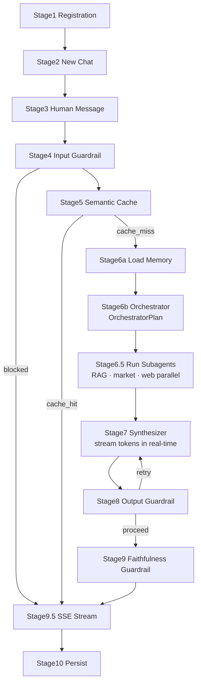

# ZimShire Assistant Flow

End-to-end request lifecycle: from registration through a streamed agent response. For each stage this document lists what the system **reads**, what it **writes**, and which storage layer is involved.

Related schema reference: [db_schema_reference.md](db_schema_reference.md).

**Storage layers:**

| Layer | Role |
|-------|------|
| **Postgres (custom tables)** | Users, chats, messages, audit logs, caches |
| **Postgres (LangGraph)** | Short-term graph state (`checkpoints*`) and long-term memory (`store*`) |
| **Qdrant** | Buffett letters corpus (read-only at runtime after offline ingest) |
| **Langfuse** | Traces, latency, token usage (external; linked via `langfuse_trace_id`) |
| **LiteLLM Gateway** | All LLM calls (orchestrator, subagents, guardrails, embeddings) |

---

## Overview



**Multi-turn:** Stages 1–2 run once per user / per new chat. Follow-up messages in the same chat start at Stage 3.

---

## API endpoints (13)

| Method | Path |
|--------|------|
| `POST` | `/users` |
| `GET` | `/users/{user_id}` |
| `POST` | `/chats` |
| `GET` | `/chats/{chat_id}` |
| `GET` | `/chats/{chat_id}/messages?user_id=` |
| `POST` | `/chats/{chat_id}/messages` (SSE) |
| `GET` | `/users/{user_id}/memory/long-term` |
| `GET` | `/users/{user_id}/chats/{chat_id}/memory/short-term` |
| `GET` | `/health` |
| `GET` | `/debug/semantic-cache` |
| `GET` | `/debug/market-data-cache` |
| `GET` | `/debug/chats/{chat_id}/rag-retrievals` |
| `GET` | `/debug/chats/{chat_id}/guardrail-logs` |

---

## Stage 1 — User registration

**Trigger:** `POST /users`

| Action | Table | Operation | Data |
|--------|-------|-----------|------|
| Create identity | `users` | WRITE | `user_id` (uuid4), `name`, `surname`, `created_at` |

---

## Stage 2 — New chat

**Trigger:** `POST /chats`

| Action | Table | Operation | Data |
|--------|-------|-----------|------|
| Verify user | `users` | READ | `SELECT` by `user_id` |
| Create session | `chats` | WRITE | `chat_id` (uuid4 = LangGraph `thread_id`), `user_id`, `chat_title`, `model` |

**Invariant:** `config["configurable"]["thread_id"]` always equals `str(chat_id)`.

---

## Stage 3 — Human message arrives

**Trigger:** `POST /chats/{chat_id}/messages`

| Action | Table | Operation | Data |
|--------|-------|-----------|------|
| Resolve session | `chats` | READ | `chat_id`, `model`, `user_id` |
| Persist human turn | `messages` | WRITE | `message_id`, `chat_id`, `role="human"`, `content`, `grounded=NULL` |
| Restore graph state | `checkpoints`, `checkpoint_blobs` | READ (auto) | Latest snapshot for `str(chat_id)` |

---

## Stage 4 — Input guardrail

**Node:** `input_guardrail` in `pipeline/preflight.py`

**Goal:** Block off-topic queries, prompt injection, and personal advice requests.

**Implementation:** Single `gpt-4o-mini` call returning `{blocked: bool, reason: str|null}`. Fail-open on LLM error.

| Action | Table | Operation | Data |
|--------|-------|-----------|------|
| Log check | `guardrail_logs` | WRITE | `message_id` (human), `guardrail_type="input"`, `result`, `blocked_reason` |
| Checkpoint | `checkpoints*` | READ/WRITE (auto) | Graph state after node |

**If blocked:** Adds safe `AIMessage` to state, routes to END. Client receives `blocked` + `done` SSE events. No assistant row written.

---

## Stage 5 — Semantic cache check

**Node:** `semantic_cache_check` in `pipeline/preflight.py`

**Goal:** Avoid LLM calls for semantically similar queries.

| Action | Table | Operation | Data |
|--------|-------|-----------|------|
| Embed query | — | LiteLLM | `text-embedding-3-small` |
| Find similar | `semantic_cache` | READ | pgvector cosine ≥ 0.92, not expired |
| On HIT | `semantic_cache` | WRITE | `hit_count += 1` |

**On HIT:** Skip all LLM calls. `draft_answer`, `sources`, and `grounded` come from the cache row. FastAPI streams the cached answer as SSE token events. A Langfuse trace is still created.

**On MISS:** Continue to Stage 6.

---

## Stage 6a — Load memory

**Node:** `load_memory` in `pipeline/preflight.py`

| Memory | Source | API |
|--------|--------|-----|
| **Long-term** | `store` / `store_vectors` | `LongTermMemoryService.load_profile(user_id, query)` |
| **Short-term** | `checkpoints` (messages) | `ShortTermMemoryService.format_recent_turns()` — formatted inline for system prompt, NOT stored in state |

**Returns:** `user_profile: {tracked_companies, research_interests, preferences, explicit_memories}`

---

## Stage 6b — Orchestrator (planner)

**Node:** `orchestrator` in `pipeline/planning.py` — Model: `claude-sonnet-4-6`

**Goal:** Decide which subagents to invoke. Does **not** call tools — it plans.

**Implementation:** `llm.with_structured_output(OrchestratorPlan)` — returns a typed plan, not a ReAct loop.

```python
class OrchestratorPlan(BaseModel):
    subagents: list[SubagentPlanItem]   # name: rag|market|web, enabled: bool
    direct_answer_possible: bool        # True for conversational follow-ups
    reasoning: str
```

**Writes to state:** `subagent_plan` (serialised `OrchestratorPlan`)

---

## Stage 6.5 — Run subagents (parallel)

**Node:** `run_subagents` in `pipeline/research/runner.py` — Model: `claude-haiku-4-5` per subagent

**Goal:** Execute the enabled subagents in parallel and accumulate results.

**Implementation:** `asyncio.gather` over all enabled items from `subagent_plan`. Each subagent runs its own ReAct loop with filtered MCP tools.

| Subagent | MCP tool(s) | Cache |
|----------|------------|-------|
| `rag` | `search_buffett_letters` | Qdrant (via MCP) |
| `market` | 12 yfinance tools | `market_data_cache` (1-hour TTL) |
| `web` | `web_search`, `web_search_news` | None |

**Writes to state:** `collected_context` (`{rag, market, web}`), `rag_agent_chunks`, `rag_invoked`, `web_agent_sources`, `subagent_results`

**DB:** `market_data_cache` READ/WRITE per market tool call.

---

## Stage 7 — Synthesizer

**Node:** `synthesizer` in `pipeline/synthesis.py` — Model: `claude-sonnet-4-6`

**Goal:** Produce the final answer from all collected context.

**Key change:** Uses `llm.astream()` so LangGraph's `stream_mode="messages"` captures tokens in real-time. These tokens are forwarded as SSE `token` events to the client as they're generated — users see the answer being written character by character.

System prompt includes: user profile, last 5 conversation turns, collected context (RAG + market + web), optional `feedback_message` if this is a guardrail retry.

**Writes to state:** `draft_answer`, `messages` (AIMessage), `feedback_message=None`

---

## Stage 8 — Output guardrail

**Node:** `output_guardrail` in `pipeline/safety.py` — Model: `gpt-4o-mini`

**Goal:** Block buy/sell advice, price targets, and factual hallucinations.

**Implementation:** Single LLM call against the **full collected context** (RAG + market + web + user profile + conversation). Checks:
1. **Safety** — buy/sell/price targets/portfolio advice
2. **Factual** — claims not found in any context source

| Action | Table | Operation |
|--------|-------|-----------|
| Log check | `guardrail_logs` | WRITE |
| On violation: retry | state | feedback_message written |
| On exhaustion: replace | state | `output_rewritten=True`, `draft_answer=safe_fallback` |

**Retry logic:** On violation + `retry_count < 2` → writes `feedback_message` → routes back to `synthesizer`. If synthesis tokens were already streamed, a `replace` SSE event is sent to the client.

**Max retries:** `output_guardrail_max_retries=2` (from `config.py`)

---

## Stage 9 — Faithfulness guardrail

**Node:** `faithfulness_guardrail` in `pipeline/safety.py` — Model: `gpt-4o-mini`

**Runs only when** `rag_invoked=True`.

**Goal:** Determine whether the answer is grounded in retrieved Buffett letter passages.

**Implementation:** LLM evaluates the answer against retrieved passages, returning `{grounded: bool, score: float}`. Fallback (if LLM fails): similarity threshold check.

**Strong hit threshold:** `FAITHFULNESS_SCORE_THRESHOLD = 0.40` — calibrated for `text-embedding-3-small`'s cosine scale (relevant passages score 0.35–0.55, not 0.7–0.9).

| Action | Table | Operation |
|--------|-------|-----------|
| Log check | `guardrail_logs` | WRITE `guardrail_type="faithfulness"` |

**`grounded=false` does NOT block the answer** — it's a transparency flag. The `done` event carries `grounded=false, sources=[]` so the client can show a disclaimer.

---

## Stage 9.5 — Stream approved answer

**Goal:** Deliver the synthesizer output as SSE token events.

With real-time streaming (`stream_mode=["messages","values"]`), synthesizer tokens are already flowing to the client as they're generated (Stage 7). Stage 9.5 handles:
- **Progress events:** emitted at stage boundaries (`subagent_plan` and `collected_context` state transitions)
- **Replace event:** if `output_rewritten=True`, send `{"type":"replace","content":"..."}` to tell the client to discard prior tokens
- **Cache hits:** stream cached answer as word-chunks (no LLM running)
- **Blocked queries:** send `{"type":"blocked","reason":"..."}` then `done`

No Postgres writes here. Persistence happens in Stage 10.

---

## Stage 10 — Persist assistant response

**Trigger:** After output + faithfulness guardrails complete.

| Order | Table | Operation | Data |
|-------|-------|-----------|------|
| 1 | `messages` | WRITE | `role="assistant"`, `content`, `grounded`, `langfuse_trace_id`, `created_at` |
| 2 | `rag_retrievals` | WRITE (N rows) | One row per Qdrant hit: `message_id`, `letter_year`, `passage_snippet`, `similarity_score`, `used_in_response` |
| 3 | `semantic_cache` | WRITE | `query_embedding`, `original_query`, `cached_response`, `sources`, `expires_at` |
| 4 | `store` / `store_vectors` | WRITE (async) | `store.aput` for new interests extracted from this turn (fire-and-forget) |
| 5 | `chats` | UPDATE | `updated_at = now()` |
| 6 | `checkpoints*` | WRITE (auto) | Final graph state including full `messages` history |

**`used_in_response`:** Set `true` on `rag_retrievals` rows whose `qdrant_point_id` appears in `sources` from the faithfulness guardrail.

---

## Stage 11 — Resuming an existing chat (multi-turn)

**Trigger:** Another `POST /chats/{chat_id}/messages` to the same `chat_id`.

Stages 1–2 are skipped. Stage 3 → 10 run normally.

The LangGraph checkpointer restores full message history from `checkpoints*`. The orchestrator and synthesizer see all prior turns in `state["messages"]`.

```
Turn 1: "How would Buffett evaluate Apple's moat?" → RAG invoked
Turn 2: "Compare to Coca-Cola in 1988."
         → messages restored → RAG invoked with years=[1988] hint
```

---

## Quick reference — all tables

| Table | READ | WRITE |
|-------|------|-------|
| `users` | Verify user (Stage 2) | Registration (Stage 1) |
| `chats` | `chat_id`, `model`, `user_id` per request | Create (Stage 2); `updated_at` (Stage 10) |
| `messages` | History API | Human turn (Stage 3); assistant turn (Stage 10) |
| `rag_retrievals` | Debug API | One row per Qdrant hit (Stage 10) |
| `guardrail_logs` | Debug API | Input/output/faithfulness checks (Stages 4, 8, 9) |
| `market_data_cache` | TTL lookup per ticker (Stage 6.5) | New row on yfinance miss |
| `semantic_cache` | Similarity search (Stage 5) | New row after answer (Stage 10); `hit_count++` on hit |
| `checkpoints*` | Restore per `str(chat_id)` | Auto after each graph node |
| `store` / `store_vectors` | User profile (Stage 6a) | Interests (Stage 10) |
| **Qdrant** | RAG search via MCP (Stage 6.5) | Offline ingest only |
| **Langfuse** | Dashboard | Trace per request + LLM generation spans |
