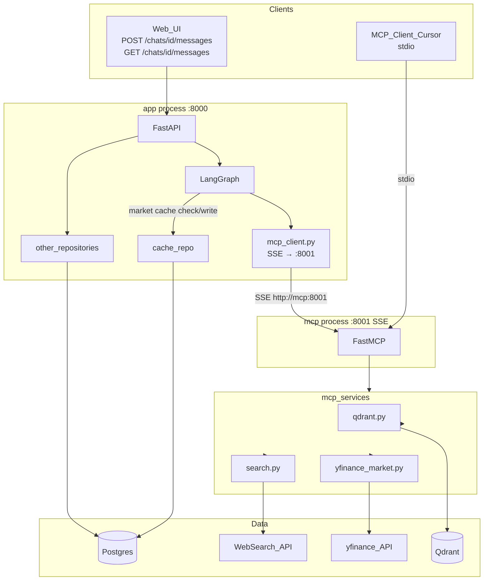

# ZimShire — файловая архитектура

Два runtime-процесса:

| Процесс | Пакет | Назначение |
|---------|--------|------------|
| **API** | `app/` | FastAPI, LangGraph-агент, персистенция чатов, SSE |
| **MCP** | `mcp_server/` | Отдельный микросервис FastMCP — только data-tools (letters, market, web). Имя `mcp_server/` вместо `mcp/` чтобы не конфликтовать с official `mcp` SDK который тянет `fastmcp` |

Логика данных (Qdrant, yfinance, web search) живёт только в **`mcp_server/services/`**. Процесс **`app/`** обращается к tools через **`MCP_BASE_URL`** (`app/graph/mcp_client.py`), без прямого импорта Qdrant/yfinance в graph nodes.

---

## Дерево проекта

```
zimshire/
├── docs/                          # Документация (не код)
├── app/                           # FastAPI + LangGraph (основное приложение)
│   ├── main.py
│   ├── core/
│   ├── routers/
│   ├── graph/
│   ├── models/
│   ├── schemas/
│   ├── db/
│   ├── repositories/
│   └── services/                  # Только оркестрация / graph-специфика (тонкий слой)
├── mcp_server/                    # MCP-микросервис (отдельный процесс, вне app/)
│   ├── main.py
│   ├── server.py
│   ├── core/
│   └── services/                  # qdrant, yfinance_market, search
├── scripts/                       # Офлайн-скрипты (ingest в Qdrant)
├── tests/
│   ├── app/
│   ├── graph/
│   └── mcp_server/
├── alembic/                       # Миграции Postgres
├── pgadmin/
│   └── servers.json
├── init.sql                       # CREATE EXTENSION vector (первый старт Postgres)
├── alembic.ini
├── docker-compose.yaml
├── .env / .env.example
├── requirements.txt               # Общие зависимости (или split: requirements-app.txt + requirements-mcp.txt)
├── run.sh                         # Запуск API + infra
├── run-mcp.sh                     # Запуск только MCP
└── .gitignore
```

---

## Корень репозитория

| Файл / папка | Назначение |
|--------------|------------|
| `docs/` | Спеки: `agent_architecture.md`, `db_schema_reference.md`, `assistant_flow.md`, `implementation_plan.md`. |
| `init.sql` | Выполняется Postgres **один раз** при создании volume: `CREATE EXTENSION vector`. Таблицы сюда **не** пишем — только Alembic. |
| `alembic.ini` + `alembic/` | Версионирование схемы Postgres. `alembic_version` — служебная таблица Alembic. |
| `docker-compose.yaml` | Postgres, Qdrant, pgAdmin, `mcp` (:8001), `api` (:8000). |
| `.env` | Секреты и URL (не в git). |
| `.env.example` | Шаблон переменных без значений. |
| `requirements.txt` | Python-зависимости. При росте проекта можно разделить на `requirements-app.txt` и `requirements-mcp.txt`. |
| `run.sh` | `docker compose up` → `alembic upgrade head` → `uvicorn app.main:app`. |
| `run-mcp.sh` | Запуск MCP: `python -m mcp_server.main` (stdio или SSE — по конфигу). |
| `pgadmin/servers.json` | Преднастройка сервера Postgres в pgAdmin. |

---

## `app/` — основное приложение (FastAPI + LangGraph)

**Граница:** всё, что связано с HTTP API, графом агента, чатами, guardrails в графе, записью в custom-таблицы Postgres.

### `app/main.py`

- Фабрика FastAPI (`app = FastAPI(...)`).
- Подключение роутеров из `app/routers/`.
- Lifespan: `init_mcp_client(settings.mcp_base_url)`, `checkpointer.setup()`, `store.setup()`.
- CORS, middleware при необходимости.
- **Не** содержит логику RAG/market/web — только wiring.

### `app/core/`

| Файл | Назначение |
|------|------------|
| `config.py` | `pydantic-settings`: `DATABASE_URL`, `QDRANT_URL`, `MCP_BASE_URL`, `MCP_PORT`, LiteLLM, Langfuse. |
| `prompts.py` | Системные промпты: orchestrator, subagents, guardrail-шаблоны. |
| `dependencies.py` | FastAPI Depends: `get_db()`, `get_settings()`, опционально текущий `user_id`. |

### `app/routers/`

HTTP-слой (канон). Только валидация, коды ответов, вызов repository/graph. См. `docs/api_endpoints.md`.

| Файл | Назначение |
|------|------------|
| `users.py` | `POST /users`, `GET /users/{user_id}` |
| `chats.py` | `POST /chats`, `GET /chats/{chat_id}` |
| `messages.py` | `GET /chats/{chat_id}/messages`, `POST /chats/{chat_id}/messages` (SSE) |
| `health.py` | `GET /health` (Postgres + Qdrant + MCP) |

Подробные схемы запросов/ответов — в `docs/api_endpoints.md`.

### `app/schemas/`

Pydantic-модели запросов/ответов API. **Не** SQLAlchemy.

| Файл | Назначение |
|------|------------|
| `user.py` | `UserCreate`, `UserResponse`. |
| `chat.py` | `ChatCreate`, `ChatResponse`, список чатов. |
| `message.py` | `MessageCreate`, stream chunks, `grounded` в ответе. |
| `common.py` | Общие типы, пагинация, ошибки. |

### `app/models/`

SQLAlchemy ORM — **7 custom-таблиц** (см. `docs/db_schema_reference.md`).

| Файл | Назначение |
|------|------------|
| `models.py` | `Base`, `User`, `Chat`, `Message`, `RagRetrieval`, `GuardrailLog`, `MarketDataCache`, `SemanticCache`. |
| `__init__.py` | Реэкспорт моделей для Alembic и repositories. |

LangGraph-таблицы (`checkpoints`, `store`, …) **не** описываются здесь — создаются через `checkpointer.setup()` / `store.setup()`.

### `app/db/`

Подключение к Postgres (async).

| Файл | Назначение |
|------|------------|
| `database.py` | `create_async_engine`, `AsyncSessionLocal`. |

### `app/repositories/`

Только CRUD и запросы к **custom**-таблицам. Без вызовов LLM/Qdrant.

| Файл | Назначение |
|------|------------|
| `user_repo.py` | `create_user`, `get_user`. |
| `chat_repo.py` | CRUD чатов. |
| `message_repo.py` | Сохранение human/assistant, `grounded`, `langfuse_trace_id`. |
| `rag_repo.py` | Batch insert в `rag_retrievals` после ответа. |
| `guardrail_repo.py` | Insert в `guardrail_logs`. |
| `cache_repo.py` | `market_data_cache`, `semantic_cache` (read/write + TTL). |

### `app/services/` (тонкий слой в app)

Оркестрация **внутри API**, которая не должна жить в graph-нодах:

| Файл | Назначение |
|------|------------|
| `chat_service.py` | Создание чата, вызов graph (`thread_id=str(chat_id)`), persist после stream. |
| `graph_service.py` | `build_graph()`, `get_compiled_graph()`, init checkpointer/store. |
| `langfuse_service.py` | Обёртки trace/span для FastAPI. |

**Правило:** Qdrant / yfinance / web search — только через MCP tools. Embeddings для semantic cache — в `app/services/embedding.py`.

### `app/graph/` — LangGraph (ядро агента)

| Файл / папка | Назначение |
|--------------|------------|
| `state.py` | `ZimShireState`: `query`, `user_preferences`, `rag_agent_*`, `web_agent_*`, `market_agent_result`, guardrail flags. |
| `builder.py` | `build_graph()` → compiled graph + checkpointer + store. |
| `routing.py` | `route_after_input`, `route_after_cache`, conditional edges. |
| `mcp_client.py` | Инициализация `langchain-mcp-adapters` сессии с `mcp_server/main.py`. Экспортирует `get_mcp_tools() → dict[str, BaseTool]`. Вызывается при старте app (lifespan). |
| `nodes/guardrails.py` | `input_guardrail`, `output_guardrail`, `faithfulness_guardrail` — LiteLLM classifiers. |
| `nodes/cache.py` | `semantic_cache_check` — embed query → pgvector lookup в `semantic_cache`. |
| `nodes/memory.py` | `load_memory` — short-term (messages) + long-term (`store.asearch`). |
| `nodes/orchestrator.py` | ReAct-оркестратор с subagent tools. |
| `tools/subagents.py` | `rag_agent`, `market_agent`, `web_agent` — обёртки над MCP. |
**Правило 1:** `tools/subagents.py` — только MCP tools через `mcp_client`. Прямой импорт `mcp_server/services/` запрещён.

**Правило 2:** `market_agent` в `subagents.py` — единственное место в graph-слое, использующее `repositories/cache_repo.py` (TTL cache в app Postgres).

**Правило 3:** graph **не** пишет в `messages` / `rag_retrievals` — это FastAPI Stage 10.

**Правило 4:** `mcp_client.py` использует SSE transport (`http://mcp:8001`) — concurrent-safe для нескольких одновременных FastAPI-запросов. Инициализируется один раз в lifespan.

---

## `mcp_server/` — отдельный MCP-микросервис

**Граница:** отдельный процесс (`python -m mcp_server.main`). Expose **tools** (letters, market, web), **не** полный агент. Для Cursor и других MCP-клиентов.

```
mcp_server/
├── main.py              # Entry: --transport sse --port 8001 (или stdio для Cursor)
├── server.py            # @mcp.tool() — тонкие обёртки
├── core/
│   └── config.py        # QDRANT_URL, LiteLLM (embeddings), search API keys
└── services/
    ├── qdrant.py        # Buffett letters search
    ├── yfinance_market.py  # stateless fetch (no Postgres cache write)
    └── search.py        # DuckDuckGo (DUCKDUCKGO_API_KEY)
```

| Файл | Назначение |
|------|------------|
| `main.py` | Старт FastMCP; SSE на `MCP_PORT` (default 8001). |
| `server.py` | Регистрация tools; вызывает `mcp.services.*`. |
| `core/config.py` | `QDRANT_URL`, embedding/search keys; **без** `DATABASE_URL` (MCP не пишет в `market_data_cache`). |

**Правило:** в `mcp_server/` **нет** LangGraph, **нет** routers, **нет** repositories. `market_data_cache` — только в **app** (`cache_repo`).

**Transport:**
- **Internal (graph → MCP):** SSE at `http://mcp:8001` — concurrent-safe для множества параллельных FastAPI-запросов
- **External (Cursor/Claude Code → MCP):** stdio (`python -m mcp_server.main`) — отдельный запуск, не конфликтует с docker

**Docker** (все 4 сервиса в `docker-compose.yaml`):

```yaml
services:
  postgres:
    image: pgvector/pgvector:pg16
    environment:
      POSTGRES_DB: zimshire
      POSTGRES_USER: zimshire
      POSTGRES_PASSWORD: zimshire
    volumes:
      - postgres_data:/var/lib/postgresql/data
      - ./init.sql:/docker-entrypoint-initdb.d/init.sql
  qdrant:
    image: qdrant/qdrant
    ports: ["6333:6333"]
  mcp:
    build: .
    command: python -m mcp_server.main --transport sse --port 8001
    ports: ["8001:8001"]
    depends_on: [qdrant, postgres]
    env_file: .env
  api:
    build: .
    command: uvicorn app.main:app --host 0.0.0.0 --port 8000
    ports: ["8000:8000"]
    depends_on: [postgres, qdrant, mcp]
    env_file: .env
volumes:
  postgres_data:
```

---

## `scripts/` — офлайн, вне runtime

| Файл | Назначение |
|------|------------|
| `download_letters.py` | Скачивание писем с berkshirehathaway.com/letters (1965–2024) → `data/letters/{YEAR}.md` (HTML/PDF → Markdown + YAML frontmatter). |
| `ingest_letters.py` | Чтение `{YEAR}.md` / `.txt` → chunk → embed → upsert в Qdrant (`mcp_server` helpers, offline). |

---

## `tests/`

| Папка | Что тестировать |
|-------|-----------------|
| `tests/app/` | API routes, repositories (с test DB). |
| `tests/graph/` | routing, nodes (mock `get_mcp_tools`). |
| `tests/mcp_server/` | tool contracts + `mcp_server/services` unit tests. |

---

## Потоки данных (кратко)



---

## Слои: кто что может

| Слой | Может | Не может |
|------|--------|----------|
| `routers` | HTTP, Depends, вызов service/graph | Прямой Qdrant/SQL в роуте |
| `schemas` | Валидация JSON | Бизнес-логика |
| `repositories` | SQLAlchemy CRUD | LLM, Qdrant |
| `graph/tools/subagents.py` | MCP tools через `mcp_client` (SSE); `cache_repo` для market TTL | Прямой импорт `mcp_server/services/` |
| `graph/nodes/orchestrator.py` | `ainvoke` → `draft_answer` в state | `astream`, стриминг клиенту (делает FastAPI после guardrails) |
| `graph/nodes/*` (остальные) | State, LiteLLM, `store` | Прямая запись `messages` (делает FastAPI Stage 10) |
| `mcp_server/services` | Qdrant, yfinance, web search | HTTP routes, LangGraph state |
| `mcp_server/server` | Tools → `mcp_server/services` | LangGraph, FastAPI, repositories |

---

## Текущее состояние vs целевое

| Уже есть | Целевое (добавить по фазам) |
|----------|-----------------------------|
| `app/core/config.py`, `prompts.py` | `dependencies.py` |
| `app/models/`, `app/db/` | `repositories/`, `schemas/`, `routers/` |
| `app/main.py` | `graph/`, `mcp_client`, `services/` |
| `alembic/`, `init.sql` | — |
| — | `mcp_server/` (+ `mcp_server/services/`), `scripts/`, `run-mcp.sh`, docker `api`+`mcp` |

---

## Запуск

```bash
# Полный docker-запуск (все 4 сервиса)
docker compose up -d
alembic upgrade head
python scripts/download_letters.py
python scripts/ingest_letters.py

# Локальная разработка (infra + mcp в docker, api локально)
docker compose up -d postgres qdrant mcp
alembic upgrade head
uvicorn app.main:app --reload --port 8000

# Cursor MCP (stdio, отдельно от docker)
python -m mcp_server.main
```

---

## Связанные документы

- `docs/agent_architecture.md` — ноды графа, guardrails, MCP Task 4
- `docs/db_schema_reference.md` — таблицы Postgres + Qdrant
- `docs/assistant_flow.md` — порядок read/write по таблицам
- `docs/implementation_plan.md` — фазы реализации
