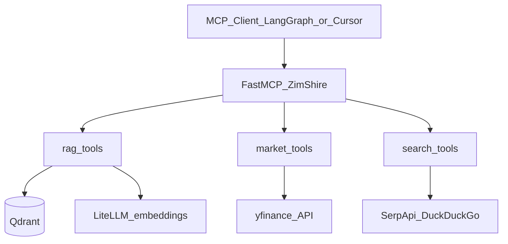

# ZimShire MCP Tools Reference

Reference for all MCP tools exposed by the `mcp_server/` package. Each tool is
registered on the **ZimShire** FastMCP server and is accessible via:

- **stdio** — for Cursor / Claude Code MCP config
- **streamable-http / SSE** — for the internal LangGraph agent

---

## Relevance legend

| Badge | Meaning |
|---|---|
| Essential | Core to ZimShire's Buffett-first research mission; orchestrator should use freely |
| Useful | Situationally valuable; worth registering but called less often |
| UI only | Renders an interactive widget for IDE clients (Cursor / Claude Code); never call from LangGraph agent |
| Overkill / Avoid | Conflicts with Buffett philosophy, ZimShire policy, or output guardrail; risk of triggering safety violations |

**Important note on Overkill tools:** Tools marked Overkill should either not be registered with the
orchestrator at all, or be excluded from the tool list passed to `create_react_agent`. If the
orchestrator calls `get_analyst_targets` or `get_recommendations` and the data flows into
`collected_context`, the output guardrail will likely block the response as a safety violation.
Keep these tools available for MCP clients (Cursor) but hidden from the LangGraph agent.

---

## Running the server

```bash
# Always run from the repo root
python -m mcp_server.main                                        # stdio (Cursor)
python -m mcp_server.main --transport streamable-http --port 8001  # LangGraph SSE
```

---

## Environment variables

All config lives in `.env` (loaded by `mcp_server/core/config.py`).

| Variable | Used by | Description |
|---|---|---|
| `QDRANT_URL` | RAG | Qdrant HTTP endpoint, e.g. `http://localhost:6333` |
| `QDRANT_COLLECTION` | RAG | Collection name, default `buffett_letters` |
| `LITELLM_BASE_URL` | RAG | LiteLLM proxy base URL |
| `LITELLM_API_KEY` | RAG | Bearer token for LiteLLM |
| `LITELLM_END_USER_ID` | RAG | End-user ID header sent to LiteLLM |
| `EMBEDDING_MODEL` | RAG | Dense embedding model, default `text-embedding-3-small` |
| `DUCKDUCKGO_API_KEY` | Web | SerpApi key (DuckDuckGo engine) |

Market tools require no API keys — they use `yfinance` directly.

---

## Architecture



---

## Data tools

### RAG

#### `search_buffett_letters` — Essential

Hybrid RAG search over Warren Buffett shareholder letters (1977–2024) stored in Qdrant.
Retrieval uses dense embeddings (LiteLLM) + sparse BM25 prefetch with RRF fusion,
reranked by ColBERT late-interaction multivectors inside Qdrant.

**Purpose:** Retrieve passages from Buffett's letters that are semantically relevant to a query.
This is the single most important tool in ZimShire — every answer should attempt to ground
itself here first.

**When to use:** Any time the question involves Buffett's investment philosophy, opinions on
specific industries, capital allocation, or historic commentary. Use `letter_years_filter` to
narrow to a specific era (e.g. "what did he say about banks in 1990").

**Input**

| Parameter | Type | Default | Description |
|---|---|---|---|
| `query` | `str` | required | Natural language search query |
| `top_k` | `int` | `5` | Number of results to return |
| `letter_years_filter` | `list[int] \| None` | `None` | Filter to specific years, e.g. `[1990, 1991]` |

**Output** — `list[dict]`

```json
[
  {
    "letter_year": 1998,
    "passage_snippet": "We look for businesses with durable competitive advantages...",
    "similarity_score": 0.872,
    "qdrant_point_id": "6ba7b810-9dad-11d1-80b4-00c04fd430c8",
    "chunk_index": 3,
    "source_file": "1998.txt"
  }
]
```

---

### Market — Fundamentals

#### `get_stock_info` — Essential

**Purpose:** Full company profile — sector, market cap, P/E, EPS, dividend yield, business
description, CEO, employee count (~100 fields from Yahoo Finance `.info`).

**When to use:** The primary tool for "How would Buffett evaluate X's moat?" type questions.
Provides P/E, forward P/E, market cap, business description — all core inputs for
Buffett-style analysis. Slower than `get_stock_price` because it fetches the full info dict.

**Input:** `ticker: str`

**Output:** `dict` — all Yahoo Finance info fields including: `sector`, `industry`,
`marketCap`, `trailingPE`, `forwardPE`, `eps`, `dividendYield`, `longBusinessSummary`,
`fullTimeEmployees`, `companyOfficers`, and ~100 more.

---

#### `get_stock_price` — Essential

**Purpose:** Lightweight current price snapshot — last price, previous close, 52-week
high/low, market cap, shares outstanding.

**When to use:** When only price metrics are needed. Prefer over `get_stock_info` for speed;
avoids fetching the full info dict. Use for "What is Apple trading at right now?"

**Input:** `ticker: str`

**Output:** `dict`

| Field | Description |
|---|---|
| `last_price` | Most recent traded price |
| `previous_close` | Previous session close |
| `year_high` / `year_low` | 52-week high / low |
| `market_cap` | Market capitalisation |
| `shares` | Shares outstanding |

---

### Market — Price History

#### `get_stock_history` — Useful

**Purpose:** OHLCV price history for a ticker over a configurable period and interval.

**When to use:** Relevant for Buffett-style long-term analysis ("how has this business
performed over 10 years?"). Use `period="max"` and `interval="1mo"` for long-term trends.
Less useful for short-term charts which contradict Buffett's philosophy.

**Input**

| Parameter | Type | Default | Values |
|---|---|---|---|
| `ticker` | `str` | required | — |
| `period` | `str` | `"1mo"` | `1d` `5d` `1mo` `3mo` `6mo` `1y` `2y` `5y` `10y` `ytd` `max` |
| `interval` | `str` | `"1d"` | `1m` `5m` `15m` `1h` `1d` `1wk` `1mo` |

**Output:** `list[dict]` — rows with `Date`, `Open`, `High`, `Low`, `Close`, `Volume`.

---

### Market — Financials

All three financial statement tools share the same signature:

**Input:** `ticker: str`, `quarterly: bool = False`
(`quarterly=True` returns last 4 quarters; `False` returns annual)

**Output:** `dict` — `{metric_name: {date_string: value, ...}, ...}`

#### `get_income_statement` — Essential

**Purpose:** Income statement (P&L) — revenue, gross profit, EBITDA, operating income, net income.

**When to use:** Core Buffett analysis — earnings power, margin trends, revenue growth over
years. Essential for "Is Coca-Cola still the business Buffett described in 1988?" questions.
Pass `quarterly=True` to get the most recent quarter.

Revenue, gross profit, EBITDA, operating income, net income.

---

#### `get_balance_sheet` — Essential

**Purpose:** Balance sheet — total assets, total debt, cash and equivalents, stockholders equity.

**When to use:** Buffett is obsessed with financial strength and minimal debt. Required for
any analysis of a company's balance sheet quality and margin of safety. Pass `quarterly=True`
for the latest snapshot.

Total assets, total debt, cash and equivalents, stockholders equity.

---

#### `get_cashflow` — Essential

**Purpose:** Cash flow statement — operating cash flow, capital expenditures, free cash flow.

**When to use:** Buffett considers free cash flow more important than net income — "earnings
are an opinion, cash is a fact." Use whenever analysing a business's real economic output.

Operating cash flow, capital expenditures, free cash flow.

---

### Market — Analysis

#### `get_earnings_estimate` — Useful

**Purpose:** Forward EPS estimates from analysts for current quarter, next quarter, current
year, and next year.

**When to use:** Useful as context for "what does the market currently expect from X's
earnings?" — framed as market expectations, not as a recommendation. The orchestrator must
present this as data, not as advice.

**Input:** `ticker: str`

**Output:** `dict` — keyed by `0q`, `+1q`, `0y`, `+1y`. Each period contains
`numberOfAnalysts`, `avg`, `low`, `high`, `yearAgoEps`, `growth`.

---

### Market — Holders

#### `get_institutional_holders` — Useful

**Purpose:** Top institutional shareholders — fund name, shares held, percentage of float.

**When to use:** Occasionally relevant for "who else owns this alongside Berkshire?" or
understanding ownership concentration. Useful as supporting context, not primary analysis.

**Input:** `ticker: str`

**Output:** `list[dict]` — `{Holder, Shares, Date Reported, % Out, Value}`.

---

#### `get_insider_transactions` — Useful

**Purpose:** Recent insider buy and sell transactions — executive name, title, date, shares.

**When to use:** Buffett values insider buying as a signal of management's conviction. Useful
for "are executives buying their own stock?" questions. Present as factual data, not advice.

**Input:** `ticker: str`

**Output:** `list[dict]` — `{Name, Title, Date, Shares, Value, Transaction, URL}`.

---

### Market — News

#### `get_stock_news` — Essential

**Purpose:** Latest news articles for a specific ticker from Yahoo Finance.

**When to use:** Getting recent company-specific news context for any research question.
Complements `web_search_news` which searches DuckDuckGo. Use both when freshness matters.

**Input:** `ticker: str`, `count: int = 10`

**Output:** `list[dict]` — Yahoo Finance news items including `title`, `link`,
`publisher`, `providerPublishTime`, `type`, `thumbnail`.

---

### Market — Screener / Discovery

#### `lookup_ticker` — Essential

**Purpose:** Resolve a company name or keyword to its Yahoo Finance ticker symbol(s).

**When to use:** Always — users frequently ask about "Berkshire", "Apple", or "the big
semiconductor company" without knowing the exact ticker. This tool must be called before
any other market tool when the ticker is uncertain.

**Input:** `query: str` — e.g. `"Berkshire Hathaway"` or `"semiconductor ETF"`

**Output:** `list[dict]` — up to 20 matches; fields include `symbol`, `shortname`,
`quoteType`, `exchange`.

---

### Web Search

All web search tools use **DuckDuckGo via SerpApi** (`DUCKDUCKGO_API_KEY`).

`date_filter` values: `d` (past day), `w` (past week), `m` (past month),
`y` (past year), or ISO range `2021-06-15..2024-06-16`.

#### `web_search` — Essential

**Purpose:** Organic web search via DuckDuckGo — returns title, URL, snippet, and
publication date.

**When to use:** Any fact not available in Qdrant or yfinance — regulatory news, competitor
analysis, general company background, recent events. Use `date_filter` to restrict to recent
content.

**Input**

| Parameter | Type | Default | Description |
|---|---|---|---|
| `query` | `str` | required | Search query |
| `max_results` | `int` | `5` | Max results returned (hard cap 50) |
| `region` | `str` | `"us-en"` | Locale, e.g. `uk-en`, `de-de` |
| `date_filter` | `str \| None` | `None` | Recency filter |

**Output:** `list[dict]` — `{title, url, snippet, date, favicon}`

---

#### `web_search_news` — Essential

**Purpose:** News-only search using the DuckDuckGo News engine.

**When to use:** When recency matters more than breadth. Use `date_filter="d"` for breaking
news, `date_filter="w"` for the past week. Complements `get_stock_news` which is
ticker-specific; use both for full coverage.

**Input:** same as `web_search`, `max_results` default `10`, hard cap `100`

**Output:** `list[dict]` — `{title, url, snippet, source, date, thumbnail}`

---

#### `web_search_knowledge` — Useful

**Purpose:** Knowledge Graph card for a well-known entity — structured facts including
description, website, founding date, headquarters, social profiles.

**When to use:** Quick entity fact-check (founder, HQ, year founded). Returns `None` if no
knowledge card exists. Best used as a fast first call before `web_search` for well-known
companies or people.

**Input:** `query: str` — e.g. `"Berkshire Hathaway"`, `"Warren Buffett"`

**Output:** `dict | None`

| Field | Type | Description |
|---|---|---|
| `title` | `str` | Entity name |
| `description` | `str` | Short description |
| `website` | `str \| None` | Official website |
| `facts` | `dict[str, str]` | Key facts (founded, CEO, headquarters, ...) |
| `profiles` | `list[dict]` | Social / external profiles |
| `related_topics` | `list[dict]` | Related entities |

---

## UI tools

UI tools are marked with `app=True` and return a **PrefabApp** interactive component
intended for direct use in Cursor or Claude Code. **Never call UI tools from the LangGraph
agent** — `PrefabApp` objects cannot be processed programmatically.

**Purpose:** Render an interactive visual component (chart, table, metric cards) directly in the IDE for the user.

**When to use:** Only when a human is interacting with the IDE and wants a rendered output. The LangGraph agent must always call the corresponding data tool (without the `_ui` suffix).

| UI tool | Wraps | Renders |
|---|---|---|
| `search_buffett_letters_ui` | `search_buffett_letters` | Sortable/searchable passage table |
| `get_stock_info_ui` | `get_stock_info` | Key-value table |
| `get_stock_price_ui` | `get_stock_price` | Metric cards + key-value table |
| `get_stock_history_ui` | `get_stock_history` | Close price line chart + OHLCV table |
| `get_income_statement_ui` | `get_income_statement` | Financial statement table |
| `get_balance_sheet_ui` | `get_balance_sheet` | Financial statement table |
| `get_cashflow_ui` | `get_cashflow` | Financial statement table |
| `get_earnings_estimate_ui` | `get_earnings_estimate` | Estimate table |
| `get_institutional_holders_ui` | `get_institutional_holders` | Holders table |
| `get_insider_transactions_ui` | `get_insider_transactions` | Transactions table |
| `get_stock_news_ui` | `get_stock_news` | News table |
| `lookup_ticker_ui` | `lookup_ticker` | Search results table |
| `web_search_ui` | `web_search` | Result table |
| `web_search_news_ui` | `web_search_news` | News table with pagination |
| `web_search_knowledge_ui` | `web_search_knowledge` | Knowledge card |

UI tools accept the same parameters as their data counterparts.

---

## Summary table

| Tool | Category | Relevance | Returns |
|---|---|---|---|
| `search_buffett_letters` | rag | Essential | `list[dict]` |
| `get_stock_info` | market / fundamentals | Essential | `dict` |
| `get_stock_price` | market / fundamentals | Essential | `dict` |
| `get_income_statement` | market / financials | Essential | `dict` |
| `get_balance_sheet` | market / financials | Essential | `dict` |
| `get_cashflow` | market / financials | Essential | `dict` |
| `get_stock_news` | market / news | Essential | `list[dict]` |
| `lookup_ticker` | market / screener | Essential | `list[dict]` |
| `web_search` | web / organic | Essential | `list[dict]` |
| `web_search_news` | web / news | Essential | `list[dict]` |
| `get_stock_history` | market / price | Useful | `list[dict]` |
| `get_earnings_estimate` | market / analysis | Useful | `dict` |
| `get_institutional_holders` | market / holders | Useful | `list[dict]` |
| `get_insider_transactions` | market / holders | Useful | `list[dict]` |
| `web_search_knowledge` | web / knowledge | Useful | `dict \| None` |
| All `*_ui` tools | ui | UI only | `PrefabApp` |

---

## Tools exposed to LangGraph orchestrator

Only these tools should be passed to `create_react_agent` via `build_tools_with_accumulator`.

```python
ORCHESTRATOR_TOOLS = [
    # RAG
    "search_buffett_letters",
    # Market — core
    "lookup_ticker",
    "get_stock_info",
    "get_stock_price",
    # Market — financials
    "get_income_statement",
    "get_balance_sheet",
    "get_cashflow",
    # Market — situational
    "get_stock_history",
    "get_earnings_estimate",
    "get_institutional_holders",
    "get_insider_transactions",
    "get_stock_news",
    # Web
    "web_search",
    "web_search_news",
    "web_search_knowledge",
]
```

---

## Related documents

- [agent_architecture.md](agent_architecture.md) — LangGraph graph nodes, subagent tools, grounding flow
- [db_schema_reference.md](db_schema_reference.md) — full project layout and service boundaries
