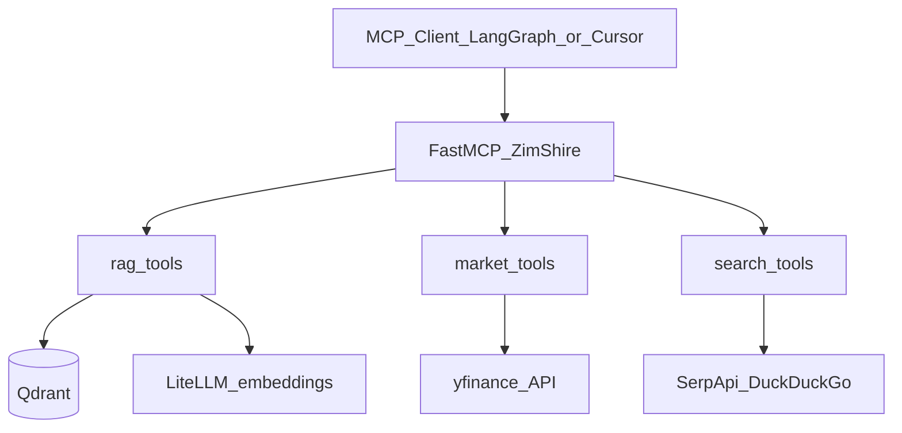

# ZimShire MCP Tools Reference

Reference for all MCP tools exposed by the `mcp_server/` package. Each tool is
registered on the **ZimShire** FastMCP server and is accessible via:

- **stdio** — for Cursor / Claude Code MCP config
- **streamable-http / SSE** — for the internal LangGraph agent

---

## Relevance legend

| Badge | Meaning |
|---|---|
| Essential | Core to ZimShire's Buffett-first research mission; orchestrator should use freely |
| Useful | Situationally valuable; worth registering but called less often |
| UI only | Renders an interactive widget for IDE clients (Cursor / Claude Code); never call from LangGraph agent |
| Overkill / Avoid | Conflicts with Buffett philosophy, ZimShire policy, or output guardrail; risk of triggering safety violations |

**Important note on Overkill tools:** Tools marked Overkill should either not be registered with the
orchestrator at all, or be excluded from the tool list passed to `create_react_agent`. If the
orchestrator calls `get_analyst_targets` or `get_recommendations` and the data flows into
`collected_context`, the output guardrail will likely block the response as a safety violation.
Keep these tools available for MCP clients (Cursor) but hidden from the LangGraph agent.

---

## Running the server

```bash
# Always run from the repo root
python -m mcp_server.main                                        # stdio (Cursor)
python -m mcp_server.main --transport streamable-http --port 8001  # LangGraph SSE
```

---

## Environment variables

All config lives in `.env` (loaded by `mcp_server/core/config.py`).

| Variable | Used by | Description |
|---|---|---|
| `QDRANT_URL` | RAG | Qdrant HTTP endpoint, e.g. `http://localhost:6333` |
| `QDRANT_COLLECTION` | RAG | Collection name, default `buffett_letters` |
| `LITELLM_BASE_URL` | RAG | LiteLLM proxy base URL |
| `LITELLM_API_KEY` | RAG | Bearer token for LiteLLM |
| `LITELLM_END_USER_ID` | RAG | End-user ID header sent to LiteLLM |
| `EMBEDDING_MODEL` | RAG | Dense embedding model, default `text-embedding-3-small` |
| `DUCKDUCKGO_API_KEY` | Web | SerpApi key (DuckDuckGo engine) |

Market tools require no API keys — they use `yfinance` directly.

---

## Architecture



---

## Data tools

### RAG

#### `search_buffett_letters` — Essential

Hybrid RAG search over Warren Buffett shareholder letters (1977–2024) stored in Qdrant.
Retrieval uses dense embeddings (LiteLLM) + sparse BM25 prefetch with RRF fusion,
reranked by ColBERT late-interaction multivectors inside Qdrant.

**Purpose:** Retrieve passages from Buffett's letters that are semantically relevant to a query.
This is the single most important tool in ZimShire — every answer should attempt to ground
itself here first.

**When to use:** Any time the question involves Buffett's investment philosophy, opinions on
specific industries, capital allocation, or historic commentary. Use `letter_years_filter` to
narrow to a specific era (e.g. "what did he say about banks in 1990").

**Input**

| Parameter | Type | Default | Description |
|---|---|---|---|
| `query` | `str` | required | Natural language search query |
| `top_k` | `int` | `5` | Number of results to return |
| `letter_years_filter` | `list[int] \| None` | `None` | Filter to specific years, e.g. `[1990, 1991]` |

**Output** — `list[dict]`

```json
[
  {
    "letter_year": 1998,
    "passage_snippet": "We look for businesses with durable competitive advantages...",
    "similarity_score": 0.872,
    "qdrant_point_id": "6ba7b810-9dad-11d1-80b4-00c04fd430c8",
    "chunk_index": 3,
    "source_file": "1998.txt"
  }
]
```

---

### Market — Fundamentals

#### `get_stock_info` — Essential

**Purpose:** Full company profile — sector, market cap, P/E, EPS, dividend yield, business
description, CEO, employee count (~100 fields from Yahoo Finance `.info`).

**When to use:** The primary tool for "How would Buffett evaluate X's moat?" type questions.
Provides P/E, forward P/E, market cap, business description — all core inputs for
Buffett-style analysis. Slower than `get_stock_price` because it fetches the full info dict.

**Input:** `ticker: str`

**Output:** `dict` — all Yahoo Finance info fields including: `sector`, `industry`,
`marketCap`, `trailingPE`, `forwardPE`, `eps`, `dividendYield`, `longBusinessSummary`,
`fullTimeEmployees`, `companyOfficers`, and ~100 more.

---

#### `get_stock_price` — Essential

**Purpose:** Lightweight current price snapshot — last price, previous close, 52-week
high/low, market cap, shares outstanding.

**When to use:** When only price metrics are needed. Prefer over `get_stock_info` for speed;
avoids fetching the full info dict. Use for "What is Apple trading at right now?"

**Input:** `ticker: str`

**Output:** `dict` — keys from Yahoo Finance `fast_info` (camelCase)

| Field | Description |
|---|---|
| `lastPrice` | Most recent traded price (USD per share) |
| `previousClose` | Previous session close |
| `yearHigh` / `yearLow` | 52-week high / low |
| `marketCap` | Market capitalisation (price × shares) |
| `shares` | Shares outstanding |

---

### Market — Price History

#### `get_stock_history` — Useful

**Purpose:** OHLCV price history for a ticker over a configurable period and interval.

**When to use:** Relevant for Buffett-style long-term analysis ("how has this business
performed over 10 years?"). Use `period="max"` and `interval="1mo"` for long-term trends.
Less useful for short-term charts which contradict Buffett's philosophy.

**Input**

| Parameter | Type | Default | Values |
|---|---|---|---|
| `ticker` | `str` | required | — |
| `period` | `str` | `"1mo"` | `1d` `5d` `1mo` `3mo` `6mo` `1y` `2y` `5y` `10y` `ytd` `max` |
| `interval` | `str` | `"1d"` | `1m` `5m` `15m` `1h` `1d` `1wk` `1mo` |

**Output:** `list[dict]` — rows with `Date`, `Open`, `High`, `Low`, `Close`, `Volume`.

---

### Market — Financials

All three financial statement tools share the same signature:

**Input:** `ticker: str`, `quarterly: bool = False`
(`quarterly=True` returns last 4 quarters; `False` returns annual)

**Output:** `dict` — `{fiscal_period_end_date: {metric_name: value, ...}, ...}`

Outer keys are **report dates** (e.g. `"2026-01-31"`). Inner keys are **line items** (e.g. `"Total Revenue"`).

#### `get_income_statement` — Essential

**Purpose:** Income statement (P&L) — revenue, gross profit, EBITDA, operating income, net income.

**When to use:** Core Buffett analysis — earnings power, margin trends, revenue growth over
years. Essential for "Is Coca-Cola still the business Buffett described in 1988?" questions.
Pass `quarterly=True` to get the most recent quarter.

Revenue, gross profit, EBITDA, operating income, net income.

---

#### `get_balance_sheet` — Essential

**Purpose:** Balance sheet — total assets, total debt, cash and equivalents, stockholders equity.

**When to use:** Buffett is obsessed with financial strength and minimal debt. Required for
any analysis of a company's balance sheet quality and margin of safety. Pass `quarterly=True`
for the latest snapshot.

Total assets, total debt, cash and equivalents, stockholders equity.

---

#### `get_cashflow` — Essential

**Purpose:** Cash flow statement — operating cash flow, capital expenditures, free cash flow.

**When to use:** Buffett considers free cash flow more important than net income — "earnings
are an opinion, cash is a fact." Use whenever analysing a business's real economic output.

Operating cash flow, capital expenditures, free cash flow.

---

### Market — Analysis

#### `get_earnings_estimate` — Useful

**Purpose:** Forward EPS estimates from analysts for current quarter, next quarter, current
year, and next year.

**When to use:** Useful as context for "what does the market currently expect from X's
earnings?" — framed as market expectations, not as a recommendation. The orchestrator must
present this as data, not as advice.

**Input:** `ticker: str`

**Output:** `dict` — keyed by `0q`, `+1q`, `0y`, `+1y`. Each period contains
`numberOfAnalysts`, `avg`, `low`, `high`, `yearAgoEps`, `growth`.

---

### Market — Holders

#### `get_institutional_holders` — Useful

**Purpose:** Top institutional shareholders — fund name, shares held, percentage of float.

**When to use:** Occasionally relevant for "who else owns this alongside Berkshire?" or
understanding ownership concentration. Useful as supporting context, not primary analysis.

**Input:** `ticker: str`

**Output:** `list[dict]` — `{Holder, Shares, Date Reported, pctHeld, Value, pctChange}`.

---

#### `get_insider_transactions` — Useful

**Purpose:** Recent insider buy and sell transactions — executive name, title, date, shares.

**When to use:** Buffett values insider buying as a signal of management's conviction. Useful
for "are executives buying their own stock?" questions. Present as factual data, not advice.

**Input:** `ticker: str`

**Output:** `list[dict]` — `{Insider, Position, Transaction, Shares, Value, Start Date, Ownership, URL, Text}`.

---

### Market — News

#### `get_stock_news` — Essential

**Purpose:** Latest news articles for a specific ticker from Yahoo Finance.

**When to use:** Getting recent company-specific news context for any research question.
Complements `web_search_news` which searches DuckDuckGo. Use both when freshness matters.

**Input:** `ticker: str`, `count: int = 10`

**Output:** `list[dict]` — nested Yahoo Finance format: each item has `content.title`,
`content.canonicalUrl.url`, `content.provider.displayName`, etc. (see examples below).

---

### Market — Screener / Discovery

#### `lookup_ticker` — Essential

**Purpose:** Resolve a company name or keyword to its Yahoo Finance ticker symbol(s).

**When to use:** Always — users frequently ask about "Berkshire", "Apple", or "the big
semiconductor company" without knowing the exact ticker. This tool must be called before
any other market tool when the ticker is uncertain.

**Input:** `query: str` — e.g. `"Berkshire Hathaway"` or `"semiconductor ETF"`

**Output:** `list[dict]` — up to 20 matches; fields include `symbol`, `shortName`,
`quoteType`, `regularMarketPrice`, `exchange`.

---

## Market tools — output examples and field guide

Real outputs below were captured with `scripts/test_market_tools.py` for ticker **NVDA**
(NVIDIA). Numbers change every trading day; structure stays the same.

### Mini-glossary (no finance background required)

| Term | Plain meaning |
|---|---|
| **Ticker** | Short code for a stock on an exchange, e.g. `NVDA`, `BRK-B`, `AAPL`. |
| **Share / stock** | One unit of ownership in a company. |
| **Price** | What one share costs right now (or at market close). |
| **Market cap** | Total company value implied by the stock price × number of shares. |
| **P/E (trailingPE)** | Price ÷ last 12 months earnings per share. Higher often means “expensive” or high growth expectations. |
| **Revenue** | Money the company collected from customers (top line). |
| **Net income** | Profit after all expenses (bottom line). |
| **Gross profit** | Revenue minus direct cost of goods sold. |
| **EBITDA** | Earnings before interest, taxes, depreciation, amortisation — rough “operating cash engine”. |
| **Assets / liabilities / equity** | What the company owns, owes, and shareholders’ residual claim. |
| **Operating cash flow** | Cash generated by running the business. |
| **CapEx** | Cash spent on plants, equipment, etc. (usually negative in the statement). |
| **Free cash flow** | Operating cash flow + CapEx — cash left after reinvestment. |
| **EPS** | Earnings per share — net income divided by share count. |
| **Institutional holder** | Large fund (BlackRock, Vanguard) holding many shares. |
| **Insider** | Executive or director of the company. |
| **OHLCV** | Open, High, Low, Close, Volume for one trading period. |

---

### Example: `get_stock_info` (NVDA)

**What it is:** A large dictionary (~180 keys) — company profile + valuation snapshot from Yahoo Finance.

**Sample fields (truncated):**

```
sector: Technology
industry: Semiconductors
marketCap: 5189349146624
trailingPE: 32.860428
dividendYield: 0.02
fullTimeEmployees: 42000
longBusinessSummary: NVIDIA Corporation operates as a data center scale AI infrastructure company...
```

| Field | Meaning for the agent |
|---|---|
| `sector` / `industry` | Broad category — helps compare “what kind of business” this is. |
| `marketCap` | ~$5.19T here — size of the company in the market’s eyes. |
| `trailingPE` | ~32.9 — investors pay ~33× last year’s earnings per share. |
| `dividendYield` | `0.02` → 2% annual dividend yield (NVDA pays a small dividend). |
| `fullTimeEmployees` | Headcount. |
| `longBusinessSummary` | Plain-text business description — best field for “what does this company do?” |

**LLM tip:** Do not dump all 180 keys into the answer. Pick 8–12 relevant fields for the question.

---

### Example: `get_stock_price` (NVDA)

**What it is:** Fast price snapshot — fewer fields than `get_stock_info`, quicker to call.

```
lastPrice: 214.25
previousClose: 214.2974
yearHigh: 236.5399932861328
yearLow: 132.9199981689453
marketCap: 5189349250000.0
shares: 24221000000
```

| Field | Meaning |
|---|---|
| `lastPrice` | Latest traded price (~$214/share). |
| `previousClose` | Prior session close — compare to `lastPrice` for daily move. |
| `yearHigh` / `yearLow` | Highest / lowest price in the last 52 weeks. |
| `marketCap` | ~$5.19 trillion total market value. |
| `shares` | ~24.2 billion shares outstanding. |

---

### Example: `get_stock_history` (NVDA, `period=1mo`, `interval=1d`)

**What it is:** One row per trading day — price action over time.

```
Date: 2026-04-27 | Open: 209.65 | High: 216.83 | Low: 207.38 | Close: 216.61 | Volume: 187172400
Date: 2026-04-28 | Open: 209.49 | High: 214.73 | Low: 208.20 | Close: 213.17 | Volume: 180275400
```

| Field | Meaning |
|---|---|
| `Date` | Trading day (timezone from exchange). |
| `Open` | First price of the day. |
| `High` / `Low` | Highest / lowest price that day. |
| `Close` | Last price of the day — most used for charts. |
| `Volume` | Number of shares traded that day (187M = very liquid). |

**LLM tip:** For “how did the stock perform?”, compare first vs last `Close` in the period, or describe trend (up/down/volatile).

---

### Example: `get_income_statement` (NVDA, annual)

**What it is:** Profit & loss over fiscal years. Structure: **date → metrics**.

```
Periods: ['2026-01-31', '2025-01-31', ...]

For 2026-01-31 (latest fiscal year):
  Total Revenue: 215938000000.0      (~$216B)
  Gross Profit: 153463000000.0        (~$153B)
  EBITDA: 144552000000.0             (~$145B)
  Net Income: 120067000000.0         (~$120B)
```

| Metric | Meaning |
|---|---|
| `Total Revenue` | All sales — $216B NVIDIA sold in that fiscal year. |
| `Gross Profit` | Revenue minus cost of goods — $153B. |
| `EBITDA` | Operating profitability before some accounting charges. |
| `Net Income` | Final profit — $120B. |

**Note:** Some companies (e.g. Berkshire `BRK-B`) omit `Gross Profit` / `EBITDA` — field may be missing, not an error.

---

### Example: `get_balance_sheet` (NVDA, annual)

**What it is:** Snapshot of what the company owns and owes at fiscal year-end.

```
For 2026-01-31:
  Total Assets: 206803000000.0              (~$207B)
  Total Debt: 11040000000.0                 (~$11B)
  Cash And Cash Equivalents: 10605000000.0  (~$11B cash)
  Stockholders Equity: 157293000000.0       (~$157B)
```

| Metric | Meaning |
|---|---|
| `Total Assets` | Everything the company owns (cash, factories, investments, …). |
| `Total Debt` | Borrowings — $11B is modest vs $207B assets for NVDA. |
| `Cash And Cash Equivalents` | Liquid cash. |
| `Stockholders Equity` | Assets minus liabilities — book value belonging to shareholders. |

**Buffett angle:** Low debt + strong equity + plenty of cash = financially strong balance sheet.

---

### Example: `get_cashflow` (NVDA, annual)

**What it is:** Where cash actually moved — often more honest than accounting profit.

```
For 2026-01-31:
  Operating Cash Flow: 102718000000.0   (~$103B in from operations)
  Capital Expenditure: -6042000000.0   (~$6B spent on equipment, negative)
  Free Cash Flow: 96676000000.0        (~$97B left after CapEx)
```

| Metric | Meaning |
|---|---|
| `Operating Cash Flow` | Cash from running the business. |
| `Capital Expenditure` | Investment in long-term assets (negative number). |
| `Free Cash Flow` | Cash available after reinvestment — key Buffett metric. |

---

### Example: `get_earnings_estimate` (NVDA)

**What it is:** What Wall Street analysts **expect** for future EPS (not actual results).

```
avg:        {'0q': 2.09, '+1q': 2.35, '0y': 8.94, '+1y': 12.65}
low / high: ranges per period
numberOfAnalysts: {'0q': 41, '+1q': 40, '0y': 47, '+1y': 48}
growth:     {'0q': 0.99, ...}   (fraction: 0.99 ≈ +99% vs year-ago quarter)
```

| Key | Meaning |
|---|---|
| `0q` | Current quarter estimate. |
| `+1q` | Next quarter. |
| `0y` / `+1y` | Current fiscal year / next fiscal year. |
| `avg` | Mean analyst EPS forecast (dollars per share). |
| `low` / `high` | Dispersion — disagreement among analysts. |
| `numberOfAnalysts` | How many analysts contributed (41 = well covered). |
| `growth` | Expected EPS growth vs year-ago period (0.99 = +99%). |

**LLM tip:** Present as “market expectations”, not buy/sell advice.

---

### Example: `get_institutional_holders` (NVDA)

**What it is:** Largest mutual funds / institutions that own the stock.

```
Holder: Blackrock Inc.           | Shares: 1925533174 | pctHeld: 0.0796 | Value: 412637916113
Holder: Vanguard ...             | Shares: 1538550382 | pctHeld: 0.0636 | Value: 329708276147
```

| Field | Meaning |
|---|---|
| `Holder` | Fund name. |
| `Shares` | Number of shares held (~1.9B for BlackRock). |
| `pctHeld` | Fraction of company owned — `0.0796` = **7.96%** of shares outstanding. |
| `Value` | Dollar value of that position at recent prices (~$413B). |
| `Date Reported` | When the filing was made (may be in full row, not shown above). |

---

### Example: `get_insider_transactions` (NVDA)

**What it is:** Recent trades by executives and directors (often option exercises or planned sales).

```
Insider: STEVENS MARK A              | Position: Director | Shares: 221682 | Value: 38502524
Insider: KRESS COLETTE M.            | Position: Chief Financial Officer | Shares: 62650 | Value: 10956706
```

| Field | Meaning |
|---|---|
| `Insider` | Person’s name. |
| `Position` | Role (CEO, CFO, Director, …). |
| `Shares` | Number of shares in the transaction. |
| `Value` | Approximate dollar value. |
| `Transaction` | Type if present (`Sale`, `Purchase`, …) — often empty for routine filings. |

**LLM tip:** Large `Value` with empty `Transaction` may still be Form 4 filing — describe as “reported transaction” without guessing buy vs sell unless `Transaction` is set.

---

### Example: `get_stock_news` (NVDA, `count=3`)

**What it is:** Recent Yahoo Finance headlines **about** the ticker (may include sector news, not only NVDA-specific).

```
title: DRAM: Is the fastest-growing ETF ever just another momentum trade?
provider: Yahoo Finance Video
link: https://finance.yahoo.com/video/dram-is-the-fastest-growing-etf-ever-...
```

Raw JSON nests fields under `content`:

```json
{
  "content": {
    "title": "...",
    "canonicalUrl": { "url": "https://..." },
    "provider": { "displayName": "Yahoo Finance Video" }
  }
}
```

| Path | Meaning |
|---|---|
| `content.title` | Headline. |
| `content.canonicalUrl.url` | Article URL. |
| `content.provider.displayName` | Publisher name. |

**LLM tip:** Headlines may mention other tickers (ETFs, competitors) — verify relevance before citing as “NVDA news”.

---

### Example: `lookup_ticker` (`query="Berkshire"`)

**What it is:** Search by company name → list of matching tickers. Call this **before** other market tools if the user did not give a ticker.

```
symbol: BRK-B  | shortName: Berkshire Hathaway Inc. New | quoteType: equity | regularMarketPrice: 485.02
symbol: BRK-A  | shortName: Berkshire Hathaway Inc.     | quoteType: equity | regularMarketPrice: 725934.88
```

| Field | Meaning |
|---|---|
| `symbol` | Ticker to pass to other tools (`BRK-B` = Class B shares, cheaper per share). |
| `shortName` | Human-readable company name. |
| `quoteType` | `equity` = common stock; can also be `etf`, `mutualfund`, etc. |
| `regularMarketPrice` | Current price for that symbol. |

**Note:** Query was `"Berkshire"` while other examples used `NVDA` — lookup is independent of the ticker under analysis.

---

### Quick reference: which tool for which question?

| User question | Tool |
|---|---|
| “What does NVIDIA do?” | `get_stock_info` → `longBusinessSummary` |
| “What’s the stock price?” | `get_stock_price` |
| “How has it moved this month?” | `get_stock_history` |
| “Revenue and profit last year?” | `get_income_statement` |
| “How much debt / cash?” | `get_balance_sheet` |
| “Free cash flow?” | `get_cashflow` |
| “What do analysts expect?” | `get_earnings_estimate` |
| “Who owns the most shares?” | `get_institutional_holders` |
| “Are insiders buying?” | `get_insider_transactions` |
| “Latest news?” | `get_stock_news` |
| “Ticker for Berkshire?” | `lookup_ticker` |

Re-run examples locally:

```bash
# Edit TICKER at top of scripts/test_market_tools.py, then:
venv\Scripts\python.exe scripts\test_market_tools.py
```

---

### Web Search

All web search tools use **DuckDuckGo via SerpApi** (`DUCKDUCKGO_API_KEY`).

`date_filter` values: `d` (past day), `w` (past week), `m` (past month),
`y` (past year), or ISO range `2021-06-15..2024-06-16`.

#### `web_search` — Essential

**Purpose:** Organic web search via DuckDuckGo — returns title, URL, snippet, and
publication date.

**When to use:** Any fact not available in Qdrant or yfinance — regulatory news, competitor
analysis, general company background, recent events. Use `date_filter` to restrict to recent
content.

**Input**

| Parameter | Type | Default | Description |
|---|---|---|---|
| `query` | `str` | required | Search query |
| `max_results` | `int` | `5` | Max results returned (hard cap 50) |
| `region` | `str` | `"us-en"` | Locale, e.g. `uk-en`, `de-de` |
| `date_filter` | `str \| None` | `None` | Recency filter |

**Output:** `list[dict]` — `{title, url, snippet, date, favicon}`

---

#### `web_search_news` — Essential

**Purpose:** News-only search using the DuckDuckGo News engine.

**When to use:** When recency matters more than breadth. Use `date_filter="d"` for breaking
news, `date_filter="w"` for the past week. Complements `get_stock_news` which is
ticker-specific; use both for full coverage.

**Input:** same as `web_search`, `max_results` default `10`, hard cap `100`

**Output:** `list[dict]` — `{title, url, snippet, source, date, thumbnail}`

---

#### `web_search_knowledge` — Useful

**Purpose:** Knowledge Graph card for a well-known entity — structured facts including
description, website, founding date, headquarters, social profiles.

**When to use:** Quick entity fact-check (founder, HQ, year founded). Returns `None` if no
knowledge card exists. Best used as a fast first call before `web_search` for well-known
companies or people.

**Input:** `query: str` — e.g. `"Berkshire Hathaway"`, `"Warren Buffett"`

**Output:** `dict | None`

| Field | Type | Description |
|---|---|---|
| `title` | `str` | Entity name |
| `description` | `str` | Short description |
| `website` | `str \| None` | Official website |
| `facts` | `dict[str, str]` | Key facts (founded, CEO, headquarters, ...) |
| `profiles` | `list[dict]` | Social / external profiles |
| `related_topics` | `list[dict]` | Related entities |

---

## UI tools

UI tools are marked with `app=True` and return a **PrefabApp** interactive component
intended for direct use in Cursor or Claude Code. **Never call UI tools from the LangGraph
agent** — `PrefabApp` objects cannot be processed programmatically.

**Purpose:** Render an interactive visual component (chart, table, metric cards) directly in the IDE for the user.

**When to use:** Only when a human is interacting with the IDE and wants a rendered output. The LangGraph agent must always call the corresponding data tool (without the `_ui` suffix).

| UI tool | Wraps | Renders |
|---|---|---|
| `search_buffett_letters_ui` | `search_buffett_letters` | Sortable/searchable passage table |
| `get_stock_info_ui` | `get_stock_info` | Key-value table |
| `get_stock_price_ui` | `get_stock_price` | Metric cards + key-value table |
| `get_stock_history_ui` | `get_stock_history` | Close price line chart + OHLCV table |
| `get_income_statement_ui` | `get_income_statement` | Financial statement table |
| `get_balance_sheet_ui` | `get_balance_sheet` | Financial statement table |
| `get_cashflow_ui` | `get_cashflow` | Financial statement table |
| `get_earnings_estimate_ui` | `get_earnings_estimate` | Estimate table |
| `get_institutional_holders_ui` | `get_institutional_holders` | Holders table |
| `get_insider_transactions_ui` | `get_insider_transactions` | Transactions table |
| `get_stock_news_ui` | `get_stock_news` | News table |
| `lookup_ticker_ui` | `lookup_ticker` | Search results table |
| `web_search_ui` | `web_search` | Result table |
| `web_search_news_ui` | `web_search_news` | News table with pagination |
| `web_search_knowledge_ui` | `web_search_knowledge` | Knowledge card |

UI tools accept the same parameters as their data counterparts.

---

## Summary table

| Tool | Category | Relevance | Returns |
|---|---|---|---|
| `search_buffett_letters` | rag | Essential | `list[dict]` |
| `get_stock_info` | market / fundamentals | Essential | `dict` |
| `get_stock_price` | market / fundamentals | Essential | `dict` |
| `get_income_statement` | market / financials | Essential | `dict` |
| `get_balance_sheet` | market / financials | Essential | `dict` |
| `get_cashflow` | market / financials | Essential | `dict` |
| `get_stock_news` | market / news | Essential | `list[dict]` |
| `lookup_ticker` | market / screener | Essential | `list[dict]` |
| `web_search` | web / organic | Essential | `list[dict]` |
| `web_search_news` | web / news | Essential | `list[dict]` |
| `get_stock_history` | market / price | Useful | `list[dict]` |
| `get_earnings_estimate` | market / analysis | Useful | `dict` |
| `get_institutional_holders` | market / holders | Useful | `list[dict]` |
| `get_insider_transactions` | market / holders | Useful | `list[dict]` |
| `web_search_knowledge` | web / knowledge | Useful | `dict \| None` |
| All `*_ui` tools | ui | UI only | `PrefabApp` |

---

## Tools exposed to LangGraph orchestrator

Only these tools should be passed to `create_react_agent` via `build_tools_with_accumulator`.

```python
ORCHESTRATOR_TOOLS = [
    # RAG
    "search_buffett_letters",
    # Market — core
    "lookup_ticker",
    "get_stock_info",
    "get_stock_price",
    # Market — financials
    "get_income_statement",
    "get_balance_sheet",
    "get_cashflow",
    # Market — situational
    "get_stock_history",
    "get_earnings_estimate",
    "get_institutional_holders",
    "get_insider_transactions",
    "get_stock_news",
    # Web
    "web_search",
    "web_search_news",
    "web_search_knowledge",
]
```

---

## Related documents

- [agent_architecture.md](agent_architecture.md) — LangGraph graph nodes, subagent tools, grounding flow
- [db_schema_reference.md](db_schema_reference.md) — full project layout and service boundaries
