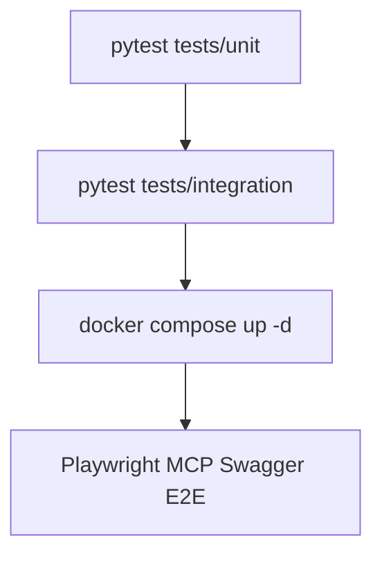

# ZimShire — Full Refactor Plan: SOLID + Design Patterns

## Goal

Make the codebase readable, testable, and scalable by applying SOLID principles and standard
design patterns without changing any runtime behavior. Every phase is independently
deployable; the app must stay green after each phase.

---

## Audit Summary (Critical Violations)

| Severity | Location | Violation |
|----------|----------|-----------|
| Critical | `messages/service.py:51-139` | SRP — 5 unrelated jobs in one function |
| Critical | `core/config.py:35` | DIP — global `settings` singleton imported in 18+ files |
| Critical | `nodes/guardrails.py:46-66` | Fail-open security — allows query when input guardrail LLM fails |
| Critical | `nodes/guardrails.py:117-128` | Fail-open quality — passes answer when output guardrail LLM fails |
| Critical | `nodes/orchestrator.py:46-52` | Silent fallback — plan defaults to `direct_answer=True` on crash |
| High | `messages/router.py:105-106` | Layer violation — router calls `get_graph()` / `get_store()` directly |
| High | `cache/gateways.py:14-70` | Anti-pattern — gateway creates its own `AsyncSessionLocal()` |
| High | `messages/service.py:24` | Untestable global singleton `_short_term_svc` |
| High | `mcp_registry.py:57-70` | Mutable global `_all_tools`; hard to test, init-order fragile |
| High | `nodes/subagent_runner.py:29-37` | OCP — hardcoded `if/elif` agent dispatch |

---

## Phase 1 — Dependency Inversion: Kill the Global Singleton

**Pattern:** Dependency Injection + Provider Protocol
**SOLID:** D (Dependency Inversion)
**Risk:** Low — purely additive, no logic change

### 1.1 ConfigProvider protocol

**New file:** `app/core/providers.py`

```python
from typing import Protocol, runtime_checkable

@runtime_checkable
class ConfigProvider(Protocol):
    database_url: str
    mcp_base_url: str
    orchestrator_model: str
    subagent_model: str
    guardrail_model: str
    memory_model: str
    embedding_model: str
    litellm_base_url: str
    litellm_api_key: str
    litellm_end_user_id: str
    langfuse_public_key: str
    langfuse_secret_key: str
    langfuse_base_url: str
```

`Settings` already satisfies this protocol — no change to `config.py`.

### 1.2 Inject config through `api/deps.py`

```python
# app/api/deps.py
from app.core.config import settings as _settings
from app.core.providers import ConfigProvider

def get_config() -> ConfigProvider:
    return _settings
```

All services that need config values receive them via `Depends(get_config)` instead of
`from app.core.config import settings`.

**Files to update:**
- `app/services/llm.py` — pass `config: ConfigProvider` to factory functions; remove 5 direct `settings.*` reads
- `app/services/embedding.py` — inject config; remove 4 direct reads
- `app/modules/chats/service.py` — inject `default_chat_model` via constructor; remove lines 27-28
- `app/modules/agents/service.py` — inject `database_url` via parameter; remove line 34
- `app/main.py` — pass `settings` explicitly to lifespan init calls

### 1.3 LLMProvider protocol

**New file:** `app/core/providers.py` (extend same file)

```python
from langchain_core.language_models import BaseChatModel

class LLMProvider(Protocol):
    def get_orchestrator_model(self) -> BaseChatModel: ...
    def get_subagent_model(self) -> BaseChatModel: ...
    def get_guardrail_model(self) -> BaseChatModel: ...
    def get_memory_model(self) -> BaseChatModel: ...
```

**New file:** `app/services/llm_provider.py` — `LiteLLMProvider(LLMProvider)` wrapping
current `llm.py` factory functions.

```python
# app/api/deps.py  (add)
from app.services.llm_provider import LiteLLMProvider

def get_llm_provider(config: ConfigProvider = Depends(get_config)) -> LLMProvider:
    return LiteLLMProvider(config)
```

All nodes that call `get_orchestrator_model()` / `get_guardrail_model()` etc. receive an
`LLMProvider` via `RunnableConfig["configurable"]["llm_provider"]` injected at graph call
time (not at node import time). No more global function calls inside nodes.

### 1.4 EmbeddingProvider protocol

```python
class EmbeddingProvider(Protocol):
    async def embed(self, text: str) -> list[float]: ...
```

Implement `LiteLLMEmbedder(EmbeddingProvider)` wrapping current `embedding.py`.
Inject into `nodes/cache.py` via config.

---

## Phase 2 — Single Responsibility: Split the 5-Job Persist Function

**Pattern:** Command Pattern
**SOLID:** S (Single Responsibility)
**Risk:** Medium — behaviour identical, but code structure changes significantly

### Problem

`messages/service.py:persist_assistant_turn` (lines 51-139) does five things:
1. Create assistant message row
2. Bulk-insert RAG retrievals
3. Write semantic cache entry
4. Update long-term user memory
5. Touch `chats.updated_at`

### Solution: 5 Command objects + a Coordinator

**New file:** `app/modules/messages/commands.py`

```python
from dataclasses import dataclass
from uuid import UUID

@dataclass(frozen=True)
class CreateAssistantMessageCommand:
    chat_id: UUID
    content: str
    grounded: bool | None
    langfuse_trace_id: str | None

@dataclass(frozen=True)
class InsertRAGRetrievalsCommand:
    message_id: UUID
    chunks: list[dict]
    used_point_ids: set[str]

@dataclass(frozen=True)
class WriteSemanticCacheCommand:
    query: str
    response: str
    sources: list[dict] | None
    embedding: list[float] | None   # None = skip

@dataclass(frozen=True)
class UpdateLongTermMemoryCommand:
    user_id: UUID
    query: str
    draft_answer: str

@dataclass(frozen=True)
class TouchChatCommand:
    chat_id: UUID
```

**New file:** `app/modules/messages/handlers.py` — one async handler per command.
Each handler receives `AsyncSession` and does exactly one DB operation.

**`persist_assistant_turn` becomes a thin coordinator:**

```python
async def persist_assistant_turn(session, *, chat_id, user_id, ...):
    msg = await handle_create_assistant_message(session, CreateAssistantMessageCommand(...))
    await handle_insert_rag_retrievals(session, InsertRAGRetrievalsCommand(...))
    await handle_write_semantic_cache(session, WriteSemanticCacheCommand(...))
    asyncio.create_task(handle_update_long_term_memory(...))  # still fire-and-forget
    await handle_touch_chat(session, TouchChatCommand(...))
    return msg
```

**Files to change:**
- `app/modules/messages/service.py` — extract 5 handlers into `handlers.py`, keep `persist_assistant_turn` as coordinator
- `app/modules/messages/handlers.py` — new file with 5 handler functions

---

## Phase 3 — Layer Boundaries: Router Must Not Touch Orchestration

**Pattern:** Service Layer / Facade
**SOLID:** S, D
**Risk:** Medium

### Problem

`messages/router.py:105-106` calls `get_graph()` and `get_store()` directly.
`messages/router.py:149-157` passes `store` from router into `persist_assistant_turn`.

### Solution: `TurnOrchestrationService`

**New file:** `app/modules/messages/turn_service.py`

```python
class TurnOrchestrationService:
    """Owns the full lifecycle of one research turn: graph run → persist."""

    def __init__(
        self,
        graph: CompiledGraph,
        store: BaseStore,
        embedding_provider: EmbeddingProvider,
    ):
        self._graph = graph
        self._store = store
        self._embedding = embedding_provider

    async def run_turn(
        self,
        chat_id: UUID,
        user_id: UUID,
        query: str,
        human_message_id: UUID,
        langfuse_handler,
    ) -> AsyncIterator[dict]:
        """Yields SSE-ready event dicts. Handles graph run + persist internally."""
        ...
```

**Router becomes thin:**

```python
@router.post("/{chat_id}/messages")
async def post_message(
    chat_id: UUID,
    body: MessageCreate,
    db: AsyncSession = Depends(get_db),
    svc: TurnOrchestrationService = Depends(get_turn_service),  # from api/deps.py
):
    chat = await get_chat(db, chat_id)
    if chat is None:
        raise HTTPException(404, "chat not found")
    if chat.user_id != body.user_id:
        raise HTTPException(403, "chat does not belong to user")
    return StreamingResponse(svc.run_turn(...), media_type="text/event-stream", ...)
```

**Add to `api/deps.py`:**

```python
def get_turn_service(
    llm: LLMProvider = Depends(get_llm_provider),
    embed: EmbeddingProvider = Depends(get_embedding_provider),
) -> TurnOrchestrationService:
    return TurnOrchestrationService(get_graph(), get_store(), embed)
```

**Files to change:**
- `app/modules/messages/router.py` — remove `get_graph`, `get_store`, `make_callback_handler` imports; delegate to `TurnOrchestrationService`
- `app/modules/messages/turn_service.py` — new file
- `app/api/deps.py` — add `get_turn_service`

---

## Phase 4 — Fix the Gateway Anti-Pattern

**Pattern:** Unit of Work / Session injection
**SOLID:** D
**Risk:** Low

### Problem

`cache/gateways.py` creates `AsyncSessionLocal()` on every call (lines 16, 26, 36, 43).
This bypasses the request-scoped session and makes the cache untestable.

### Solution: Pass session in, or use a proper Unit-of-Work

Option A (minimal): Delete the gateways; call repos directly with the session already in
scope at the service/handler level.

Option B (proper): Create `CacheService` that accepts `AsyncSession` in constructor.

**Recommended: Option A** — gateways are already a layer-violation workaround.

```python
# Before (in nodes/cache.py):
from app.modules.cache.gateways import lookup_semantic, write_semantic

# After: gateways move into a CacheService injected via config
class CacheService:
    def __init__(self, session: AsyncSession, embedding: EmbeddingProvider):
        self._session = session
        self._embed = embedding

    async def lookup(self, query: str): ...
    async def write(self, query: str, response: str, sources): ...
```

For graph nodes (which can't receive a session): keep a thin gateway that opens its own
session **but logs errors explicitly instead of silently swallowing them**.

**Files to change:**
- `app/modules/cache/gateways.py` — add explicit error propagation; or replace with `CacheService`
- `app/modules/guardrails/gateways.py` — same treatment
- `app/modules/agents/nodes/cache.py` — use `CacheService` if session injectable, otherwise use gateway directly

---

## Phase 5 — Strategy Pattern for Agent Dispatch

**Pattern:** Strategy Map
**SOLID:** O (Open/Closed)
**Risk:** Low

### Problem

`nodes/subagent_runner.py:29-37` has hardcoded `if/elif/else`:

```python
if item.name == "rag":
    return await run_rag_subagent(...)
elif item.name == "market":
    return await run_market_subagent(...)
else:
    return await run_web_subagent(...)
```

Adding a new subagent requires modifying this file.

### Solution: Strategy registry

```python
# app/modules/agents/subagents/registry.py

from typing import Protocol, Awaitable

class SubagentStrategy(Protocol):
    async def run(self, item: SubagentPlanItem, config: RunnableConfig) -> SubagentResult: ...

class RAGSubagentStrategy:
    async def run(self, item, config): return await run_rag_subagent(...)

class MarketSubagentStrategy:
    async def run(self, item, config): return await run_market_subagent(...)

class WebSubagentStrategy:
    async def run(self, item, config): return await run_web_subagent(...)

SUBAGENT_REGISTRY: dict[str, SubagentStrategy] = {
    "rag": RAGSubagentStrategy(),
    "market": MarketSubagentStrategy(),
    "web": WebSubagentStrategy(),
}
```

`subagent_runner.py` becomes:

```python
strategy = SUBAGENT_REGISTRY.get(item.name)
if strategy is None:
    logger.warning("unknown subagent: %s", item.name)
    continue
return await strategy.run(item, config)
```

New subagents: add to registry only. No existing file changes.

**Files to change:**
- `app/modules/agents/subagents/registry.py` — new file
- `app/modules/agents/nodes/subagent_runner.py` — replace if/elif with registry lookup

---

## Phase 6 — Repository Protocol (testability)

**Pattern:** Repository Pattern with Protocol
**SOLID:** D, I
**Risk:** Low

### Problem

Repositories are functions (`async def get_chat(session, id)`), not objects with protocols.
Tests can't inject fakes without monkeypatching.

### Solution: Repository Protocol per domain

```python
# app/core/repository_protocols.py

class ChatRepositoryProtocol(Protocol):
    async def get(self, chat_id: UUID) -> Chat | None: ...
    async def create(self, user_id: UUID, title: str | None) -> Chat: ...

class MessageRepositoryProtocol(Protocol):
    async def list(self, chat_id: UUID) -> list[Message]: ...
    async def create_human(self, chat_id: UUID, content: str) -> Message: ...
    async def create_assistant(self, chat_id: UUID, **kwargs) -> Message: ...
```

Concrete implementations: thin wrappers around current functions.

```python
class SqlChatRepository:
    def __init__(self, session: AsyncSession): self._s = session
    async def get(self, chat_id): return await repo_get_chat(self._s, chat_id)
    async def create(self, user_id, title): return await repo_create_chat(self._s, ...)
```

`api/deps.py` provides:

```python
def get_chat_repo(db = Depends(get_db)) -> ChatRepositoryProtocol:
    return SqlChatRepository(db)
```

Services receive protocol via constructor, not concrete repo:

```python
class ChatService:
    def __init__(self, repo: ChatRepositoryProtocol): ...
```

**Priority domains (in order):**
1. `chats` — ChatRepository
2. `messages` — MessageRepository
3. `users` — UserRepository
4. `rag_retrievals` — RagRetrievalRepository
5. `guardrails` — GuardrailLogRepository

**Files to change:**
- `app/core/repository_protocols.py` — new file
- `app/modules/chats/` — wrap functions in `SqlChatRepository`
- `app/modules/messages/` — wrap functions in `SqlMessageRepository`
- `app/modules/users/` — wrap functions in `SqlUserRepository`
- `app/api/deps.py` — add `get_chat_repo`, `get_message_repo`, `get_user_repo`

---

## Phase 7 — Split Bloated Files (SRP at file level)

**Pattern:** Module decomposition
**SOLID:** S
**Risk:** Very low — renaming + moving, no logic change

### 7.1 Split `nodes/guardrails.py` into three files

```
app/modules/agents/nodes/
  input_guardrail.py     ← input_guardrail() only
  output_guardrail.py    ← output_guardrail() only  
  faithfulness_guardrail.py ← faithfulness_guardrail() only
```

`guardrails.py` becomes a re-export shim for backward compat:

```python
# nodes/guardrails.py (compatibility shim — delete after all imports updated)
from .input_guardrail import input_guardrail
from .output_guardrail import output_guardrail
from .faithfulness_guardrail import faithfulness_guardrail
```

### 7.2 Split `mcp_registry.py` into three files

```
app/modules/agents/
  tool_registry.py      ← set_all_tools, get_all_tools, tool_tags, _matches_agent
  tool_wrappers.py      ← _wrap_market_tool, _wrap_traced_tool, get_agent_tools
  tool_allowlists.py    ← AGENT_PRIMARY_TAG, AGENT_TOOL_ALLOWLIST, MARKET_TOOL_MAP (data only)
```

### 7.3 Split `cache/repository.py` into two files

```
app/modules/cache/
  market_cache_repo.py  ← get_valid_market, upsert_market, list_market
  semantic_cache_repo.py ← find_similar, bump_hit, insert_semantic, list_semantic
```

Keep `repository.py` as re-export shim.

### 7.4 Split `agents/service.py` into two files

```
app/modules/agents/
  graph_factory.py      ← build_checkpointer, build_store
  agent_service.py      ← init_graph, close_graph, get_graph, get_store (lifecycle only)
```

### 7.5 Refactor `main.py`

Extract into:
- `app/core/logging.py` — `configure_logging()`
- `app/api/health.py` — health check functions
- `app/main.py` — only app factory + lifespan + router inclusion

---

## Phase 8 — Error Handling: Make Failures Observable

**Pattern:** Result type / explicit error propagation
**SOLID:** S
**Risk:** Medium

### 8.1 Replace silent failures in gateways

```python
# Before (cache/gateways.py line 19-20):
except Exception as exc:
    logger.warning("cache.lookup_market failed: %s", exc)
    return None

# After:
except Exception as exc:
    logger.error("cache.lookup_market failed: %s", exc, exc_info=True)
    # Still return None (fail-soft), but increment a counter:
    _CACHE_FAILURE_COUNTER.inc()  # simple module-level counter for /health
    return None
```

### 8.2 Harden guardrail fail-open (security)

Current: on LLM failure in `input_guardrail`, query allowed through (`blocked=False`).

Fix: introduce a `FAIL_OPEN_ALLOWED` flag in config. Default `True` for now (no behavior change),
but makes the decision explicit and overridable in tests:

```python
# nodes/input_guardrail.py
except Exception as exc:
    logger.error("input_guardrail LLM failed: %s", exc)
    blocked = not config.fail_open_on_guardrail_error  # explicit, testable
```

### 8.3 Fire-and-forget tasks: track failures

```python
# Before (messages/service.py):
asyncio.create_task(handle_update_long_term_memory(...))

# After:
async def _safe_update_memory(...):
    try:
        await handle_update_long_term_memory(...)
    except Exception as exc:
        logger.error("long_term_memory update failed for user=%s: %s", user_id, exc)

asyncio.create_task(_safe_update_memory(...))
```

### 8.4 Typed exception hierarchy

```python
# app/core/exceptions.py (extend)
class ZimShireError(Exception): ...
class DomainError(ZimShireError): ...
class RepositoryError(ZimShireError): ...
class CacheError(ZimShireError): ...
class LLMError(ZimShireError): ...
class GuardrailError(ZimShireError): ...
class AgentPlanError(ZimShireError): ...
```

Raise typed exceptions at the right layer; catch and translate at the layer boundary.

**Files to change:**
- `app/core/exceptions.py` — add exception hierarchy
- `app/modules/cache/gateways.py` — raise `CacheError`, catch in service
- `app/modules/agents/nodes/input_guardrail.py` — explicit fail-open config
- `app/modules/agents/nodes/output_guardrail.py` — explicit fail-open config
- `app/modules/agents/nodes/orchestrator.py` — raise `AgentPlanError` instead of silent fallback
- `app/modules/messages/service.py` — wrap fire-and-forget tasks with error logger

---

## Phase 9 — Remove Global Mutable State

**Pattern:** Application context / lifespan scoped objects
**SOLID:** D
**Risk:** Medium

### Problem files

| File | Global | Fix |
|------|--------|-----|
| `mcp_registry.py:57` | `_all_tools: dict` | Move into `ToolRegistry` class; store on `app.state` |
| `agents/service.py:11-16` | `_state: dict` | Move into `AgentContext` dataclass; store on `app.state` |
| `messages/service.py:24` | `_short_term_svc = ShortTermMemoryService()` | Remove; construct from `api/deps.py` per request |
| `mcp_client.py:14-15` | `_client`, `_tools` | Move into `MCPContext`; store on `app.state` |

### Solution: FastAPI `app.state`

```python
# app/main.py lifespan
@asynccontextmanager
async def lifespan(app: FastAPI):
    mcp_client = await init_mcp_client(settings.mcp_base_url)
    tool_registry = ToolRegistry(mcp_client.get_tools())
    graph, store = await build_graph_and_store(settings, tool_registry)
    app.state.tool_registry = tool_registry
    app.state.graph = graph
    app.state.store = store
    yield
    await graph.aclose()
    await mcp_client.aclose()

# app/api/deps.py
def get_graph(request: Request) -> CompiledGraph:
    return request.app.state.graph

def get_tool_registry(request: Request) -> ToolRegistry:
    return request.app.state.tool_registry
```

---

## Phase 10 — Testability: Add Missing Tests

**Pattern:** Test fixtures with Protocol injection
**Risk:** Very low (additive)

### Test structure target

```
tests/
  unit/
    test_guardrails.py        ← already exists; improve with mock LLMProvider
    test_orchestrator.py      ← already exists; improve
    test_turn_service.py      ← new: test TurnOrchestrationService with mocks
    test_cache_service.py     ← new: test CacheService with in-memory mock
    test_command_handlers.py  ← new: test each of 5 persist handlers
    test_tool_registry.py     ← new: test ToolRegistry filtering
    test_subagent_strategies.py ← new: test strategy dispatch
  integration/
    test_messages_api.py      ← new: httpx TestClient end-to-end (no real graph)
    test_health.py            ← new: health endpoint with mocked backends
  conftest.py                 ← fixtures: FakeLLMProvider, FakeCacheService,
                                           FakeMessageRepo, FakeRAGRepo
```

### Key fixtures to create

```python
# tests/conftest.py
class FakeLLMProvider:
    """Returns canned JSON responses for guardrail + plan tests."""
    def get_orchestrator_model(self): return FakeChatModel(CANNED_PLAN_RESPONSE)
    def get_guardrail_model(self): return FakeChatModel(CANNED_GUARDRAIL_PASS)

class FakeChatModel:
    def __init__(self, response): self._r = response
    async def ainvoke(self, messages): return AIMessage(content=self._r)

class FakeMessageRepository:
    def __init__(self): self.messages = []
    async def create_assistant(self, **kwargs):
        msg = Message(**kwargs); self.messages.append(msg); return msg
```

---

## Execution Order

| Phase | What | Files Created/Changed | Risk | Est. |
|-------|------|-----------------------|------|------|
| 1 | ConfigProvider + LLMProvider protocols; inject via deps.py | `core/providers.py`, `services/llm_provider.py`, `api/deps.py` + 6 files updated | Low | 1 day |
| 2 | Split persist_assistant_turn into 5 commands | `messages/commands.py`, `messages/handlers.py`, `messages/service.py` | Medium | 1 day |
| 3 | TurnOrchestrationService; router cleanup | `messages/turn_service.py`, `messages/router.py`, `api/deps.py` | Medium | 1 day |
| 4 | Fix gateway anti-pattern; explicit errors | `cache/gateways.py`, `guardrails/gateways.py` | Low | 0.5 day |
| 5 | Strategy registry for subagent dispatch | `subagents/registry.py`, `nodes/subagent_runner.py` | Low | 0.5 day |
| 6 | Repository protocols for top 3 domains | `core/repository_protocols.py`, chats/messages/users repos | Low | 1 day |
| 7 | Split bloated files (guardrails, mcp_registry, cache repo) | ~10 files split into ~18 | Very Low | 1 day |
| 8 | Error handling: typed exceptions + hardened guardrails | `core/exceptions.py` + 6 node files | Medium | 1 day |
| 9 | Remove global mutable state → app.state | `main.py`, `agents/service.py`, `mcp_registry.py`, `api/deps.py` | Medium | 1 day |
| 10 | Tests: fixtures + unit + integration | `tests/unit/`, `tests/integration/`, `tests/conftest.py` | Low | 2 days |
| 11 | Post-refactor testing: full API suite + Playwright MCP | `tests/` layout, `tests/e2e/playwright_scenarios.md` | Low | 2 days |

**Total estimate: ~12 working days**

---

## Design Patterns Applied (Summary)

| Pattern | Where Applied | Phase |
|---------|--------------|-------|
| **Dependency Injection** | `api/deps.py` provides all dependencies | 1, 9 |
| **Provider / Protocol** | `ConfigProvider`, `LLMProvider`, `EmbeddingProvider` | 1 |
| **Command Pattern** | 5 command objects + handlers for persist turn | 2 |
| **Facade / Service Layer** | `TurnOrchestrationService` hides orchestration from router | 3 |
| **Repository Pattern** | Protocol + SQL implementations per domain | 6 |
| **Strategy Pattern** | `SUBAGENT_REGISTRY` for agent dispatch | 5 |
| **Factory Pattern** | `LiteLLMProvider`, `GraphFactory` with injected config | 1, 9 |
| **Application Context** | `app.state` for lifespan-scoped singletons | 9 |
| **Module decomposition** | Split guardrails, registry, cache repo by concern | 7 |

---

## SOLID Principles Addressed

| Principle | Current State | After Refactor |
|-----------|--------------|----------------|
| **S — Single Responsibility** | `persist_assistant_turn` does 5 jobs; `guardrails.py` holds 3 classifiers | Each handler, each guardrail node, each repo = 1 job |
| **O — Open/Closed** | Adding a subagent requires editing `subagent_runner.py` | Add entry to `SUBAGENT_REGISTRY` — no existing file changes |
| **L — Liskov Substitution** | No protocols, so untestable; LSP not applicable | `FakeLLMProvider` replaces `LiteLLMProvider` transparently |
| **I — Interface Segregation** | `Settings` class mixes all config domains | `ConfigProvider` protocol exposes only what each consumer needs |
| **D — Dependency Inversion** | 18+ files import `settings` directly; nodes call global model factories | All high-level modules depend on protocols, not concrete classes |

---

## Constraints

- **No runtime behavior changes** — every phase must pass all existing tests
- **No topology changes** — LangGraph graph structure stays identical
- **No new endpoints** — API contract unchanged
- **Incremental** — each phase independently deployable; merge separately
- **Never `docker compose down -v`** — qdrant data preserved throughout
- **After Phase 11** — minimum 40+ pytest cases + 9 Playwright MCP scenarios (E1–E9) documented and green on local docker

---

## Phase 11 — Post-Refactor Testing (Detailed)

**Goal:** After Phases 1–10, verify every public API endpoint and core `app/` module via a three-layer test pyramid. All tests live under `tests/`. Contract source: `docs/api_endpoints.md` (9 endpoints).

### 11.1 Test pyramid and run order

```text
Layer 1 — tests/unit/          pytest, mocks only, target <30s
Layer 2 — tests/integration/   httpx AsyncClient + overrides, target <2min
Layer 3 — tests/e2e/           Playwright MCP vs Swagger UI + live docker stack
```

**Gate after each Phase 1–10:**

```bash
pytest tests/unit -v --tb=short
pytest tests/integration -v --tb=short
```

**Gate after Phase 11 (full refactor complete):**

```bash
docker compose up -d --build
pytest tests/ -v
# Claude runs Playwright MCP scenarios from tests/e2e/playwright_scenarios.md
```



### 11.2 Target `tests/` layout

```text
tests/
  conftest.py
  pytest.ini
  unit/
    agents/
      test_guardrails.py
      test_orchestrator.py
      test_routing.py
    chat_history/
      test_short_term.py
  integration/
    api/
      test_health.py
      test_users_api.py
      test_chats_api.py
      test_messages_api.py
      test_memory_api.py
    graph/
      test_turn_mocked_graph.py
  e2e/
    playwright_scenarios.md
    artifacts/          # gitignored
  helpers/
    sse_parser.py
    fake_providers.py
    factories.py
```

### 11.3 Pytest infrastructure

**`tests/pytest.ini`:** `asyncio_mode = auto`, markers `unit`, `integration`, `slow`.

**`tests/conftest.py` fixtures:**
- `fake_graph` — `astream` yields fixed `final_state` (no real LLM)
- `fake_store` — in-memory store stub
- `client` — `httpx.AsyncClient` with ASGI transport
- `db_session` — real Postgres session; skip integration if unavailable
- `test_user`, `test_chat` — factory fixtures for happy-path flows

**Dev dependencies:** `pytest`, `pytest-asyncio`, `pytest-cov`, `httpx` (see `requirements-dev.txt`).

**Rule:** unit tests never call real LiteLLM, Postgres, Qdrant, or MCP.

### 11.4 Unit test coverage map (`app/`)

| Module | Test file | Focus |
|--------|-----------|-------|
| `agents/nodes/guardrails` | `unit/agents/test_guardrails.py` | pass/block/fail-open/retry/safe_text |
| `agents/routing` | `unit/agents/test_routing.py` | route_after_input/cache/output |
| `agents/schemas` + short_term | `unit/agents/test_orchestrator.py` | plan serialization, turn pairs |
| `chat_history/short_term` | `unit/chat_history/test_short_term.py` | 5 turn-pairs, ToolMessage skip |

### 11.5 Integration tests — every API endpoint

Use `httpx.AsyncClient` + `app.dependency_overrides` / patches for `get_graph`, `get_store`, health checks.

| File | Endpoints | Key cases |
|------|-----------|-----------|
| `test_health.py` | GET /health | 200 ok (mocked deps), 503 degraded |
| `test_users_api.py` | POST/GET /users | 201 empty body, 201 name/surname, 200, 404 |
| `test_chats_api.py` | POST/GET /chats | 201, 404 unknown user, 200, 404 |
| `test_messages_api.py` | GET/POST .../messages | 200 history, 403 wrong user, SSE happy/blocked/error |
| `test_memory_api.py` | GET long-term, GET short-term | 200/403/404, empty short-term on new chat |
| `test_turn_mocked_graph.py` | full flow | user → chat → POST message with FakeGraph |

**SSE parsing:** `tests/helpers/sse_parser.py` — `parse_sse_lines(body) -> list[dict]`.

### 11.6 Playwright MCP — E2E via Swagger UI

**Scope:** Swagger UI at `http://127.0.0.1:8000/docs` + live API (docker stack).

**Prerequisites:**
1. `docker compose up -d --build`
2. `GET /health` → `status: ok`
3. Playwright MCP enabled in Cursor

**Scenarios:** documented in `tests/e2e/playwright_scenarios.md` (E1–E9):

| ID | Scenario |
|----|----------|
| E1 | GET /health via Swagger |
| E2 | POST /users → GET /users/{id} |
| E3 | POST /chats |
| E4 | GET messages (empty) |
| E5 | POST messages (SSE research turn) |
| E6 | GET messages (after turn) |
| E7 | GET long-term memory |
| E8 | GET short-term memory |
| E9 | POST messages wrong user_id → 403 |

**Claude workflow:**
1. `browser_navigate` → `/docs`
2. Expand endpoint, fill path/query/body, Execute
3. `browser_snapshot` → save to `tests/e2e/artifacts/`
4. For SSE: assert `"type":"done"` in response panel
5. Report pass/fail summary

Playwright MCP does **not** replace pytest — it is smoke/E2E on top of docker.

### 11.7 Coverage targets

| Layer | Target |
|-------|--------|
| unit | ≥80% for `messages`, `agents/nodes`, `agents/routing` |
| integration | 9/9 public endpoints: ≥1 happy + ≥1 error case each |
| e2e | E1–E9 green on local docker |

```bash
pytest tests/unit --cov=app --cov-report=term-missing
```

### 11.8 Verification after Phase 11

```text
- [ ] pytest tests/unit -v — all pass
- [ ] pytest tests/integration -v — all pass (mocked graph where needed)
- [ ] docker compose up -d && GET /health ok
- [ ] Playwright MCP: scenarios E1–E9 against /docs
- [ ] All tests under tests/ (no stray test_*.py at repo root)
```